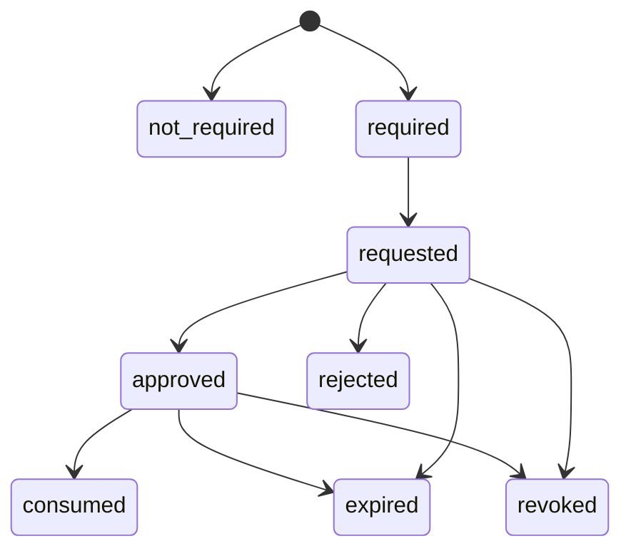

Approvals are operation-specific authority evidence. They bind one defined
action, at one definition revision, for one occurrence, with one capability set.
They are not reusable consent.

## Status

Approval semantics — issue, expiry, revocation, consumption, and invalidation —
are ratified in [coven-threads#29](https://github.com/OpenCoven/coven-threads/issues/29)
and integrated into dispatch by
[#857](https://github.com/OpenCoven/coven/issues/857). The landed automation
surface has no approval endpoint yet: actions are authorized by the policy that
ships with the runtime, and anything outside that policy is refused. Build
approval UX against the ratified states below, but do not assume a live API.

## Lifecycle

## What an approval record pins

A request records, immutably:

- the exact definition revision and action digest;
- the occurrence and intended runtime;
- the requested capabilities and declared side-effect class;
- the familiar identity revision the run would embody;
- who requested it and when.

Any relevant change after approval — definition revision, action digest,
capabilities, familiar revision, or intended runtime — invalidates the approval.
An approval for one occurrence cannot authorize another occurrence, and it
cannot be expanded to cover capabilities that were not requested.

## Rules for clients (Cave, SDK, integrations)

- Approve or reject with an authenticated principal context and a stable
  adoption key. Duplicate submissions with the same adoption key are
  idempotent; conflicting ones are rejected.
- Never write `approved` directly into run, occurrence, or approval state. No
  client can forge authoritative lifecycle state; the daemon is the only writer.
- Render approval state read-only. If approval evidence is missing, expired, or
  unverifiable, display the degraded truth — do not synthesize an authorized
  state.
- Treat refusal, expiry, and revocation as explainable outcomes: the occurrence
  stays inspectable and recoverable without launching.

## Scheduler behavior at dispatch

When an action requires approval, the scheduler either waits within a bounded
policy or skips/fails the slot according to a declared approval-misfire policy.
It never launches half-authorized. If approval is revoked while a run is queued,
awaiting approval, dispatching, or running, the behavior is explicit and
audited — policy changes do not rewrite history, and revocation is recorded as
evidence.

## Refusal is a feature

A rejected or expired approval leaves a durable, explainable reason on the
occurrence. That is the intended behavior, not a failure of the approval
system: the safe outcome of uncertain authority is "did not run, and here is
why". For operator handling of approval-blocked runs, see
[Unauthorized or approval-blocked run](/docs/automations/operations/unauthorized).
