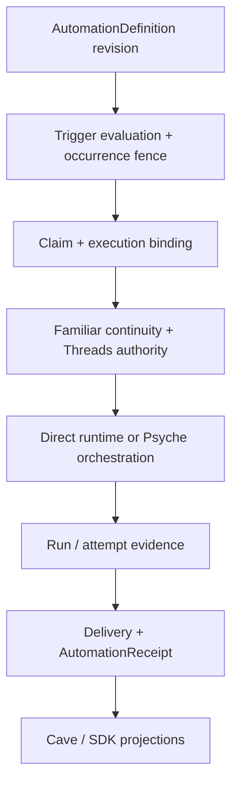

Coven Automations v1 is the automation profile of the OpenCoven identity → authority → orchestration → runtime → oversight stack. Coven owns schedules and lifecycle; every other layer owns its explicit slice and nothing more.

## End-to-end flow

Each arrow is a durable boundary. The links landed today and the links that are
ratified targets differ:

| Flow stage | Status today |
| --- | --- |
| Definition revision | Landed: versioned definitions in SQLite, paused by default. |
| Trigger evaluation + occurrence fence | Landed: RRULE planning with a unique `(automation_id, scheduled_for)` fence. |
| Claim + execution binding | Claim and lease landed; the immutable execution-binding object is a ratified target ([#855](https://github.com/OpenCoven/coven/issues/855), [#857](https://github.com/OpenCoven/coven/issues/857)). |
| Familiar continuity + Threads authority | Target: familiar ID propagates today; exact root/revision embodiment binding ([familiar-contract#17](https://github.com/OpenCoven/familiar-contract/issues/17)) and Threads authority ([coven-threads#29](https://github.com/OpenCoven/coven-threads/issues/29)) are open. |
| Direct runtime or Psyche orchestration | Direct runtime launch landed (default `coven-code`); the Psyche adapter is a target ([psyche#18](https://github.com/OpenCoven/psyche/issues/18)). |
| Run/attempt evidence | Run records landed; attempts, typed failures, and receipts are targets ([#855](https://github.com/OpenCoven/coven/issues/855)). |
| Delivery + AutomationReceipt | Atomic output delivery landed; verifiable AutomationReceipts are a target ([#857](https://github.com/OpenCoven/coven/issues/857)). |
| Cave/SDK projections | Cave reads the Coven control plane ([coven-cave#4990](https://github.com/OpenCoven/coven-cave/pull/4990)); the complete SDK surface is a target ([sdk#80](https://github.com/OpenCoven/sdk/issues/80)). |

## Canonical ownership

| Layer | Owns | Must not own |
| --- | --- | --- |
| Coven | Definitions, planning, occurrences, runs/attempts, leases, dispatch, recovery, receipts, changefeed | Familiar identity authorship or UI-local truth |
| Familiar Contract / continuity profile | Familiar root, revision, same-familiar continuity, embodiment binding | Schedules, run state, or runtime dispatch |
| Coven Threads / authority profile | Protected-action classification, capability/approval semantics, authority evidence | Clock liveness or occurrence planning |
| Psyche | Multi-step orchestration invoked by an occurrence when needed | Canonical schedules or a second automation ledger |
| Coven runtimes | Runtime capability truth and conformance | Scheduling or product authority |
| SDK | Constrained typed clients, subscriptions, verification, authority-aware requests | Independent persistence or inferred permissions |
| Cave | Oversight, proposal/creation flows, approvals, diagnostics, recovery controls | Scheduler policy or run-state authorship |
| Beads | Implementation dependency graph, assignment, status, evidence references | Runtime definitions, occurrences, runs, approvals, artifacts, or receipts |
| GitHub | Public outcomes, rationale, acceptance gates, durable delivery links | Implementation execution state or runtime truth |

## Non-ownership rules

These rules are how misrepresentation is prevented. Each one names what a layer
must never do, even when it could.

- **Coven** does not author familiar identity or render UI-local truth as runtime state. It resolves identity and authority inputs owned elsewhere and fails closed when they are missing or stale.
- **Familiar Contract** does not schedule, plan, claim, or dispatch. A familiar root names who runs, never when.
- **Coven Threads** does not decide clock liveness or occurrence order. It classifies and authorizes actions; it does not plan them.
- **Psyche** never holds a canonical schedule, occurrence ledger, or second automation ledger. It is invoked by an occurrence, never the reverse.
- **Runtimes** never own wall-clock liveness, occurrence claims, or retry policy. A runtime that cannot reach the daemon does not self-schedule.
- **SDK** clients do not persist automation state independently or infer permissions from read models. They render daemon state.
- **Cave** proposes, approves, inspects, and renders; it never synthesizes successful, running, authorized, or healthy state, and it never edits scheduler policy.
- **Beads and GitHub** track dependency graph, status, and public outcomes. Tracker state is never queried as production automation truth, and no lifecycle object (definition, occurrence, run, approval, receipt) is authored in a tracker.

## Non-negotiable invariants

These invariants come from the program definition in
[OpenCoven/coven#854](https://github.com/OpenCoven/coven/issues/854) and bind
every layer:

- Coven is the only canonical automation definition and lifecycle authority.
- At-least-once observation is acceptable; duplicate execution of one fenced occurrence is not.
- No state is called `succeeded` until the runtime outcome and the required delivery commit are durably recorded.
- Every mutating request has stable adoption/idempotency semantics (ratified in [#855](https://github.com/OpenCoven/coven/issues/855); adoption keys are not yet enforced by the landed control actions).
- Ambiguous mutating work enters explicit recovery; it is never automatically replayed as though nothing happened.
- Unknown, stale, malformed, revoked, or unavailable authority inputs fail closed.
- Cave and SDK render daemon state; neither synthesizes successful, running, authorized, or healthy state.
- Logs, events, receipts, diagnostics, and tracker evidence are bounded and privacy-classified.

## Reading the boundary in this documentation set

- [Definitions](/docs/automations/definitions) — the versioned definition object and its validation.
- [Lifecycle](/docs/automations/lifecycle) — occurrence, run, and attempt state machines.
- [Identity and authority](/docs/automations/identity-authority) — who is allowed to run and how that is proven.
- [Conformance](/docs/automations/conformance) — how certification status is reported without overclaiming.
