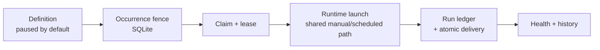

import { Callout } from 'fumadocs-ui/components/callout';
import { HubCards } from '@/components/hub-cards';

Automations are durable, recurring routines that Coven itself owns. A routine is a versioned definition (a schedule plus a familiar-bound prompt), an occurrence ledger with fenced claims, and run records with atomic output delivery. Runtimes are replaceable workers; they never own the schedule.

## Status: foundation, not v1 certification

Coven Automations v1 is a cross-repository program tracked in
[OpenCoven/coven#854](https://github.com/OpenCoven/coven/issues/854). The local
scheduler foundation has landed and is verified against the Coven implementation;
the full v1 protocol, authority binding, and conformance certification are still
open work. This documentation distinguishes the two everywhere:

- **Landed today** — verified against the Coven implementation at the revision
  pinned in [`source-lock.json`](https://github.com/OpenCoven/coven-docs/blob/main/docs/source-lock.json).
- **Ratified target** — normative behavior agreed in the program issues
  ([#855](https://github.com/OpenCoven/coven/issues/855),
  [#856](https://github.com/OpenCoven/coven/issues/856),
  [#857](https://github.com/OpenCoven/coven/issues/857),
  [#858](https://github.com/OpenCoven/coven/issues/858)) that has not landed yet.

<Callout type="warn" title="Foundation-ready, not v1-certified">
Recurring familiar work is a local execution convenience until the identity,
authority, and conformance gates pass. It is not proof of authorized familiar
continuity, and unattended external side effects stay out of scope until the
authority and certification gates pass. See
[Conformance](/docs/automations/conformance).
</Callout>

## What Coven owns

- Versioned definitions stored under `$COVEN_HOME`, not a harness home.
- RRULE-backed planning with unique occurrence fencing.
- Bounded claim leases and expired-lease recovery.
- A shared dispatch path for scheduled and manual runs.
- The run ledger, bounded logs, and atomic output delivery.
- A paused-by-default lifecycle: nothing runs until a human activates it.

## What Coven does not own

- Familiar identity: the [Familiar Contract](https://github.com/OpenCoven/familiar-contract) owns familiar roots and revisions.
- Authority: [Coven Threads](https://github.com/OpenCoven/coven-threads) owns protected-action and approval semantics.
- Model access and provider credentials: they stay with the runtime.
- Orchestration: Psyche executes delegated multi-step work without owning schedules.

The full table, including non-ownership rules, is in
[Architecture and ownership](/docs/automations/architecture).

## Where to go next

<HubCards href="/docs/automations" />
