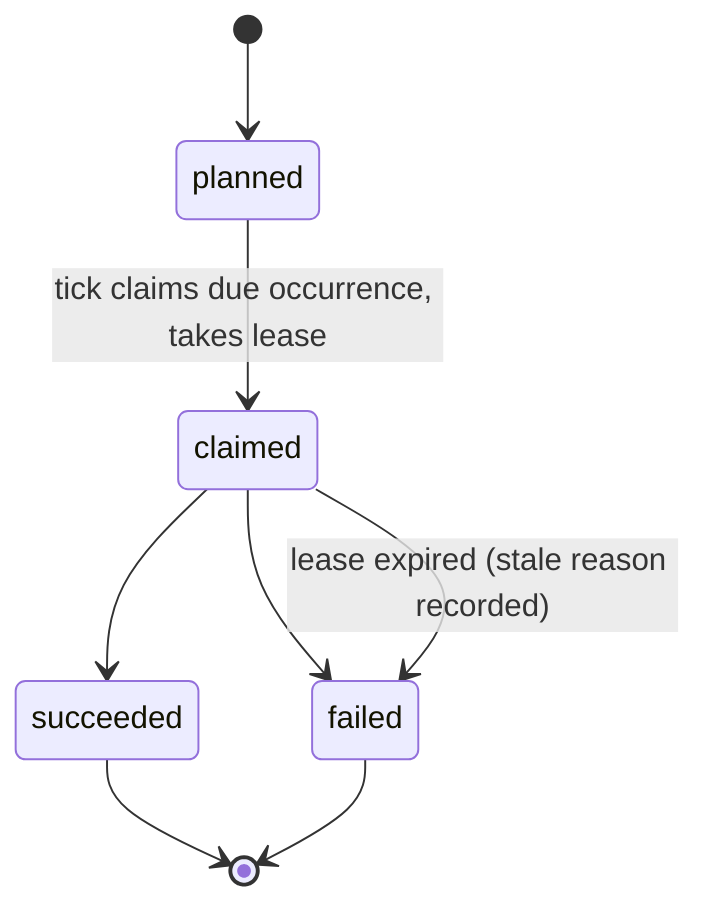

Acceptance, dispatch, and success are distinct states. A claim is not a launch,
a launch is not a success, and no state is called `succeeded` until the runtime
outcome and the required delivery commit are durably recorded.

## Definition revisions

A definition has a stable `id` and is edited by full replacement (`coven.automations.update`). The landed foundation tracks status (`ACTIVE`/`PAUSED`) and timestamps; the ratified [#855](https://github.com/OpenCoven/coven/issues/855) contract adds a monotonic `revision` and an integrity digest per definition, so every historical occurrence and run pins the exact revision that produced it. Definition revisions never rewrite history.

## Occurrence states

Landed today:



- `planned` — the slot exists and is fenced by the unique
  `(automation_id, scheduled_for)` key. Re-planning the same slot is a no-op
  (`alreadyFenced` in the tick report).
- `claimed` — a tick took a bounded lease (1–1440 minutes) and owns the slot.
  Overlap refusal: a new occurrence is skipped while the previous one has not
  settled (`overlap: forbid`).
- `succeeded` / `failed` — terminal. An expired lease is recovered to `failed`
  with a durable `lease expired` reason; a stale lease never renders as live
  work.

Ratified in [#855](https://github.com/OpenCoven/coven/issues/855):

```text
planned -> eligible -> claimed -> dispatching -> running
  -> succeeded | failed | cancelled | timed_out | recovery_required

planned/eligible -> skipped | superseded | cancelled
claimed/running with expired evidence -> recovering -> failed | recovery_required
```

## Run and attempt states

A run is one execution binding for an occurrence. Landed run records carry
`status`, `exitCode`, `sessionId`, bounded `logJson`, `outputCommit`, and
timestamps, written through the shared manual/scheduled dispatch path.

Attempts are a ratified object: each retry creates a new, monotonically
numbered attempt with its own adoption key and dispatch fence, and the prior
attempt is never rewritten.

```text
attempt: adopted -> dispatching -> started -> observing
  -> succeeded | failed | cancelled | timed_out | ambiguous
```

An `ambiguous` attempt outcome is terminal for that attempt: ambiguous mutating
work enters explicit recovery, and is never automatically replayed as though
nothing happened.

## Claim, lease, and fence ownership

- **Fence** — the unique occurrence key (`automation_id`, `scheduled_for`). It
  makes duplicate planning a no-op.
- **Lease** — a bounded claim (`leaseOwner`, `leaseExpiresAt`) recorded on the
  occurrence. Only the lease owner may settle the occurrence.
- **Recovery** — a later tick marks occurrences whose lease has expired as
  `failed` with a stale reason and clears lease fields.

Ratified additions: monotonic fencing generations for scheduler ownership and
occurrence claims, so two daemon processes sharing one store can never both
dispatch the same occurrence, and stale workers are rejected after lease
transfer. Multi-host routing stays out of scope; this fencing prevents unsafe
accidental concurrency without pretending SQLite is consensus.

## Cancellation

Ratified model: cancellation is a **request** until it is acknowledged or
reconciled. Cancellation records who requested it, when, at what scope, and why,
fences against the exact run/attempt and runtime correlation, and defines the
completion-vs-cancel and timeout-vs-completion races to one convergent terminal
result. A runtime that cannot confirm stop enters recovery-required or a
defined timeout terminal state — it is never assumed stopped. Disabling or
deleting a definition prevents future planning and does not rewrite an in-flight
run.

Not landed yet: today the safe operator moves are pause (stop planning) and
letting lease recovery converge. See
[Operations](/docs/automations/operations).

## Retry and delivery-only retry

Ratified rules:

- Retry is failure-class-aware. Validation and authority refusals never retry;
  ambiguous side effects never retry automatically; a bounded, persisted retry
  policy with backoff and deterministic jitter applies only to classes that
  permit it.
- Retry creates a new attempt; it never rewrites the prior attempt.
- A delivery commit failure after a successful execution retries **delivery
  only** — the familiar action is never rerun to fix a delivery problem.

## Recovery-required and ambiguous outcomes

When evidence is missing — a crash between dispatch and settlement, a lost
runtime, a delivery commit that may or may not have landed — the ratified
outcome is `recovery_required`, an explicit state a human or a reconciling tool
resolves with evidence. Missing runtime evidence can never become success. The
[#856](https://github.com/OpenCoven/coven/issues/856) crash matrix injects a
crash at every consequential boundary (definition commit, planning, claim,
adoption, dispatch, session creation, first runtime event, terminal
observation, settlement, delivery temp write, delivery rename, receipt commit,
event publication) and requires restart to converge to exactly one explainable
disposition.

## Restart reconciliation

Landed: after a daemon restart, the next tick recovers expired leases, plans
the latest missed occurrence for active definitions, and refuses overlap.
Ratified: startup performs an immediate reconcile before the first timed wait,
and daemon shutdown follows a bounded drain policy that records every active
attempt left for restart reconciliation. Psyche-orchestrated runs will use the
same reconciliation: the adapter observes correlation, never authority (see
[Psyche](/docs/automations/psyche)).

## Health projection

`coven.automations.health` reports the landed observability surface per
routine: `nextDueAt`, `lastPlannedAt`, `lastStartedAt`, `lastSuccessAt`,
`consecutiveFailures`, `leaseOwner`, `leaseExpiresAt`, and a `staleReason` when
something needs attention. This is read-only evidence; there is no command that
mutates lifecycle rows directly.
