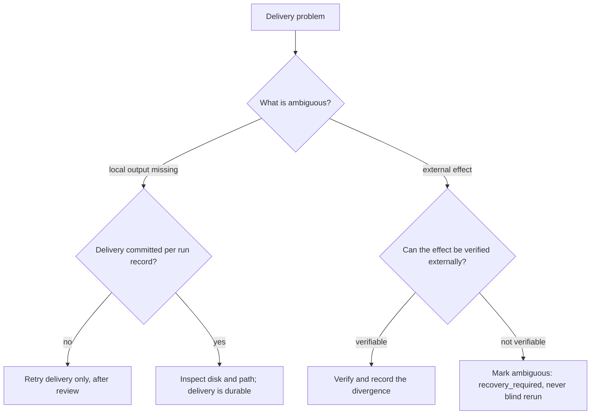

## Symptoms

- A run record shows a terminal status without a committed `outputCommit`.
- The expected output file is missing, partial, or stale.
- An action touched an external system and the evidence is inconclusive.

## Authoritative evidence

1. `coven.automations.runs` — `status`, `outputCommit`, `finishedAt`,
   bounded `logJson`.
2. The state of `outputTarget` on disk, compared against the run's timestamps.
3. Daemon logs for the delivery window.
4. The daemon's own recovery guidance if the store itself is in question
   ([Recovery and upgrades](/docs/daemon/recovery-upgrades)).

The invariant: a failed output commit fails the run visibly; success is never
claimed for a delivery that did not durably land. The flip side: a **successful
delivery record is the proof** — do not accept a run as delivered on UI state
alone.

## Decision tree

## Permitted recovery

- **Delivery-only retry** — when the familiar action provably succeeded and only
  the output commit failed, the ratified rule is to retry the delivery, never
  the familiar action ([#856](https://github.com/OpenCoven/coven/issues/856)).
  Until delivery-only retry ships as a command, record the divergence, preserve
  the evidence, and escalate if the output matters — do not re-run the prompt to
  regenerate the file.
- **Disk pressure or path problems** — fix the storage condition first; a
  delivery retry into a full disk fails again identically.
- **Ambiguous external side effect** — this is the one case where the only
  correct state is explicit ambiguity. The ratified outcome is
  `recovery_required`: a human verifies the external system's state and decides
  with evidence. Automatic replay of ambiguous mutating work is forbidden by the
  program invariants ([#854](https://github.com/OpenCoven/coven/issues/854)).
- Record the final decision in the incident record so the occurrence's history
  explains why it settled the way it did.

## Forbidden shortcuts

- Do not re-run the whole routine because "the file wasn't there" — if the
  action also had external effects, a rerun doubles them.
- Do not hand-write the missing output and call delivery fixed.
- Do not delete the failed run record or its logs.
- Do not convert an ambiguous external effect into `succeeded` to close the
  incident.

## Escalation

Ambiguous side effects and repeated delivery failures both warrant escalation
([Operations index](/docs/automations/operations)). Include the run
record, the delivery evidence, the external system's observed state, and — for
ambiguity — exactly which verification step could not be completed.
