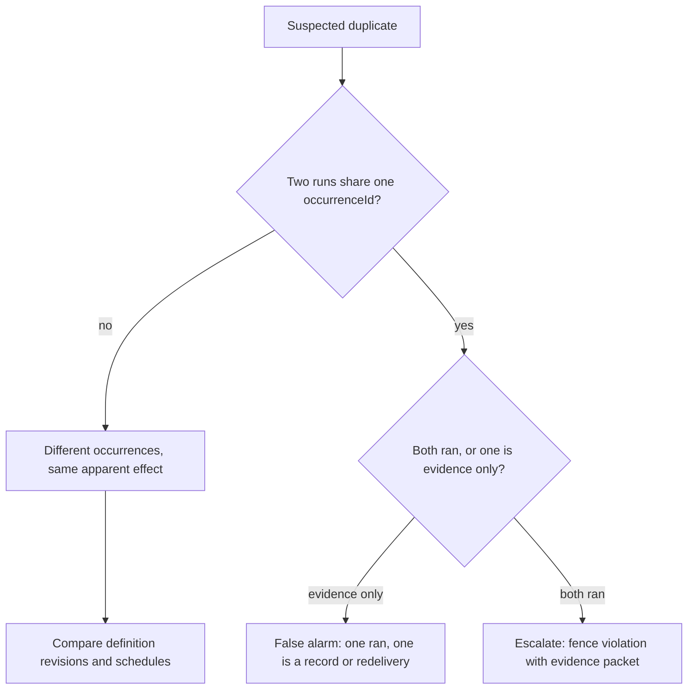

## Symptoms

- Two run records appear correlated with one scheduled slot.
- A familiar acted twice within one slot's window.
- An event subscriber re-delivered events after a reconnect and a downstream
  effect looks doubled.

## Authoritative evidence

- `coven.automations.runs` for the routine — compare `occurrenceId`, `startedAt`,
  and `sessionId` per run.
- `coven.automations.health` — lease and stale fields for the slot's window.
- The tick report from `coven.automations.tick` — `alreadyFenced` proves the
  unique `(automation_id, scheduled_for)` fence absorbed a duplicate planning
  attempt.
- Daemon logs around the timestamps.

The invariant: **at-least-once observation is acceptable; duplicate execution of
one fenced occurrence is not.** Prove which of the two you are looking at before
acting.

## Decision tree

## Permitted recovery

- **Duplicate observation or event redelivery** — fix the consumer: replay from
  the last contiguous cursor, deduplicate by event identity, and keep
  processing idempotent ([SDK and integrations](/docs/automations/sdk)). The
  ratified changefeed defines replay and duplicate-delivery semantics
  ([#855](https://github.com/OpenCoven/coven/issues/855)); until it lands,
  treat every redelivery as something your consumer must absorb.
- **Two similar occurrences by schedule** — inspect the definitions (`get`)
  for overlapping schedules or a duplicated definition id under a different
  name; pause the redundant one after review.
- **Two runs for one occurrenceId** — this is a fence violation, the most
  serious outcome in the runbook set. Do not "clean it up"; preserve evidence
  and escalate. A duplicate execution is exactly what occurrence fencing exists
  to prevent, and it is a certification failure for the scheduler
  ([#858](https://github.com/OpenCoven/coven/issues/858)).

## Forbidden shortcuts

- Do not delete one of the two run records to make the ledger consistent.
- Do not re-run the occurrence "once, carefully" to replace the ambiguous pair.
- Do not edit the fence or lease columns in the database.

## Escalation

A confirmed fence violation needs the full evidence packet
([Operations index](/docs/automations/operations)): both run records in
full, the tick reports for the window, the daemon logs, and the store file
preserved for offline inspection.
