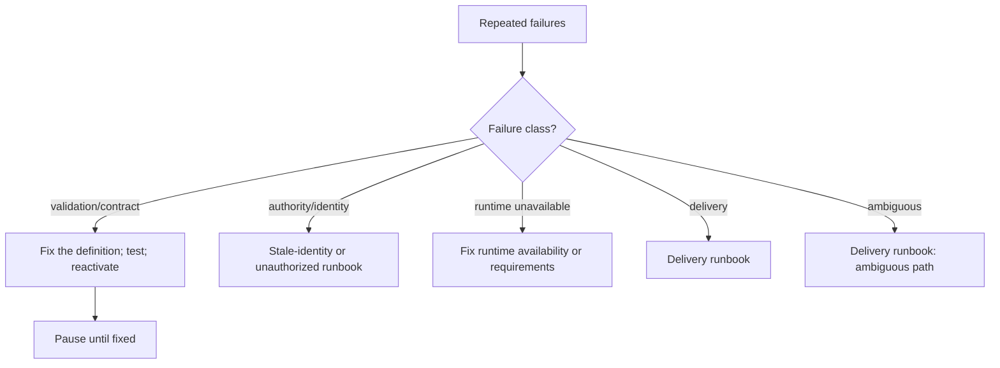

## Symptoms

- `consecutiveFailures` climbs in `coven.automations.health`.
- The same failure class repeats every slot.
- The routine's failures dominate logs or event volume.

## Authoritative evidence

1. `coven.automations.health` — `consecutiveFailures`, `lastSuccessAt`,
   `staleReason`.
2. `coven.automations.runs` — the failing runs' `status`, `exitCode`, bounded
   `logJson`, and whether delivery committed (`outputCommit`).
3. The daemon logs and the runtime session evidence for one representative
   failure.

Classify before acting: validation/contract failure, identity or authority
refusal, scheduler/store transient, runtime unavailable, runtime failed after
start, ambiguous outcome, or delivery failure. The retry rules differ per class
(ratified in [#856](https://github.com/OpenCoven/coven/issues/856): refusals
never retry; ambiguous work never auto-retries; bounded backoff applies only
where class permits).

## Decision tree

## Permitted recovery

- **Pause first.** `update` the definition to `PAUSED`. This stops the bleeding
  immediately and is always safe — history is untouched.
- Fix the root cause, test the corrected definition against the
  [checklist](/docs/automations/migration-codex#review-and-activation-checklist),
  then reactivate explicitly.
- **Quarantine** — a circuit state that stops a broken routine from storming is
  the ratified [#856](https://github.com/OpenCoven/coven/issues/856) behavior.
  Until it lands, pausing is the operator's quarantine; apply it on the second
  identical failure of a known class, not the tenth.

## Forbidden shortcuts

- Do not leave a failing routine active "to watch it" — each slot is another
  unattended execution attempt.
- Do not widen `timeoutMinutes` or change schedules hoping the failure class
  goes away.
- Do not delete history rows for the failing runs; they are the evidence the
  fix will be judged against.

## Escalation

If the failure class is unclear or the same failure survives a definition fix,
escalate with the packet
([Operations index](/docs/automations/operations)): health output, the
bounded logs of three representative failed runs, the daemon logs, and the
classification you reached.
