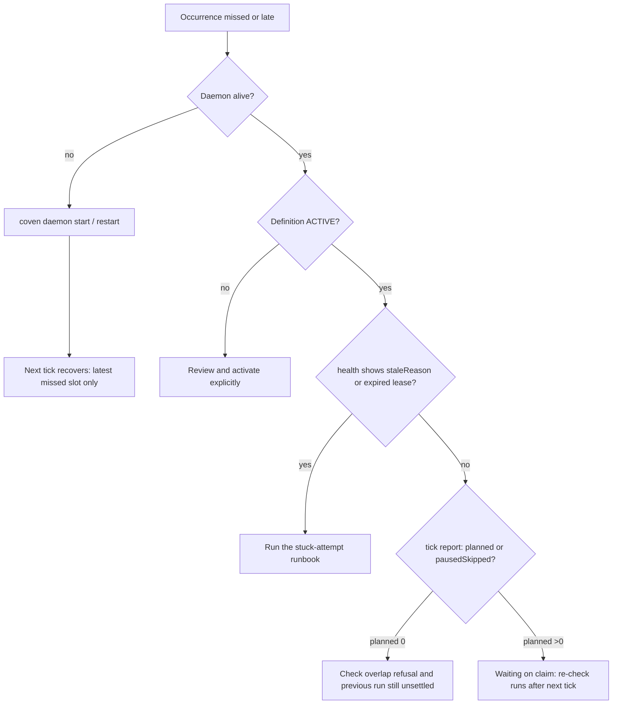

## Symptoms

- `nextDueAt` has passed but no new occurrence was planned or claimed.
- Runs resumed after a gap with only the latest slot executed, not every missed slot.
- The routine seems permanently late after a host clock change.

## Authoritative evidence

Read evidence in this order; later surfaces do not override earlier ones:

1. `coven daemon status` — is the daemon alive at all? A down daemon plans nothing; that is expected behavior, not a bug.
2. `coven.automations.health` for the routine — `nextDueAt`, `lastPlannedAt`, `staleReason`, lease fields.
3. `coven.automations.get` — is `status` still `ACTIVE`? A paused definition reports `pausedSkipped` on every tick.
4. `coven.automations.tick` — its report separates `planned`, `alreadyFenced`, `pausedSkipped`, `recovered`, `claimed`, `failed`.
5. The daemon logs for the window ([Observability](/docs/daemon/observability)).

Do not use Cave UI state or tracker tickets as evidence of what the scheduler did.

## Decision tree

## Permitted recovery

- Daemon down: start it (`coven daemon start`). The next tick plans the latest
  missed occurrence for active definitions (`misfire: latest`) — one run, not a
  burst. This is the intended post-downtime behavior, not data loss to repair.
- Definition paused: review it and activate explicitly
  ([Quickstart step 6](/docs/automations/quickstart#6-activate-explicitly)).
- Stale lease or stuck claim: follow
  [Stuck claimed or running attempt](/docs/automations/operations/stuck).
- Overlap refusal while a previous run has not settled: investigate the
  unsettled run, do not force a second concurrent one. `overlap: forbid` is the
  definition you accepted.
- Host clock change: verify the clock, then check the next `nextDueAt`. A
  recorded replan (never duplicate work) is the ratified
  [#856](https://github.com/OpenCoven/coven/issues/856) behavior; until it
  lands, confirm the next slot is sane before assuming damage.

## Forbidden shortcuts

- Do not insert or edit occurrence rows to "backfill" missed slots.
- Do not re-run the prompt manually and call the occurrence settled — a manual
  run is new evidence, not recovery of the missed one.
- Do not widen the RRULE or disable overlap to make late slots "catch up".

## Escalation

If ticks report `planned > 0` but claims never happen, or recovery keeps
producing `lease expired` failures, collect the escalation packet
([Operations index](/docs/automations/operations)) plus the tick reports
and attach it to the incident.
