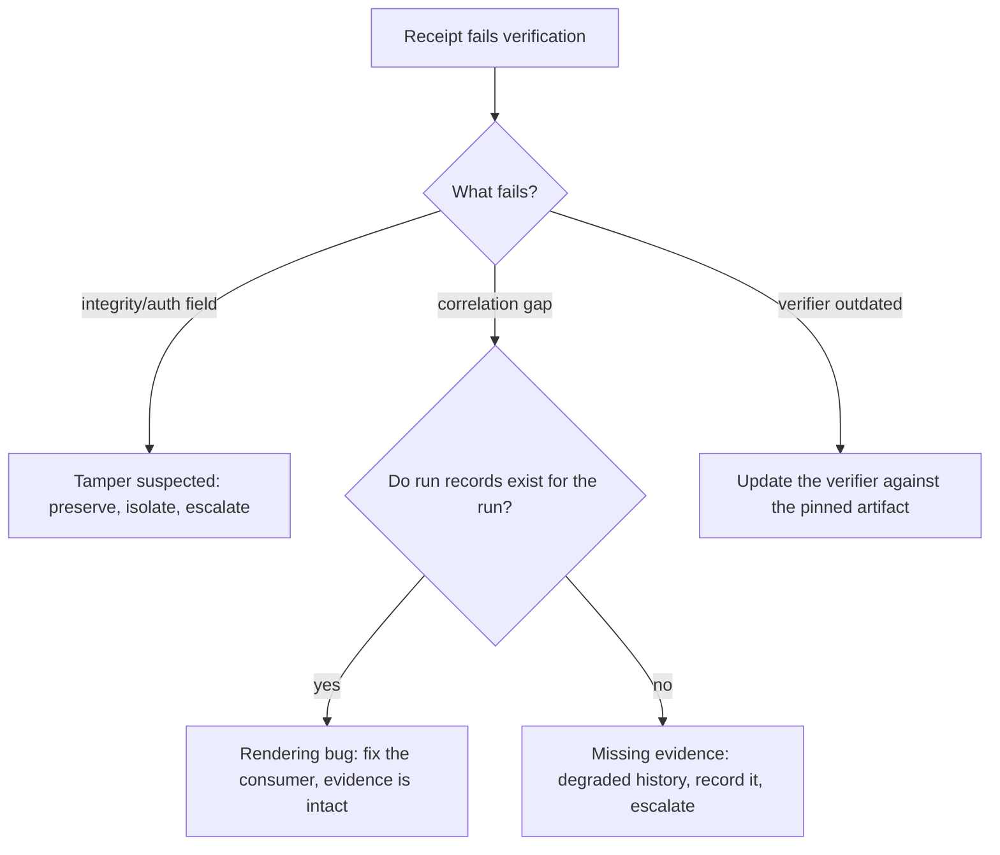

## Symptoms

- A receipt's integrity/authentication field does not verify.
- History and receipt evidence disagree about a run's outcome.
- A subscriber or verifier reports a receipt it cannot validate.

## Authoritative evidence

Receipts are a ratified
[#857](https://github.com/OpenCoven/coven/issues/857) object: an immutable,
versioned body with correlation, binding, decision, delivery, and integrity
fields that an independent verifier can check without Coven internals. The
landed run ledger records `status`, `exitCode`, `sessionId`, bounded logs, and
`outputCommit` per run — the same evidence at an earlier maturity.

Until receipts ship, treat these as the verification surface: the run ledger,
the daemon logs, and the delivery evidence on disk. When they ship, an
independent verifier's failure is authoritative over any client's rendering.

## Decision tree

## Permitted recovery

- **Suspected tampering** — stop consuming the evidence, preserve the store and
  logs for offline inspection, and escalate. Verification failure of an
  integrity field is a security signal first, not a rendering bug. Follow
  [Security and privacy](/docs/automations/security-privacy) for the threat
  model and the [daemon's security posture](/docs/daemon/security) for local
  access boundaries.
- **Correlation gaps with intact run records** — the evidence exists and the
  consumer is misrendering it. Fix the consumer; the ledger needs no repair.
- **Missing evidence** — a history gap is rendered as degraded, honestly, and
  recorded. Missing runtime evidence can never become success; a gap stays a
  gap with an explanation.
- **Verifier mismatch** — verify against the exact pinned artifact versions
  ([Compatibility](/docs/automations/compatibility)); a stale verifier is a
  client bug, not tampering.

## Forbidden shortcuts

- Do not regenerate or re-sign evidence locally to "fix" verification.
- Do not treat an unverifiable receipt as valid because the run "probably
  succeeded".
- Do not delete rows whose receipts fail verification.
- Do not mark a degraded history as trusted after the fact.

## Escalation

Every verification failure escalates with the packet
([Operations index](/docs/automations/operations)) plus: the receipt (or
run record) in full, the verifier output, the artifact versions in use, and the
preserved store path. For anything that looks like tampering, coordinate through
[SECURITY.md](https://github.com/OpenCoven/coven-docs/blob/main/SECURITY.md)
instead of a public issue.
