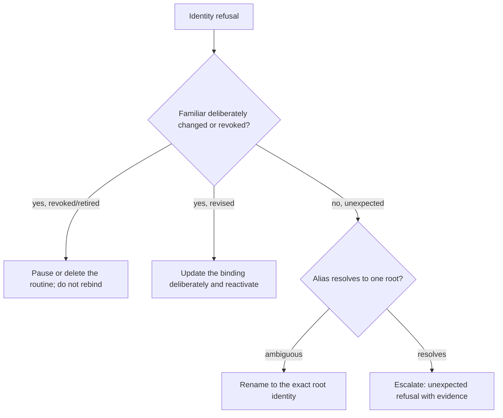

## Symptoms

- Dispatch refusals naming identity: stale revision, revoked identity, retired
  familiar, or ambiguous alias resolution.
- A routine that ran fine before a familiar change now fails closed.
- Evidence shows the current identity revision differs from what the run needs.

## Authoritative evidence

1. The Familiar Contract state for the familiar — root identity, current
   revision, revocation/retirement status
   ([familiar-contract#17](https://github.com/OpenCoven/familiar-contract/issues/17)
   defines the embodiment-binding profile).
2. `coven.automations.get` — the definition's `familiarId` binding.
3. `coven.automations.runs` and the daemon logs — the refusal reasons at
   dispatch.

Fail-closed here is the contract: a paused, retired, revoked, or ambiguous
familiar cannot dispatch. Identity is resolved fresh at dispatch time, never
inherited from creation.

## Decision tree

## Permitted recovery

- **Deliberate revision** — after the familiar's new revision is verified in the
  Familiar Contract, update the definition's binding deliberately (full
  `update`) and let the reviewed change activate. Treat it like a new
  activation: review, preview, explicit `ACTIVE`.
- **Deliberate revocation or retirement** — pause the routine immediately and
  decide its fate. Do not rebind it to another familiar to "keep the schedule
  alive"; a schedule without its intended identity is not the same automation.
- **Ambiguous alias** — replace the alias in the definition with the exact
  stable root identity. Ambiguity refuses by design; best-guess resolution is
  forbidden.
- **Unexpected refusal** — treat as a possible stale policy snapshot or binding
  bug ([#857](https://github.com/OpenCoven/coven/issues/857)); escalate with
  evidence rather than editing identity state.

## Forbidden shortcuts

- Do not strip the `familiarId` from the definition so the schedule keeps
  running unbound — that converts an identity-bound routine into an unattributed
  one.
- Do not reuse another familiar's identity as a stand-in.
- Do not lower identity requirements or pin an old revision manually.

## Escalation

Identity refusals that fire without a known identity change go straight to
escalation: include the identity state (root, revision, revocation status), the
definition, the refusal reasons, and the daemon logs in the packet
([Operations index](/docs/automations/operations)).
