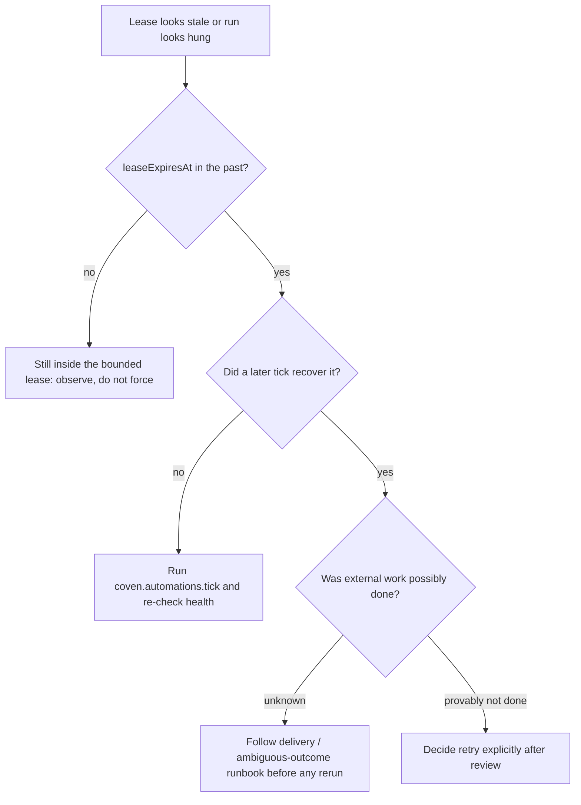

## Symptoms

- `health` shows `leaseOwner` and a `leaseExpiresAt` long in the past.
- A run record has `startedAt` but no `finishedAt`, well beyond `timeoutMinutes`.
- Later occurrences are refused (`overlap: forbid`) because this one has not settled.

## Authoritative evidence

1. `coven.automations.health` — lease owner, lease expiry, `staleReason`.
2. `coven.automations.runs` — the run's `status`, `sessionId`, `startedAt`, and whether it ever finished.
3. `coven daemon status` and the daemon logs — did the daemon restart mid-run?
4. The runtime's session evidence (`sessionId`), if the session surface is available.

## What actually happens

Claim leases are bounded (1–1440 minutes). A lease whose expiry passes is
recovered by a later tick: the occurrence is marked `failed` with a durable
`lease expired` reason and the lease fields are cleared. A stale lease never
renders as live work and never blocks the next slot forever — that is the
landed recovery contract.

## Decision tree

## Permitted recovery

- Let lease recovery converge: `tick` schedules are daemon-owned, and recovery
  happens on a tick. Forcing one `coven.automations.tick` is a permitted,
  recorded action.
- If the run actually finished externally (the runtime completed but evidence
  was lost), treat the outcome as ambiguous: the external effect is real, the
  ledger's `failed` is about evidence. Document the divergence in the incident
  and follow [Delivery commit failure](/docs/automations/operations/delivery)
  for effect-side verification.
- Retry is an explicit, human decision after review — retries create new
  attempts with their own evidence (ratified in
  [#856](https://github.com/OpenCoven/coven/issues/856); not yet automated).
- Fix the root cause before the next slot: a runtime that hangs past its
  timeout will do it again. Check `timeoutMinutes` against the action's real
  duration.

## Forbidden shortcuts

- Do not delete or rewrite the occurrence row, the lease columns, or the run
  record.
- Do not kill the daemon mid-write to "unstick" the slot — that is exactly the
  crash boundary recovery exists for.
- Do not disable overlap to let new slots run past a stuck one; settle or wait
  instead.

## Escalation

If recovery keeps producing `lease expired` failures for the same routine, or
leases expire while the runtime is demonstrably alive, escalate with the packet
([Operations index](/docs/automations/operations)) plus the daemon logs
and the runtime session evidence.
