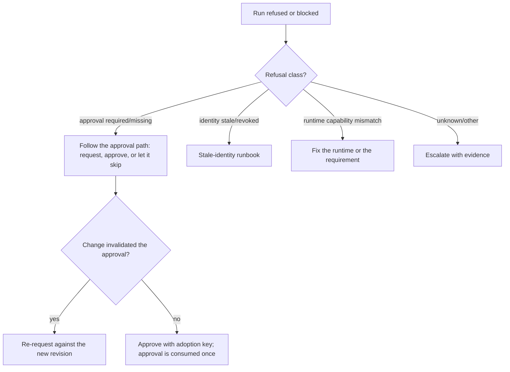

## Symptoms

- Runs never start for one routine while others work.
- Evidence shows a refusal at dispatch: identity, authority, capability, or
  approval class.
- An action waits indefinitely for an approval that never arrives.

## Authoritative evidence

1. `coven.automations.get` — read the definition's `familiarId`, `runtime`, and
   `prompt` for scope claims.
2. `coven.automations.runs` and `health` — refusal reasons and consecutive
   failures.
3. The daemon logs for the dispatch attempt.
4. The authority profile state (Familiar Contract and Threads artifacts) once
   those integrations land — the definitions in
   [Identity and authority](/docs/automations/identity-authority) are the
   normative reference.

A refusal is the system working as designed. Unknown, stale, malformed,
incompatible, or unavailable authority inputs are required to fail closed — the
failure mode to fear is the missing refusal, not the present one.

## Decision tree

## Permitted recovery

- **Approval-blocked** — request the approval against the exact definition
  revision, occurrence, and capability set. One approval authorizes one
  operation; changes after approval invalidate it
  ([Approvals](/docs/automations/approvals)). If the action should not be
  approved, let the approval-misfire policy skip or fail the slot and adjust the
  definition instead.
- **Runtime capability mismatch** — either change the runtime in the definition
  to one whose descriptor satisfies the declared requirements, or reduce the
  action's declared requirements through policy review. Never relax the runtime
  pin itself.
- **Prompt or scope overreach** — revise the definition to a narrower, local,
  low-risk action and reactivate. This is the correct response to a risk-class
  refusal.
- **Repeated authority refusals** — pause the routine while you investigate;
  refused dispatches should not be retried into a storm (retry rules live in
  [#856](https://github.com/OpenCoven/coven/issues/856)).

## Forbidden shortcuts

- Do not grant the missing permission globally to make one routine pass.
- Do not remove the `familiarId` or swap runtimes to bypass a refusal — the
  refusal will follow the action, correctly.
- Do not treat creation-time approvals as reusable authority; there is no such
  path by design.
- Do not edit policy artifacts or identity state directly to unblock a run.

## Escalation

Escalate refusals whose class is unclear, refusals that contradict the authority
profile, or refusals that fire for previously authorized actions — those can
indicate a stale policy snapshot or a genuine TOCTOU bug
([#857](https://github.com/OpenCoven/coven/issues/857)). Attach the packet
([Operations index](/docs/automations/operations)) with the definition
revision, refusal reasons, and the daemon logs.
