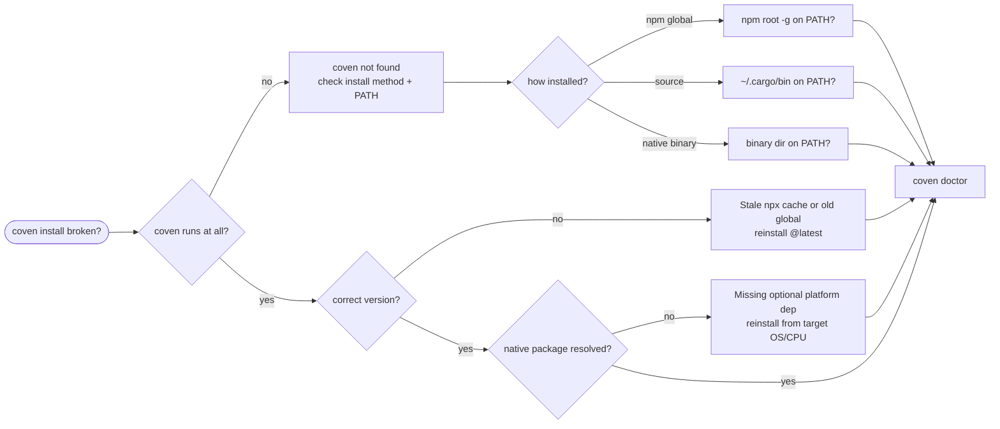

import { Callout } from 'fumadocs-ui/components/callout';

Use this page when installing the Coven CLI did not produce a working `coven` command. For runtime failures after a successful install (daemon, harness, or session problems), see [Troubleshooting](/docs/reference/troubleshooting) and [Harness Troubleshooting](/docs/harnesses/troubleshooting).

## Start With Doctor

If `coven` runs at all, run it first:

```sh
coven doctor
```

`doctor` reports store, project, daemon, socket, and harness readiness. If `coven doctor` fails because the command is not found, work through the sections below.

If `coven` is not on `PATH` yet, you can still exercise the published package without a global install:

```sh
npx @opencoven/cli doctor
pnpm dlx @opencoven/cli doctor
```

## Install Decision Flow



## Fast Triage

| Symptom | Likely cause | Fix |
| --- | --- | --- |
| `coven: command not found` | Install dir not on `PATH`, or global install failed | Confirm install method, then add its bin dir to `PATH`. |
| `coven` runs an old version | Stale `npx` cache or an old global install shadows the new one | Clear the cache / reinstall `@latest`; check `which -a coven`. |
| npm warns about a missing optional dependency | The native platform package did not resolve for your OS/CPU | Reinstall `@opencoven/cli` from the environment where you run it. |
| `Unsupported platform` on install | OS/CPU is not covered by a published native package | Build from source, or use a supported platform / WSL2. |
| Source build fails to compile | Toolchain or dependency mismatch | Update Rust stable and retry a clean `cargo build`. |

## `coven` Command Not Found

The fix depends on how you installed.

### npm global install

Confirm npm's global bin directory and that it is on `PATH`:

```sh
npm root -g
npm prefix -g
echo "$PATH" | tr ':' '\n' | grep -Fx "$(npm prefix -g)/bin"
```

On macOS and Linux the global bin directory is `<prefix>/bin`, which is exactly what the last command checks for; on Windows the prefix itself is the bin directory, so look for the `npm prefix -g` value in `Path` instead. (`npm bin -g` printed the directory directly, but the command was removed in npm 9.)

If the global bin directory is missing from `PATH`, add it in your shell profile, open a new terminal, and retry:

```sh
coven doctor
```

If the global install itself failed (for example, permission errors writing to the global prefix), prefer a user-writable npm prefix or a version manager over `sudo npm install -g`.

### Native binary

If you downloaded a native binary directly, make sure its directory is on `PATH`:

```sh
which -a coven
echo "$PATH" | tr ':' '\n'
```

### Source build

If you built with Cargo, make sure Cargo's bin directory is on `PATH`:

```sh
echo "$PATH" | tr ':' '\n' | grep "$HOME/.cargo/bin"
```

## Wrong Or Stale Version

`npx` caches packages, so a one-off invocation can run an older CLI than you expect. Confirm what is actually running:

```sh
which -a coven
coven --version
```

Reinstall the latest global build, or clear the `npx` cache and rerun:

```sh
npm install -g @opencoven/cli@latest
coven doctor
```

If more than one `coven` appears in `which -a coven`, an earlier install is shadowing the new one on `PATH`. Remove the stale copy or reorder `PATH` so the intended install wins.

## Missing Native Platform Package

The npm wrapper `@opencoven/cli` resolves a matching native package as an optional dependency. The published target matrix currently covers macOS Apple Silicon (`darwin-arm64`), macOS Intel (`darwin-x64`, package `@opencoven/cli-macos-x64`), Linux x64 (`linux-x64`), and Windows x64 (`win32-x64`). If npm cannot resolve the package for your OS/CPU pair, `coven` will not run even though the wrapper installed.

<Callout type="warn" title="Reinstall from the environment where you run Coven">
Installing on one platform and copying `node_modules` to another skips the native package for the target. Reinstall `@opencoven/cli` from the same OS/CPU where you plan to run `coven`.
</Callout>

Check what npm published and what resolved:

```sh
npm view @opencoven/cli version dist-tags
npm view @opencoven/cli-macos-x64 version dist-tags
npm view @opencoven/cli-linux-x64 version dist-tags
npm view @opencoven/cli-windows version dist-tags
```

On an Intel Mac, confirm `node -p "process.platform + '-' + process.arch"` prints `darwin-x64`. If it does not, reinstall Node for a native Intel shell first, then reinstall `@opencoven/cli` so npm can resolve `@opencoven/cli-macos-x64`.

The published wrapper currently targets `darwin-arm64`, `darwin-x64`, `linux-x64`, and `win32-x64`. Alpine/musl is not covered by the published wrapper today. On an unsupported platform, build from source or use a compatible WSL2 Linux distro — see [Platforms](/docs/guide/platforms).

## Source Build Failures

Build from source when you are contributing, testing unreleased behavior, or running on an unsupported npm platform:

```sh
git clone https://github.com/OpenCoven/coven.git
cd coven
cargo build --workspace
cargo run -p coven-cli -- doctor
```

If the build fails to compile, update the Rust toolchain and retry from a clean state:

```sh
rustup update stable
cargo clean
cargo build --workspace
```

To install the built binary onto your Cargo bin path:

```sh
cargo install --path crates/coven-cli
coven doctor
```

## Evidence To Collect

When an install problem needs a support report, include:

- The install method (`npx`, global npm, native binary, or source build).
- The output of `coven --version` and `which -a coven`.
- Your OS and CPU architecture.
- For npm installs, the output of the `npm view` commands above and any missing-optional-dependency warning.
- For source builds, the failing `cargo build` output.

Do not paste secrets or private paths into a report. Once `coven` runs, continue with [Doctor](/docs/cli/doctor).
