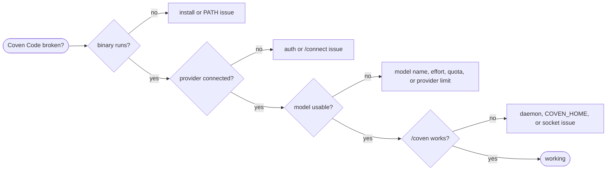

import { Callout } from 'fumadocs-ui/components/callout';

Start by separating the failure class:



## Fast Checks

```sh
coven-code --version
which coven-code
coven doctor
coven daemon status
```

On Windows, use `where coven-code` instead of `which coven-code`.

| Symptom | Likely cause | Fix |
| --- | --- | --- |
| `coven-code` is not found | Install did not add the binary to `PATH` | Reopen the terminal, reinstall, or add the install directory to `PATH`. |
| Wrong version runs | Old npm, archive, or source install appears first on `PATH` | Remove stale installs and verify `which coven-code`. |
| `/connect` cannot find a Claude account | Claude CLI credentials are absent or not importable | Sign in to Claude Code locally or use Anthropic API key setup. |
| Codex login succeeds but provider fails | Active provider or model is not Codex | Run `/connect`, choose Codex, then use `/model`. |
| Claude returns `429` | Provider rate limit for the account/model | Wait for reset, choose a lighter model, switch providers, or use a different official CLI path. |
| `/coven` reports daemon unavailable | Daemon is stopped or `COVEN_HOME` differs | Run `coven daemon start` and make both processes share `COVEN_HOME`. |

## Install Or PATH Problems

Check the installed package path:

```sh
npm list -g --depth=0 | grep opencoven
which coven
which coven-code
```

If several installs exist, keep one channel. The recommended channel is `@opencoven/coven`; the direct TUI-only channel is `@opencoven/coven-code`.

For archive installs, confirm the binary is executable:

```sh
chmod +x /path/to/coven-code
```

On macOS, clear quarantine only for a release you trust:

```sh
xattr -rd com.apple.quarantine /path/to/coven-code
```

## Provider Auth Problems

Open the TUI and run:

```txt
/connect
```

Then choose the provider path you want:

- Anthropic API key for direct key-based Claude access.
- Claude CLI import when you want to reuse local Claude Code credentials.
- Codex login for the ChatGPT/Codex account path.

<Callout type="warn" title="Claude CLI import shares credentials, not process behavior">
Imported Claude CLI credentials do not make Coven Code run the official `claude` CLI for that turn. Coven Code still uses its own provider client, so rate limits and errors can differ from a direct Claude Code session.
</Callout>

## Model Problems

If a provider is connected but prompts fail:

```sh
coven-code models --refresh
coven-code models anthropic
coven-code models codex
```

Then open `/model` in the TUI and select a model shown for the active provider. If using extended-thinking or reasoning effort, lower `/effort` to reduce quota pressure.

## Daemon Problems

`/coven` depends on the local daemon. Verify it outside the TUI:

```sh
coven doctor
coven daemon status
coven daemon start
coven sessions --all
```

If the CLI sees sessions but Coven Code does not, compare `COVEN_HOME` in both environments. A GUI launcher, terminal multiplexer, or shell profile can give the TUI a different environment than the daemon command.

## Local Reset Options

Reset only the layer that is broken:

| Reset | Effect |
| --- | --- |
| Move `~/.coven-code/settings.json` aside | Resets Coven Code settings without deleting sessions. |
| Move `~/.coven-code` aside | Resets Coven Code TUI state, accounts, keybindings, and local transcripts. |
| Move `~/.coven` aside | Resets shared Coven daemon state. Use only when you intend to lose daemon sessions and events. |

## Evidence To Collect

For a support report, include:

- Coven Code version from `coven-code --version`.
- Install channel: `@opencoven/coven`, `@opencoven/coven-code`, archive, or source.
- OS and CPU architecture.
- Active provider and model, without secrets.
- Output of `coven doctor` and `coven daemon status` if `/coven` is involved.
- Whether `COVEN_HOME`, `COVEN_CODE_PROVIDER`, or `COVEN_CODE_API_BASE` is set.

Do not paste API keys, OAuth tokens, private file contents, or sensitive paths.
