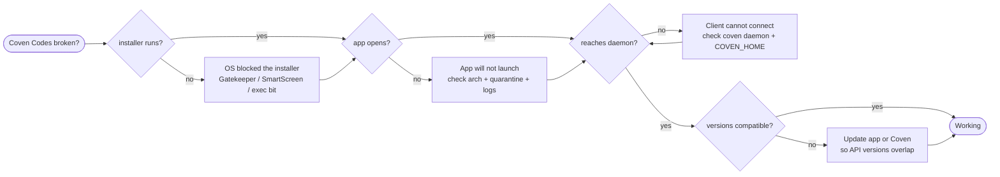

import { Callout } from 'fumadocs-ui/components/callout';

Coven Codes is a first-party desktop application, distributed as a published build rather than an npm package. Use this page when installing or opening the app did not produce a working workspace.

<Callout type="info" title="Verify the current release channel">
Coven Codes ships from [`OpenCoven/coven-codes` releases](https://github.com/OpenCoven/coven-codes/releases). Download the build that matches your OS and CPU, and confirm the current channel there before relying on any version-specific behavior.
</Callout>

Coven Codes is a client. It talks to the local `coven` daemon over the Unix socket at `~/.coven/coven.sock`, the same boundary every other client uses. It does not bypass daemon validation, and it should stay useful with clear fallback states even when Coven is not installed. Two failure classes matter here: the **app itself** will not install or launch, and the app launches but **cannot reach the daemon**.

## Install Decision Flow



## Fast Triage

| Symptom | Likely cause | Fix |
| --- | --- | --- |
| Installer is blocked or "damaged" | OS gatekeeping on an unsigned/quarantined download | Allow the app in OS security settings; re-download over HTTPS from Releases. |
| App icon appears but nothing opens | Wrong CPU build, or the download is quarantined | Install the build for your architecture; clear the quarantine attribute. |
| App opens but shows no sessions / "daemon unavailable" | The `coven` daemon is stopped, or the app uses a different `COVEN_HOME` | `coven daemon start`; make sure the app and CLI share the same `COVEN_HOME`. |
| App works but launch/kill/input is refused | Expected — the daemon is the authority | Check session liveness with `coven sessions --all`; the daemon validates every sensitive request. |
| Features missing or API errors | App and daemon expose non-overlapping API versions | Update Coven Codes or the CLI so supported versions overlap. |

## Installer Is Blocked

Because the app is downloaded rather than installed from a package registry, the OS may gate the first launch.

### macOS

If macOS reports the app is damaged or from an unidentified developer, it is quarantined. Open it once from Finder with **Control-click → Open**, or allow it under **System Settings → Privacy & Security**. Re-download over HTTPS if the file may be corrupted.

### Windows

If SmartScreen blocks the installer, choose **More info → Run anyway** for a build you downloaded yourself from Releases. Prefer the signed installer when one is published.

### Linux

For an `AppImage`, make it executable before running it:

```sh
chmod +x CovenCodes-*.AppImage
./CovenCodes-*.AppImage
```

If the AppImage will not start, confirm FUSE is available on your distribution, or extract and run it with `--appimage-extract`. For a `.deb`/`.rpm`, install it with your system package manager instead.

## App Will Not Launch

If the installer succeeded but the app does not open:

- Confirm you installed the build for your CPU architecture (for example, Apple Silicon vs Intel on macOS).
- On macOS, clear a stuck quarantine attribute on the installed app bundle:

  ```sh
  xattr -dr com.apple.quarantine "/Applications/Coven Codes.app"
  ```

- Re-download from Releases if the file may be truncated or corrupted, and reinstall.

## App Cannot Reach The Daemon

If Coven Codes opens but shows no sessions or reports the daemon is unavailable, the problem is the client-to-daemon link, not the install. Verify the daemon from a terminal:

```sh
coven doctor
coven daemon status
coven daemon start
```

<Callout type="warn" title="The app and CLI must share COVEN_HOME">
Coven Codes connects to the socket under `COVEN_HOME` (default `~/.coven`, socket `~/.coven/coven.sock`). If the CLI uses a custom `COVEN_HOME` that the app does not, they will not see the same daemon or sessions. Point both at the same path.
</Callout>

Coven Codes is designed to stay useful when Coven is not installed — it should present a clear "install Coven" state rather than failing silently. If you see that state, the app is working; install or start Coven to connect. See [Install Coven](/docs/guide/install).

## Version Or API Mismatch

Clients and the daemon negotiate a supported API version (`/api/v1`). If the app is much newer or older than the installed CLI/daemon, some features can be rejected. Update whichever side is behind so their supported versions overlap. See [API Version Rejected](/docs/reference/troubleshooting#api-version-rejected).

## Evidence To Collect

For a support report, include:

- The Coven Codes version and the release you downloaded, plus your OS and CPU architecture.
- Whether the failure is install, launch, or daemon connectivity.
- The output of `coven doctor` and `coven daemon status`.
- Whether the app and CLI use the same `COVEN_HOME`.

Do not paste secrets or private paths into a report. To remove the app, see [Uninstall](/docs/coven-codes/uninstall).
