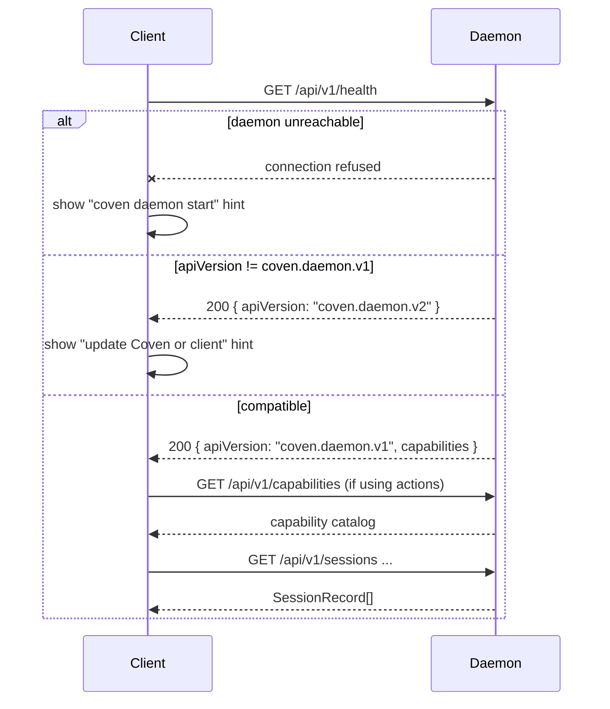
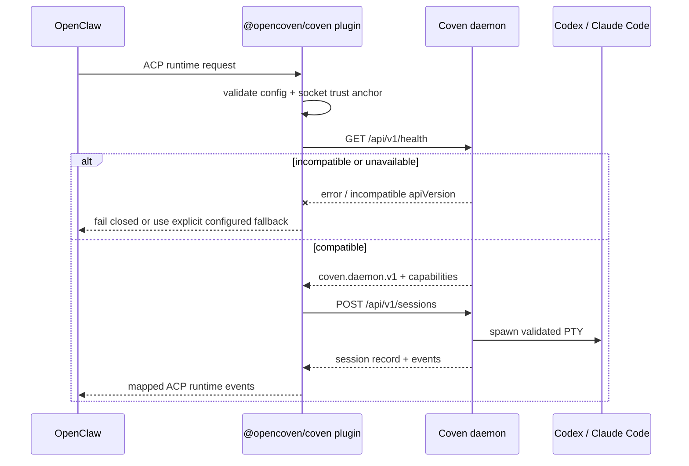

import { DocsDataTable } from '@/components/docs-data-table';

Coven is a runtime substrate. Clients should present, route, and observe work without taking over the authority boundary.

## Integration Rule

Talk to Coven through the local socket API. Do not duplicate Coven's path, harness, live-session, or deletion policy in a way that can drift from the daemon.

Recommended handshake:

1. Call `GET /api/v1/health`.
2. Confirm `apiVersion === "coven.daemon.v1"` and the needed `capabilities` fields are available.
3. Call `GET /api/v1/capabilities` if using control-plane actions.
4. Use versioned `/api/v1/...` routes only.



Clients should treat the handshake as **mandatory before any other request**. Skipping it means depending on undefined response shapes from a future daemon version.

## Client Responsibilities

<DocsDataTable
  caption="Client-owned UX surfaces and daemon-owned enforcement surfaces"
  searchPlaceholder="Filter responsibility surfaces..."
  columns={[
    { key: 'surface', label: 'Surface' },
    { key: 'owner', label: 'Owner', filter: true },
    { key: 'group', label: 'Group', filter: true },
    { key: 'implementation', label: 'Implementation posture' },
  ]}
  rows={[
    { surface: 'Navigation', owner: 'Client-owned', group: 'Shell', implementation: 'Clients can decide information architecture, routing, and page transitions.' },
    { surface: 'Panes', owner: 'Client-owned', group: 'Workspace UI', implementation: 'Clients can arrange session panes, inspectors, and review surfaces.' },
    { surface: 'Chat or intake UI', owner: 'Client-owned', group: 'Input', implementation: 'Clients can collect user intent before sending an explicit daemon request.' },
    { surface: 'Task forms', owner: 'Client-owned', group: 'Input', implementation: 'Clients can shape structured prompts, project choices, and launch options.' },
    { surface: 'Diff and review surfaces', owner: 'Client-owned', group: 'Review', implementation: 'Clients can make outputs inspectable before merge, PR, archive, or cleanup actions.' },
    { surface: 'Notification rendering', owner: 'Client-owned', group: 'Status', implementation: 'Clients can translate daemon events into local notifications and badges.' },
    { surface: 'Session selection', owner: 'Client-owned', group: 'Workspace UI', implementation: 'Clients can choose which daemon sessions to list, pin, open, or hide.' },
    { surface: 'Optimistic local UI state', owner: 'Client-owned', group: 'Status', implementation: 'Clients can show pending states, but must reconcile against daemon events.' },
    { surface: 'User approval UX', owner: 'Client-owned', group: 'Approvals', implementation: 'Clients can present approvals clearly; the daemon still owns sensitive enforcement.' },
    { surface: 'Project-root boundaries', owner: 'Daemon-enforced', group: 'Filesystem policy', implementation: 'The Rust daemon must canonicalize and reject widened project roots.' },
    { surface: 'cwd restrictions', owner: 'Daemon-enforced', group: 'Filesystem policy', implementation: 'The daemon must prove cwd resolves inside the approved project root.' },
    { surface: 'Harness allowlists', owner: 'Daemon-enforced', group: 'Harness policy', implementation: 'Unsupported harness ids fail closed even if a client presents them.' },
    { surface: 'Live-session checks', owner: 'Daemon-enforced', group: 'Session policy', implementation: 'Input and kill requests require daemon-verified live session state.' },
    { surface: 'Destructive deletion rules', owner: 'Daemon-enforced', group: 'Session policy', implementation: 'Running sessions cannot be permanently deleted by client-side confidence alone.' },
    { surface: 'Socket trust', owner: 'Daemon-enforced', group: 'Transport policy', implementation: 'Clients validate the local socket anchor; daemon-side home ownership remains authoritative.' },
    { surface: 'External action approvals', owner: 'Daemon-enforced', group: 'Approvals', implementation: 'Actions that leave the machine need explicit policy and approval handling.' },
  ]}
/>

## CastCodes and Cast Agent

CastCodes is the first-party workspace layer. Cast Agent is the Coven-native substrate manager and agent backend inside that workspace.

<DocsDataTable
  caption="CastCodes and Cast Agent responsibilities"
  searchPlaceholder="Filter CastCodes responsibilities..."
  columns={[
    { key: 'capability', label: 'Capability' },
    { key: 'group', label: 'Group', filter: true },
    { key: 'dataSource', label: 'Data source', filter: true },
    { key: 'clientBehavior', label: 'Client behavior' },
  ]}
  rows={[
    { capability: 'List Coven sessions', group: 'Session discovery', dataSource: 'Daemon or CLI JSON', clientBehavior: 'Show active work without becoming the source of truth.' },
    { capability: 'Launch sessions from visible project/worktree context', group: 'Launch', dataSource: 'Daemon API', clientBehavior: 'Pass explicit project root, cwd, harness id, and prompt to the daemon.' },
    { capability: 'Open sessions in panes', group: 'Workspace UI', dataSource: 'Client state', clientBehavior: 'Render live or replayed work inside visible panes.' },
    { capability: 'Attach or rejoin live work', group: 'Session control', dataSource: 'Daemon API', clientBehavior: 'Offer attachment only after daemon liveness checks.' },
    { capability: 'Collect substrate', group: 'Context', dataSource: 'Cast Agent', clientBehavior: 'Collect active file, panes, cwd, git branch, and diagnostics without turning context into authority.' },
    { capability: 'Stream gateway responses', group: 'Agent runtime', dataSource: 'Coven Gateway', clientBehavior: 'Render streaming responses while keeping daemon-backed session operations separate.' },
    { capability: 'Show logs and artifacts', group: 'Review', dataSource: 'Event log', clientBehavior: 'Make completed work inspectable after process exit or daemon restart.' },
    { capability: 'Review diffs', group: 'Review', dataSource: 'Repository state', clientBehavior: 'Keep file changes visible before merge or cleanup actions.' },
    { capability: 'Merge, PR, archive, or clean up explicitly', group: 'Completion flow', dataSource: 'Client commands plus daemon state', clientBehavior: 'Require explicit user action for state-changing workflow steps.' },
  ]}
/>

CastCodes should remain useful when Coven is not installed. If Coven is missing, present clear installation and fallback states instead of assuming the daemon exists.

Cast Codes are portable intent syntax that CastCodes and Cast Agent can parse. They are not permission grants; daemon validation still decides whether a launch, input, kill, action, archive, summon, or sacrifice request is allowed.

## OpenClaw Plugin

OpenClaw integration belongs in the external `@opencoven/coven` package, not OpenClaw core. Treat this as the supported bridge direction, not permission to move Coven code into OpenClaw or to bypass the local daemon.

The package installs an opt-in OpenClaw plugin with plugin id `opencoven-coven` and ACP backend id `coven`. The intended install path is through ClawHub:

```sh
openclaw plugins install clawhub:@opencoven/coven
```

For local development from the Coven repo:

```sh
openclaw plugins install ./packages/openclaw-coven --force
```

The bridge is a client of Coven. Its first runtime step should be the same as every other client: connect to the configured local socket, call `GET /api/v1/health`, verify `apiVersion === "coven.daemon.v1"`, then depend only on documented `/api/v1` behavior.



<DocsDataTable
  caption="OpenClaw plugin contract"
  searchPlaceholder="Filter plugin contract rows..."
  columns={[
    { key: 'expectation', label: 'Expectation' },
    { key: 'posture', label: 'Posture', filter: true },
    { key: 'boundary', label: 'Boundary', filter: true },
    { key: 'reason', label: 'Reason' },
  ]}
  rows={[
    { expectation: 'Register an optional Coven backend', posture: 'Do', boundary: 'Integration', reason: 'OpenClaw can opt into Coven without making Coven a core dependency.' },
    { expectation: 'Require explicit plugin/backend selection', posture: 'Do', boundary: 'Configuration', reason: 'The bridge should be intentional, visible, and reversible.' },
    { expectation: 'Validate config for UX', posture: 'Do', boundary: 'Client experience', reason: 'Fast feedback belongs in the plugin, but it is not enforcement.' },
    { expectation: 'Connect to the local socket', posture: 'Do', boundary: 'Transport', reason: 'The socket API is the supported compatibility layer.' },
    { expectation: 'Handshake with GET /api/v1/health before launch', posture: 'Do', boundary: 'API compatibility', reason: 'apiVersion and capabilities decide whether the plugin can safely operate.' },
    { expectation: 'Launch sessions through POST /api/v1/sessions', posture: 'Do', boundary: 'Launch authority', reason: 'The daemon must own project, cwd, harness, and liveness validation.' },
    { expectation: 'Map Coven events into OpenClaw runtime events', posture: 'Do', boundary: 'Runtime bridge', reason: 'OpenClaw should observe and present Coven work without hiding provenance.' },
    { expectation: 'Preserve fallback behavior only when explicitly configured', posture: 'Do', boundary: 'Operational fallback', reason: 'Fallbacks should be deliberate, visible, and testable.' },
    { expectation: 'Treat the Rust daemon as launch authority', posture: 'Do', boundary: 'Policy', reason: 'Client integration cannot replace daemon-side checks.' },
    { expectation: 'Bypass the daemon for launches', posture: 'Do not', boundary: 'Launch authority', reason: 'Direct harness launches recreate the policy drift Coven exists to prevent.' },
    { expectation: 'Depend on OpenClaw core internals', posture: 'Do not', boundary: 'Package design', reason: 'The bridge should remain external and replaceable.' },
    { expectation: 'Store provider credentials', posture: 'Do not', boundary: 'Credentials', reason: 'Provider authentication stays in each harness provider flow.' },
    { expectation: 'Assume unversioned routes are stable', posture: 'Do not', boundary: 'API compatibility', reason: 'Clients should target the versioned local contract.' },
    { expectation: 'Widen project-root permissions', posture: 'Do not', boundary: 'Filesystem policy', reason: 'Only daemon validation can decide the actual launch boundary.' },
  ]}
/>

Compatibility is the stability gate. The plugin source lives with the Coven daemon so fixture-backed tests can change in the same work slice as API-affecting daemon changes. When `/api/v1/health`, `/api/v1/sessions`, `/api/v1/events`, input, or kill behavior changes, update the bridge fixtures and compatibility tests before claiming broad plugin stability.

The current bridge scope is Codex and Claude Code. Future harness ids must be explicitly configured only after the Rust daemon supports and validates them. The plugin should not expose OpenClaw tools to Coven-managed harnesses, store provider credentials, or tunnel the raw Coven socket through TCP, browser, mobile, or remote transports.

## Intake Surfaces

Intake clients are best treated as presentation layers.

<DocsDataTable
  caption="Intake surface responsibilities"
  searchPlaceholder="Filter intake responsibilities..."
  columns={[
    { key: 'responsibility', label: 'Responsibility' },
    { key: 'group', label: 'Group', filter: true },
    { key: 'boundary', label: 'Boundary' },
  ]}
  rows={[
    { responsibility: 'Capture user intent', group: 'Input', boundary: 'Collect the task, then hand off to Coven instead of becoming the runtime.' },
    { responsibility: 'Show local status', group: 'Status', boundary: 'Reflect daemon and client state clearly.' },
    { responsibility: 'Present approvals', group: 'Approvals', boundary: 'Make consent explicit before sensitive local or external actions.' },
    { responsibility: 'Display notifications', group: 'Status', boundary: 'Surface session changes without inventing state.' },
    { responsibility: 'Hand work into Coven', group: 'Launch', boundary: 'Use daemon APIs for project-scoped execution.' },
    { responsibility: 'Show session updates from Coven', group: 'Observation', boundary: 'Render daemon events and session records as the source of truth.' },
  ]}
/>

Avoid making intake clients the automation engine. Reusable automation should live behind Coven capabilities and actions so the policy boundary stays centralized.

## Desktop Clients and Control Rooms

A native control room can make Coven easier to operate by showing the operational surface in one place.

[**Cave**](/docs/guide/cave) is the first-party desktop control room. It is a Tauri 2 + Next.js application (macOS / Windows / Linux) for talking to familiars, watching tools, inspecting memory, and following session events. Cave talks to the local daemon over the same socket API as every other client; it does not bypass authority.

The patterns below describe the general control-room contract — Cave follows it, and third-party desktop clients should follow it too.

<DocsDataTable
  caption="Control room surfaces"
  searchPlaceholder="Filter control room surfaces..."
  columns={[
    { key: 'surface', label: 'Surface' },
    { key: 'group', label: 'Group', filter: true },
    { key: 'source', label: 'Source', filter: true },
    { key: 'purpose', label: 'Purpose' },
  ]}
  rows={[
    { surface: 'Active sessions', group: 'Sessions', source: 'Daemon or CLI JSON', purpose: 'Show live and recent work that can be opened or inspected.' },
    { surface: 'Archived sessions', group: 'Sessions', source: 'Daemon or CLI JSON', purpose: 'Recover preserved work without crowding the active list.' },
    { surface: 'Daemon health', group: 'Runtime', source: 'Health endpoint', purpose: 'Expose availability, API version, and capability readiness.' },
    { surface: 'Project roots', group: 'Runtime', source: 'Daemon records', purpose: 'Make launch boundaries visible before work starts.' },
    { surface: 'Harness availability', group: 'Harnesses', source: 'Doctor or capabilities', purpose: 'Show which CLIs are installed, authenticated, and launchable.' },
    { surface: 'Client integrations', group: 'Clients', source: 'Config and capability records', purpose: 'Make connected tools and bridges inspectable.' },
    { surface: 'Capability catalog', group: 'Control plane', source: 'Capabilities endpoint', purpose: 'Show supported actions without hardcoding client assumptions.' },
    { surface: 'Action approval queue', group: 'Approvals', source: 'Control plane', purpose: 'Keep sensitive pending actions reviewable.' },
    { surface: 'Logs and traces', group: 'Observability', source: 'Event log', purpose: 'Preserve what happened across process exits and daemon restarts.' },
    { surface: 'Docs and troubleshooting links', group: 'Support', source: 'Docs site', purpose: 'Route users from a broken state to the next useful action.' },
  ]}
/>

Use `coven sessions --json` for active sessions and `coven sessions --json --all` when the client needs archived records too. The CLI returns a top-level object with a `sessions` array, and each record uses the same `SessionRecord` field names exposed by the daemon API, including `project_root`, `status`, `created_at`, `updated_at`, and nullable `archived_at`.

The control room should still use the same socket API and capability handshake as other clients.

## Desktop Automation Adapters

Desktop automation is useful when an app has no clean API. It is also powerful enough to need clear policy.

Recommended pattern:

```text
user request
  -> client captures intent
  -> Coven exposes capability and policy hints
  -> client asks for approval when required
  -> Coven routes a known action id
  -> adapter performs the local UI action
  -> event/result returns to the client
```

Do not let UI clients bind directly to OS automation libraries and then call that "Coven integration." The reusable boundary should be Coven's control plane.

## Compatibility Expectations

<DocsDataTable
  caption="Client compatibility expectations"
  searchPlaceholder="Filter compatibility expectations..."
  columns={[
    { key: 'rule', label: 'Rule' },
    { key: 'riskArea', label: 'Risk area', filter: true },
    { key: 'clientBehavior', label: 'Client behavior' },
  ]}
  rows={[
    { rule: 'Use /api/v1', riskArea: 'API versioning', clientBehavior: 'Route all supported calls through the versioned local contract.' },
    { rule: 'Call health first', riskArea: 'Handshake', clientBehavior: 'Confirm daemon availability and compatible apiVersion before other requests.' },
    { rule: 'Ignore unknown additive fields when safe', riskArea: 'Forward compatibility', clientBehavior: 'Avoid breaking when the daemon adds optional response data.' },
    { rule: 'Fail closed on unknown required behavior', riskArea: 'Safety', clientBehavior: 'Do not guess when a new daemon response changes required semantics.' },
    { rule: 'Test against representative daemon responses', riskArea: 'Compatibility tests', clientBehavior: 'Keep bridge behavior pinned to real response shapes.' },
    { rule: 'Update docs/API-CONTRACT.md when response shapes change', riskArea: 'Contract drift', clientBehavior: 'Document API-affecting daemon changes in the same work slice.' },
  ]}
/>

## Error Handling

A good client should translate daemon errors into action-oriented UI.

<DocsDataTable
  caption="Daemon error handling matrix"
  searchPlaceholder="Filter error handling paths..."
  columns={[
    { key: 'condition', label: 'Condition' },
    { key: 'category', label: 'Category', filter: true },
    { key: 'clientResponse', label: 'Client response' },
  ]}
  rows={[
    { condition: 'Daemon unavailable', category: 'Runtime', clientResponse: 'Show start or restart instructions.' },
    { condition: 'Unsupported API version', category: 'Compatibility', clientResponse: 'Ask the user to update Coven or the client.' },
    { condition: 'Missing harness', category: 'Harnesses', clientResponse: 'Show coven doctor guidance and install/auth hints.' },
    { condition: 'outside-root cwd', category: 'Filesystem policy', clientResponse: 'Explain the project boundary and offer a valid cwd choice.' },
    { condition: 'Session not live', category: 'Session policy', clientResponse: 'Offer log viewing instead of live input.' },
    { condition: 'Destructive action blocked', category: 'Session policy', clientResponse: 'Explain that the session is running or lacks confirmation.' },
  ]}
/>
