import { DocsDataTable } from '@/components/docs-data-table';
import { Mermaid } from '@/components/mermaid';

# Harness Adapter Guide

Coven v0 supports Codex and Claude Code. This guide describes the current adapter shape and the bar for adding more harnesses.

For install, provider-auth, project-root, and per-harness operational details, see the first-class [Harnesses deep dives](/docs/harnesses/what-is-a-harness).

## Current Adapter Shape

A built-in harness adapter defines a compact launch contract.

<DocsDataTable
  caption="Harness adapter fields"
  searchPlaceholder="Filter adapter fields..."
  columns={[
    { key: 'field', label: 'Field' },
    { key: 'purpose', label: 'Purpose' },
    { key: 'consumer', label: 'Consumer', filter: true },
  ]}
  rows={[
    { field: 'Stable Coven harness id', purpose: 'Names the adapter in CLI and API requests.', consumer: 'CLI/API' },
    { field: 'User-facing label', purpose: 'Gives clients a readable display name.', consumer: 'Client UI' },
    { field: 'Executable name', purpose: 'Lets `coven doctor` detect the CLI on `PATH`.', consumer: 'Doctor' },
    { field: 'Interactive prompt args', purpose: 'Defines the fixed argv prefix for live PTY sessions.', consumer: 'Launcher' },
    { field: 'Non-interactive prompt args', purpose: 'Defines the fixed argv prefix for one-shot output capture.', consumer: 'Launcher' },
    { field: 'Install/authentication hint', purpose: 'Explains the next setup step when detection fails.', consumer: 'Doctor' },
  ]}
/>

The current implementation expects the prompt to be the final command argument after any fixed prefix args.

## Built-in Harnesses

<DocsDataTable
  caption="Built-in harness adapters"
  searchPlaceholder="Filter built-in harnesses..."
  columns={[
    { key: 'harness', label: 'Harness', filter: true },
    { key: 'id', label: 'Harness id' },
    { key: 'executable', label: 'Executable' },
    { key: 'interactiveArgs', label: 'Interactive prefix args' },
    { key: 'nonInteractiveArgs', label: 'Non-interactive prefix args' },
    { key: 'setup', label: 'Setup hint' },
  ]}
  rows={[
    { harness: 'Codex', id: '`codex`', executable: '`codex`', interactiveArgs: 'None', nonInteractiveArgs: '`exec --skip-git-repo-check --color never`', setup: '`npm install -g @openai/codex`; `codex login`' },
    { harness: 'Claude Code', id: '`claude`', executable: '`claude`', interactiveArgs: 'None', nonInteractiveArgs: '`--print`', setup: '`npm install -g @anthropic-ai/claude-code`; `claude doctor`' },
  ]}
/>

## Compatibility Matrix

<DocsDataTable
  caption="Harness compatibility expectations"
  searchPlaceholder="Filter compatibility expectations..."
  columns={[
    { key: 'surface', label: 'Surface' },
    { key: 'codex', label: 'Codex (`codex`)' },
    { key: 'claude', label: 'Claude Code (`claude`)' },
    { key: 'newHarnessRequirement', label: 'Requirement for another harness' },
  ]}
  rows={[
    { surface: 'Provider auth', codex: '`codex login`; Coven does not read tokens.', claude: '`claude doctor`; Coven does not read tokens.', newHarnessRequirement: 'Auth remains provider-owned. No API key, OAuth token, account id, or org id is added to Coven requests.' },
    { surface: 'Command construction', codex: 'Program `codex`; prompt is an argv element after fixed prefix args.', claude: 'Program `claude`; prompt is an argv element after fixed prefix args.', newHarnessRequirement: 'Build with argv APIs only. No prompt execution through `sh -c` or equivalent shell interpolation.' },
    { surface: 'Project root and cwd', codex: 'Daemon validates `projectRoot` and `cwd` before launch.', claude: 'Daemon validates `projectRoot` and `cwd` before launch.', newHarnessRequirement: 'Launch must fail closed when cwd resolves outside the project root.' },
    { surface: 'PTY lifecycle', codex: 'Daemon spawns and owns the PTY, input writer, and killer handle.', claude: 'Daemon spawns and owns the PTY, input writer, and killer handle.', newHarnessRequirement: 'Adapter must work under daemon-owned PTY supervision and return clear spawn failures.' },
    { surface: 'Event replay', codex: 'Output and exit data are appended to the SQLite event log.', claude: 'Output and exit data are appended to the SQLite event log.', newHarnessRequirement: 'Output must be replayable through `GET /api/v1/events` and `coven attach` after process exit.' },
    { surface: 'Live input', codex: '`POST /api/v1/sessions/:id/input` writes `{ data }` to the live PTY.', claude: '`POST /api/v1/sessions/:id/input` writes `{ data }` to the live PTY.', newHarnessRequirement: 'Live input must either work through the daemon PTY writer or be explicitly documented as unsupported before public support.' },
    { surface: 'Live kill', codex: '`POST /api/v1/sessions/:id/kill` uses the daemon killer handle and records `killed`.', claude: '`POST /api/v1/sessions/:id/kill` uses the daemon killer handle and records `killed`.', newHarnessRequirement: 'Kill must terminate only a daemon-verified running session and return `409 session_not_live` otherwise.' },
    { surface: 'Client compatibility', codex: 'Covered by API/session docs and local smoke coverage.', claude: 'Covered by API/session docs and local smoke coverage.', newHarnessRequirement: 'Update docs, daemon tests, smoke coverage, and client/plugin compatibility fixtures before advertising support.' },
  ]}
/>

## Current, Future, and Unsupported Adapters

<DocsDataTable
  caption="Harness support status"
  searchPlaceholder="Filter harness support..."
  columns={[
    { key: 'name', label: 'Name' },
    { key: 'status', label: 'Status', filter: true },
    { key: 'reason', label: 'Reason' },
  ]}
  rows={[
    { name: '`codex`', status: 'Current', reason: 'Built-in adapter and harness id in the daemon.' },
    { name: '`claude`', status: 'Current', reason: 'Built-in adapter and harness id in the daemon.' },
    { name: 'Hermes', status: 'Future / planned', reason: 'Documented as a candidate, not a current daemon adapter.' },
    { name: 'Aider', status: 'Future / planned', reason: 'Documented as a candidate, not a current daemon adapter.' },
    { name: 'Gemini CLI', status: 'Future / planned', reason: 'Documented as a candidate, not a current daemon adapter.' },
    { name: 'OpenCode', status: 'Future / planned', reason: 'Documented as a candidate, not a current daemon adapter.' },
    { name: 'Custom local harness', status: 'Future / design', reason: 'Requires a policy and compatibility story before broad support.' },
    { name: 'OpenClaw', status: 'Not a Coven harness', reason: 'OpenClaw integration is an external client/plugin path through `@opencoven/coven`, not a daemon harness id.' },
    { name: 'Generic command adapter', status: 'Not supported in v0', reason: 'Arbitrary commands need explicit policy, approval, and audit behavior before they can be safe.' },
  ]}
/>

## Adapter Requirements

Before adding a new harness, confirm the readiness checks below.

<DocsDataTable
  caption="Adapter readiness requirements"
  searchPlaceholder="Filter adapter requirements..."
  columns={[
    { key: 'requirement', label: 'Requirement' },
    { key: 'riskArea', label: 'Risk area', filter: true },
    { key: 'acceptance', label: 'Acceptance signal' },
  ]}
  rows={[
    { requirement: 'CLI detection on `PATH`', riskArea: 'Setup', acceptance: '`coven doctor` can find the executable safely.' },
    { requirement: 'Prompt passed without shell interpolation', riskArea: 'Command safety', acceptance: 'Launcher builds argv directly and keeps the prompt as data.' },
    { requirement: 'Validated project cwd', riskArea: 'Filesystem policy', acceptance: 'The process starts only after project-root and cwd checks pass.' },
    { requirement: 'PTY/session event capture', riskArea: 'Observability', acceptance: 'Output and exit data become replayable session events.' },
    { requirement: 'Provider-owned authentication', riskArea: 'Credentials', acceptance: 'Login remains in the harness provider flow.' },
    { requirement: '`coven doctor` failure clarity', riskArea: 'Setup', acceptance: 'Missing auth or executable states include actionable hints.' },
    { requirement: 'Command and missing-executable tests', riskArea: 'Regression coverage', acceptance: 'Tests prove safe argv construction and understandable failures.' },
  ]}
/>

## What Not to Add Yet

Avoid generic arbitrary command adapters until Coven has explicit policy and approval behavior for them.

Arbitrary commands are more dangerous than named harness adapters because they can blur the difference between "run a coding agent in this project" and "execute whatever string a client sent." Keep v0 narrow.

## Future Harness Evaluation Checklist

For a candidate harness, document the evaluation packet.

<DocsDataTable
  caption="Future harness evaluation packet"
  searchPlaceholder="Filter evaluation fields..."
  columns={[
    { key: 'field', label: 'Field' },
    { key: 'group', label: 'Group', filter: true },
    { key: 'whyItMatters', label: 'Why it matters' },
  ]}
  rows={[
    { field: 'Install command', group: 'Setup', whyItMatters: 'Users need a repeatable path to get the CLI.' },
    { field: 'Executable name', group: 'Setup', whyItMatters: 'Doctor detection needs the exact binary name.' },
    { field: 'Local auth flow', group: 'Credentials', whyItMatters: 'Provider credentials must stay outside Coven.' },
    { field: 'One-shot prompt command', group: 'Launch shape', whyItMatters: 'Non-interactive runs need predictable output capture.' },
    { field: 'Interactive command', group: 'Launch shape', whyItMatters: 'Live PTY sessions need a stable argv shape.' },
    { field: 'Resume/session command', group: 'Session continuity', whyItMatters: 'Native upstream session ids may become useful metadata.' },
    { field: 'Non-interactive output mode', group: 'Output', whyItMatters: 'Clients need clean logs without terminal control noise.' },
    { field: 'stdin prompt injection requirement', group: 'Launch shape', whyItMatters: 'stdin prompts have different safety and replay behavior.' },
    { field: 'Color/control sequence controls', group: 'Output', whyItMatters: 'Replay and docs output should stay readable.' },
    { field: 'Shell quoting hazards', group: 'Command safety', whyItMatters: 'Adapters must avoid `sh -c` style prompt execution.' },
    { field: 'Known exit codes', group: 'Error handling', whyItMatters: 'Clients can translate failures into useful next steps.' },
    { field: 'Minimum safe smoke test', group: 'Regression coverage', whyItMatters: 'Public support needs proof beyond a maintainer machine.' },
  ]}
/>

## Session Identity Mapping

Some harnesses have their own upstream session ids. Coven's session id remains the local runtime id.

If upstream ids become useful, store them as metadata rather than replacing Coven's own id. Clients should be able to rely on a stable Coven id for attach, events, archive, summon, and sacrifice.

## Suggested Adapter Maturity Stages

<DocsDataTable
  caption="Adapter maturity stages"
  searchPlaceholder="Filter maturity stages..."
  columns={[
    { key: 'stage', label: 'Stage' },
    { key: 'name', label: 'Name' },
    { key: 'proof', label: 'Proof required' },
  ]}
  rows={[
    { stage: '1', name: 'Research note', proof: 'Document CLI shape and risks.' },
    { stage: '2', name: 'Command construction tests', proof: 'Prove argv construction is safe.' },
    { stage: '3', name: 'Doctor detection', proof: 'Add install and authentication hints.' },
    { stage: '4', name: 'Launch smoke', proof: 'Prove a session can run in a temporary project.' },
    { stage: '5', name: 'Attach/replay smoke', proof: 'Prove events can be replayed.' },
    { stage: '6', name: 'Client compatibility', proof: 'Update docs and integration tests.' },
  ]}
/>

Do not skip from research directly to public support.

```mermaid
flowchart LR
  S1["1. Research note\n(public CLI shape + risks)"] --> S2
  S2["2. argv construction tests\n(no shell, prompt last)"] --> S3
  S3["3. coven doctor detection\n(install + auth hints)"] --> S4
  S4["4. Launch smoke\n(temp project, fake creds)"] --> S5
  S5["5. Attach / replay smoke\n(events round-trip)"] --> S6
  S6["6. Client compatibility\n(CastCodes + plugin tests)"] --> Done(["Public support"])

  style S1 fill:#3D3547,stroke:#9A8ECD,color:#fff
  style S2 fill:#3D3547,stroke:#9A8ECD,color:#fff
  style S3 fill:#3D3547,stroke:#9A8ECD,color:#fff
  style S4 fill:#3D3547,stroke:#9A8ECD,color:#fff
  style S5 fill:#3D3547,stroke:#9A8ECD,color:#fff
  style S6 fill:#3D3547,stroke:#9A8ECD,color:#fff
  style Done fill:#9A8ECD,stroke:#D4B5FF,color:#1A1825
```

A harness skipping any stage is **not** ready for public support, even if it appears to work on a maintainer's machine.

## Harness Adapter Model

<Mermaid chart={`
flowchart LR
    Request["coven run / POST /api/v1/sessions"] --> Daemon["Coven daemon\nproject + cwd + harness validation"]
    Daemon --> Current["Current adapters"]
    Current --> Codex["codex\nCodex CLI"]
    Current --> Claude["claude\nClaude Code CLI"]
    Daemon -. future .-> Future["Future adapters\nHermes / Aider / Gemini / OpenCode / custom"]
    OpenClaw["OpenClaw"] --> Plugin["@opencoven/coven\nexternal client plugin"]
    Plugin --> Daemon

    style Daemon fill:#9A8ECD,stroke:#D4B5FF,color:#1A1825
    style Current fill:#3D3547,stroke:#9A8ECD,color:#fff
    style Future fill:#3D3547,stroke:#9A8ECD,color:#fff
`} />
