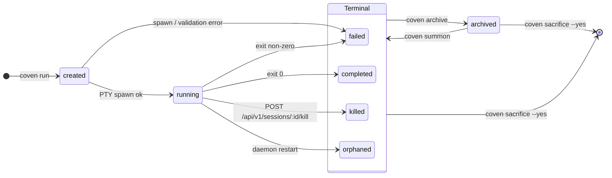
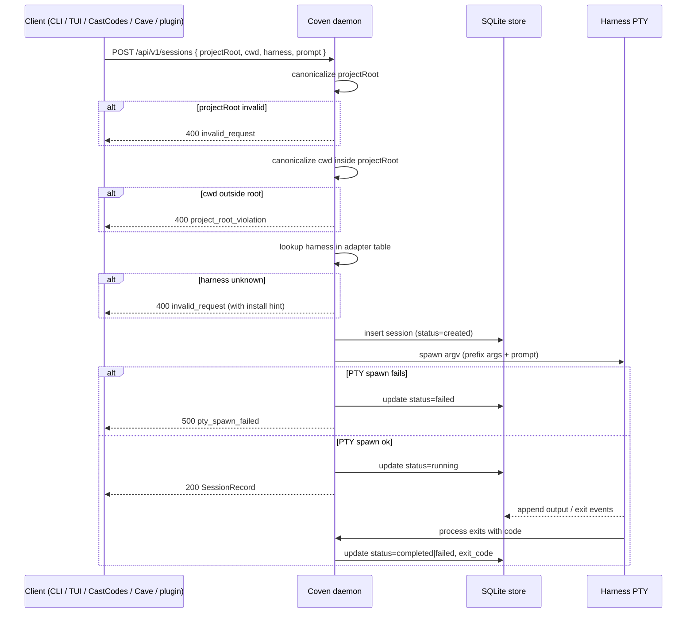

import { DocsDataTable } from '@/components/docs-data-table';

This document explains what happens from `coven run` through completion, replay, archive, summon, and deletion.

## Lifecycle States

The current store records session status as a string.

<DocsDataTable
  caption="Session lifecycle states"
  searchPlaceholder="Filter session states..."
  columns={[
    { key: 'state', label: 'State' },
    { key: 'category', label: 'Category', filter: true },
    { key: 'meaning', label: 'Meaning' },
  ]}
  rows={[
    { state: '`created`', category: 'Startup', meaning: 'The session record exists before live execution begins.' },
    { state: '`running`', category: 'Live', meaning: 'The harness process is active under daemon supervision.' },
    { state: '`completed`', category: 'Terminal', meaning: 'The harness exited successfully.' },
    { state: '`failed`', category: 'Terminal', meaning: 'Setup or launch failed before normal completion.' },
    { state: '`killed`', category: 'Terminal', meaning: 'The daemon accepted a live kill request and recorded a kill event.' },
    { state: '`orphaned`', category: 'Recovery', meaning: 'A previous daemon stopped while a session was still marked running.' },
  ]}
/>

Archive state is stored separately as `archived_at`. A completed or failed session can be hidden from the active list without changing its final status.



The diagram above is normative for the v0 store. `running` sessions cannot be archived or sacrificed directly — kill them or wait for exit first. `created → running` is the only transition that requires PTY spawn; every other transition is a store-only state change managed by the Rust daemon. `coven summon` restores an archived session to whichever terminal status it held before archival (`completed`, `failed`, `killed`, or `orphaned`).

## Launch Path

The normal launch flow keeps validation in the daemon.

<DocsDataTable
  caption="Session launch flow"
  searchPlaceholder="Filter launch steps..."
  columns={[
    { key: 'step', label: 'Step' },
    { key: 'owner', label: 'Owner', filter: true },
    { key: 'action', label: 'Action' },
  ]}
  rows={[
    { step: '1', owner: 'User or client', action: 'Sends a task through the CLI or local API.' },
    { step: '2', owner: 'Daemon', action: 'Resolves the project root.' },
    { step: '3', owner: 'Daemon', action: 'Canonicalizes the project root and working directory.' },
    { step: '4', owner: 'Daemon', action: 'Rejects outside-root working directories.' },
    { step: '5', owner: 'Daemon', action: 'Verifies the harness id is supported.' },
    { step: '6', owner: 'Store', action: 'Creates a session record in SQLite.' },
    { step: '7', owner: 'Daemon', action: 'Spawns the harness in a PTY using argv APIs.' },
    { step: '8', owner: 'Event log', action: 'Writes output and exit data as events.' },
    { step: '9', owner: 'Store', action: 'Updates session status and exit code.' },
  ]}
/>

The Rust layer performs the authority checks even when a TypeScript client has already validated the request for UX.



## Detached Records

`coven run ... --detach` creates the session record without launching the harness. This is useful for testing and development flows that need a ledger record without starting an external process.

Detached records should not be presented as completed agent work.

## Attach and Replay

`coven attach <session-id>` replays known event output and follows live output when the session is still active.

For a completed session, attach acts like a log viewer. For a running session, attach also forwards input to the live daemon session.

## Live Input And Kill

Live session control is available through the daemon API:

- `POST /api/v1/sessions/:id/input` with `{ "data": "..." }` forwards input to a verified `running` session and records an `input` event.
- `POST /api/v1/sessions/:id/kill` stops a verified `running` session, changes its status to `killed`, and records a `kill` event.

Both endpoints return `202 { "ok": true, "accepted": true }` on success. Unknown session ids return `404 session_not_found`. Existing sessions that are `completed`, `failed`, `killed`, archived, or `orphaned` return `409 session_not_live`; clients should show those records as replay/log surfaces instead of input targets.

## Session Browser Behavior

`coven sessions` chooses output mode based on context.

<DocsDataTable
  caption="Session browser output modes"
  searchPlaceholder="Filter session browser modes..."
  columns={[
    { key: 'mode', label: 'Mode' },
    { key: 'trigger', label: 'Trigger' },
    { key: 'behavior', label: 'Behavior' },
  ]}
  rows={[
    { mode: 'Interactive browser', trigger: 'Interactive terminal', behavior: 'Opens the session browser.' },
    { mode: 'Plain table', trigger: 'Piped output or `--plain`', behavior: 'Prints table output for copy/paste and scripts.' },
    { mode: 'JSON records', trigger: '`--json`', behavior: 'Prints machine-readable session records for local clients.' },
    { mode: 'Archived included', trigger: '`--all`', behavior: 'Includes archived sessions.' },
    { mode: 'Forced browser', trigger: '`--manage`', behavior: 'Forces the browser.' },
  ]}
/>

The browser offers contextual actions so users do not have to memorize session ids.

## Archive

Archive hides a non-running session from the default active list while preserving the session record and event log.

```sh
coven archive <session-id>
```

Use archive for old work that should remain inspectable.

## Summon

Summon restores an archived session to the active list and then replays/follows it:

```sh
coven summon <session-id>
```

Summon does not re-run the original harness prompt. It changes archive state and opens the existing record.

## Sacrifice

Sacrifice permanently deletes a non-running session and cascades deletion to its events:

```sh
coven sacrifice <session-id> --yes
```

The command refuses live sessions. The interactive browser asks the user to type `sacrifice` before deletion.

Use sacrifice only when the session and its logs should be removed from the local ledger.

## Orphan Recovery

If the daemon starts and finds sessions that were marked `running` from a previous daemon lifetime, those sessions are marked `orphaned`.

An orphaned session means Coven no longer owns a live process for that record. The event log may still be useful, but live input and kill operations should fail.

## Event Durability

Events are append-only records in SQLite. This gives clients a stable replay source even when the original PTY process has exited.

Do not intentionally write secrets, environment dumps, private URLs, or token-bearing command output into events. Coven cannot guarantee that harness output is secret-free, so users should avoid running untrusted prompts in sensitive repositories.

## Related

- [What is a familiar?](/docs/familiars/what-is-a-familiar) for how persistent familiars sit above individual sessions.
- [Rituals cheat sheet](/docs/cli/sessions#rituals-cheat-sheet) for the archive/summon/sacrifice command mapping.
- [Memory overview](/docs/memory-models/memory) for how session events become durable memory.

