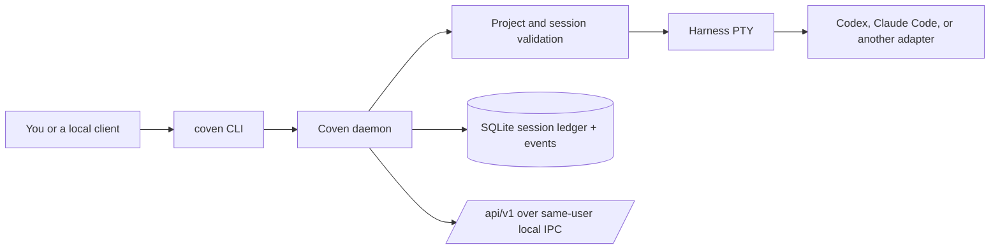

1. A CLI command or local client asks the daemon to create or inspect a session.
2. The daemon validates the project root, working directory, harness id, and session state.
3. It starts and supervises the harness in a PTY, recording lifecycle and output events.
4. The ledger preserves the record for attach, replay, archive, and diagnostics after the process exits.

The design is intentionally narrow: Coven is the durable local control plane for coding-agent work, while harnesses remain responsible for provider authentication and model behavior.

## Experimental agent filesystem foundation

Coven has an experimental SQLite-backed Agent File System storage crate. It can
model a copy-on-write filesystem delta over a read-only base, but it is not yet
part of the daemon's public session or API surface. It does not add a mount,
sandbox, network listener, or replacement for the current project-root and
Git/worktree safeguards.

Read [Agent filesystem](/docs/guide/agent-filesystem) for the implemented
storage boundary and the phased roadmap for mount, safety, daemon, and review
work.

For the operating model, read [Daemon](/docs/daemon). For integration details, read the [local API](/docs/reference/api).
