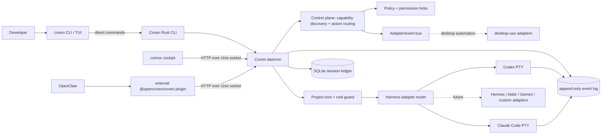
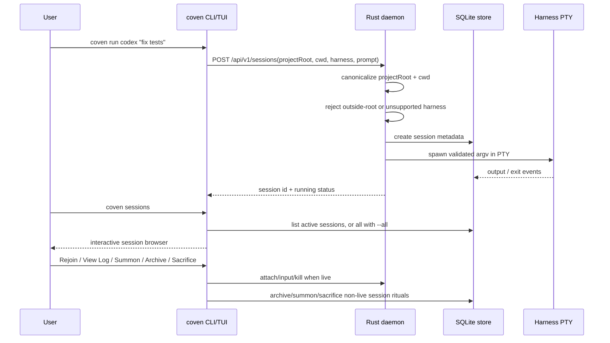
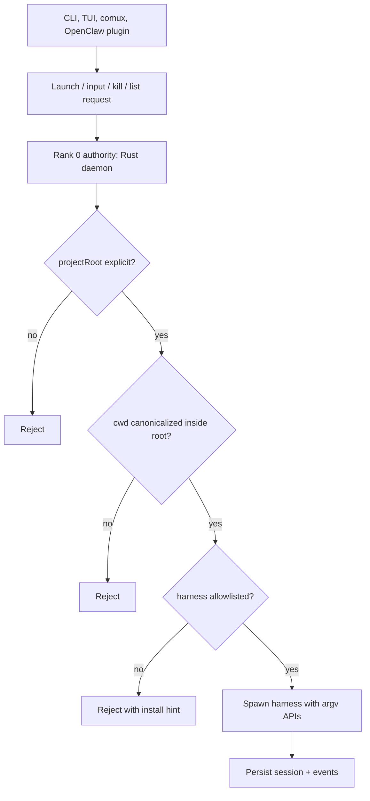

import { DocsDataTable } from '@/components/docs-data-table';
import { Mermaid } from '@/components/mermaid';

## System Overview

<Mermaid chart={`
flowchart TD
    U[You] -->|message| CH[Channel\nTelegram / Discord / iMessage]
    CH --> FAM[Familiar\nNova, Sage, Echo...]
    FAM --> HAR[Harness\nOpenClaw / Claude Code / Codex]
    FAM --> MEM[(Memory\nfiles + vectors)]
    HAR --> TOOLS[Tools\nweb_search / exec / calendar]
    HAR --> MODEL[AI Model\ngpt-5.5 / claude-sonnet]
    FAM -->|delegate| SUB[Subagent\nCody / Kitty]
    SUB --> HAR
`} />

read_when:
  - Understanding the Coven runtime topology
  - Designing a client around the local socket API
description: "How the Coven Rust daemon, CLI, TUI, comux cockpit, and OpenClaw plugin compose around the local socket API, PTY adapters, and event store."

# Coven Architecture

Coven is a local-first harness substrate. The Rust CLI/daemon is the authority layer; clients such as the CLI TUI, comux, and the optional OpenClaw plugin are presentation/integration layers.

The versioned local socket API contract lives in [`docs/API-CONTRACT.md`](/API-CONTRACT). Clients should use `GET /api/v1/health` and negotiate against `apiVersion: "coven.daemon.v1"` and the `capabilities` object before depending on session or event response shapes. All error responses use the structured `{ error: { code, message, details } }` envelope documented there.

## Runtime Topology



## Session Lifecycle



## Authority Boundary



## Automation Boundary

Coven is the canonical shared local runtime for reusable automation because it centralizes the authority surfaces below.

<DocsDataTable
  caption="Automation authority surfaces"
  searchPlaceholder="Filter automation surfaces..."
  columns={[
    { key: 'surface', label: 'Surface' },
    { key: 'group', label: 'Group', filter: true },
    { key: 'reason', label: 'Reason' },
  ]}
  rows={[
    { surface: 'Daemon/process ownership', group: 'Runtime', reason: 'One process owns launch, liveness, input, and kill decisions.' },
    { surface: 'Policy and permission decisions', group: 'Policy', reason: 'Sensitive choices fail closed at the daemon boundary.' },
    { surface: 'Config/profile storage', group: 'State', reason: 'Clients read state instead of inventing drift-prone local copies.' },
    { surface: 'Capability discovery', group: 'Control plane', reason: 'Clients can show only supported actions.' },
    { surface: 'Action routing and event emission', group: 'Control plane', reason: 'Adapter actions stay inspectable and replayable.' },
    { surface: 'Adapter ownership', group: 'Adapters', reason: 'Accessibility, AppleScript, keyboard/mouse, window, filesystem, clipboard, and app-specific bridges stay behind Coven.' },
  ]}
/>

The intended flow is:

```text
user -> client -> Coven -> adapters -> desktop/apps
desktop/apps -> Coven -> client UI updates
```

`GET /api/v1/capabilities` lets clients discover what Coven can route. `POST /api/v1/actions` gives clients a stable intent envelope without coupling them directly to brittle OS automation APIs.

## Future Adapter Boundary

Coven's current public runtime is single-harness per session. The daemon already keeps the right lower-level boundary for future coordination work: clients can discover capabilities, launch known harnesses, read events, and preserve project-root enforcement in Rust.

Do not document future orchestration commands as user-facing until they exist in the CLI and socket API. Future coordination layers should build above the current session/event contract without bypassing daemon validation.


## Current User-facing Surface

<DocsDataTable
  caption="Current user-facing commands"
  searchPlaceholder="Filter command surfaces..."
  columns={[
    { key: 'surface', label: 'Surface' },
    { key: 'category', label: 'Category', filter: true },
    { key: 'behavior', label: 'Behavior' },
  ]}
  rows={[
    { surface: '`coven` and `coven tui`', category: 'Entry point', behavior: 'Open the beginner-friendly slash-command palette.' },
    { surface: '`coven doctor`', category: 'Diagnostics', behavior: 'Checks store/project/harness readiness and prints next steps.' },
    { surface: '`coven daemon start/status/restart/stop`', category: 'Daemon', behavior: 'Manages the local daemon.' },
    { surface: '`coven run codex|claude <prompt>`', category: 'Launch', behavior: 'Launches a project-scoped PTY session.' },
    { surface: '`coven sessions`', category: 'Sessions', behavior: 'Opens the human session browser; `--plain` keeps scriptable output.' },
    { surface: 'Session browser actions', category: 'Sessions', behavior: 'Surfaces **Rejoin**, **View Log**, **Summon**, **Archive**, and **Sacrifice**.' },
    { surface: '`coven attach|summon|archive|sacrifice <session-id>`', category: 'Sessions', behavior: 'Keeps explicit lower-level verbs available for scripts and copy/paste workflows.' },
  ]}
/>

## Distribution Snapshot

The npm wrapper packages are published for early adopters.

<DocsDataTable
  caption="Published npm packages"
  searchPlaceholder="Filter packages..."
  columns={[
    { key: 'package', label: 'Package' },
    { key: 'target', label: 'Target', filter: true },
    { key: 'role', label: 'Role' },
  ]}
  rows={[
    { package: '`@opencoven/cli`', target: 'Universal wrapper', role: 'User-facing install entrypoint.' },
    { package: '`@opencoven/cli-macos`', target: 'macOS', role: 'Platform binary package.' },
    { package: '`@opencoven/cli-linux-x64`', target: 'Linux x64', role: 'Platform binary package.' },
    { package: '`@opencoven/cli-windows`', target: 'Windows x64', role: 'Platform binary package.' },
  ]}
/>

The source package versions stay template-like in the repo; release workflow dispatch supplies the published version and builds platform packages. Check the npm registry and GitHub releases before making version-specific release claims.
