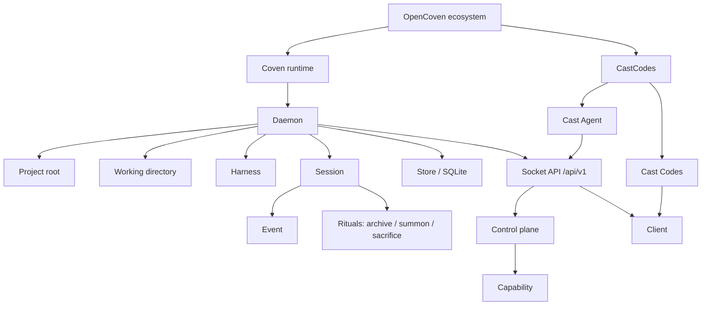

import { DocsDataTable } from '@/components/docs-data-table';
import { Mermaid } from '@/components/mermaid';

title: "Coven concepts and terminology"
summary: "Definitions for the nouns Coven uses across CastCodes, Cast Agent, CLI, daemon, API, and clients: harnesses, sessions, projects, rituals, summon, and sacrifice."
read_when:
  - Learning the Coven vocabulary
  - Mapping product terms to daemon and CLI behavior
description: "Definitions for the nouns Coven uses across CastCodes, Cast Agent, CLI, daemon, API, and clients: harnesses, sessions, projects, rituals, summon, and sacrifice."

# Coven Concepts

This page defines the nouns used across the Coven CLI, daemon, API, docs, and client integrations.



Every term below is one node in the graph above.

## OpenCoven

OpenCoven is the ecosystem and organization around the runtime, cockpit, and integrations.

Use **OpenCoven** when talking about the broader project family.

## Coven

Coven is the local runtime substrate. It owns project-scoped harness sessions, PTYs, logs, local daemon state, and the socket API.

Use **Coven** for the CLI, daemon, Rust crate, npm wrapper, and local session runtime.

## `coven`

`coven` is the user-facing command.

Do not tell users to run `opencoven` or `@opencoven`. The package names live under `@opencoven/*`, but the command is always `coven`.

## CastCodes

CastCodes is the first-party OpenCoven workspace and cockpit app. It gives Coven sessions a visible place to live alongside panes, files, diffs, diagnostics, and review flow.

Use **CastCodes** when talking about the product surface.

## Cast Agent

Cast Agent is the Coven-native substrate manager and AI agent backend inside CastCodes. It collects workspace context, talks to Coven Gateway when available, lists local Coven sessions, and keeps daemon-backed session operations visible in the app.

Cast Agent is still a client-side backend. It does not replace daemon validation.

## Cast Codes

Cast Codes are the portable intent grammar for switching familiars, delegating work, broadcasting constraints, checking status, resuming lanes, and requesting handoff context.

Use **Cast Codes** for parseable intent. Do not treat a Cast Code as authorization; the daemon still validates sensitive requests.

## Harness

A harness is an external coding-agent CLI that Coven can launch and supervise.

Current v0 harnesses:

<DocsDataTable
  caption="Current v0 harnesses"
  searchPlaceholder="Filter harnesses..."
  columns={[
    { key: 'harness', label: 'Harness' },
    { key: 'id', label: 'Harness id' },
    { key: 'authOwner', label: 'Auth owner' },
  ]}
  rows={[
    { harness: 'Codex', id: '`codex`', authOwner: 'Codex CLI local authentication flow' },
    { harness: 'Claude Code', id: '`claude`', authOwner: 'Claude Code CLI local authentication flow' },
  ]}
/>

Coven does not store provider credentials. Each harness keeps using its own local authentication flow.

## Project Root

The project root is the explicit boundary for a session. Coven validates and canonicalizes the project root before launching work.

The root matters because it defines where the harness is allowed to start. A client cannot widen this boundary by sending a different `cwd` or a looser config value.

## Working Directory

The working directory is the launch directory for a harness session. It must be inside the project root after canonicalization.

Examples:

```sh
coven run codex "fix tests"
coven run codex "inspect the CLI package" --cwd packages/cli
```

The second command is valid only when `packages/cli` resolves inside the selected project root.

## Session

A session is a Coven-owned record of one harness run.

It includes the record fields clients need to list, inspect, and replay work.

<DocsDataTable
  caption="Session record fields"
  searchPlaceholder="Filter session fields..."
  columns={[
    { key: 'field', label: 'Field' },
    { key: 'group', label: 'Group', filter: true },
    { key: 'purpose', label: 'Purpose' },
  ]}
  rows={[
    { field: 'Stable session id', group: 'Identity', purpose: 'Lets clients attach, replay, archive, summon, or sacrifice a specific run.' },
    { field: 'Project root', group: 'Boundary', purpose: 'Preserves the launch boundary.' },
    { field: 'Harness id', group: 'Execution', purpose: 'Records which adapter ran the work.' },
    { field: 'Readable title', group: 'Display', purpose: 'Makes session lists scannable.' },
    { field: 'Status', group: 'Lifecycle', purpose: 'Shows whether the run is live, finished, failed, or orphaned.' },
    { field: 'Optional exit code', group: 'Lifecycle', purpose: 'Captures process completion detail when available.' },
    { field: 'Archive state', group: 'Lifecycle', purpose: 'Separates hidden archived records from active sessions.' },
    { field: 'Created/updated timestamps', group: 'Timeline', purpose: 'Supports sorting and recency views.' },
  ]}
/>

Session records are stored in SQLite.

## Event

An event is an append-only record associated with a session.

Events include output, exit, and metadata records. They let clients replay or inspect what happened after the process exits or the daemon restarts.

## Daemon

The daemon is the local Rust process that owns live session state and exposes the HTTP-over-Unix-socket API.

The daemon is the authority boundary.

<DocsDataTable
  caption="Daemon validation responsibilities"
  searchPlaceholder="Filter daemon checks..."
  columns={[
    { key: 'check', label: 'Check' },
    { key: 'riskArea', label: 'Risk area', filter: true },
    { key: 'failurePosture', label: 'Failure posture' },
  ]}
  rows={[
    { check: 'Launch requests', riskArea: 'Session creation', failurePosture: 'Reject malformed or unsupported requests before spawning.' },
    { check: 'Project roots', riskArea: 'Filesystem policy', failurePosture: 'Require an explicit valid root.' },
    { check: 'Working directories', riskArea: 'Filesystem policy', failurePosture: 'Reject cwd values outside the project root.' },
    { check: 'Harness ids', riskArea: 'Harness policy', failurePosture: 'Fail closed on unsupported harnesses.' },
    { check: 'Live input', riskArea: 'Session control', failurePosture: 'Only forward input to a verified live process.' },
    { check: 'Kill requests', riskArea: 'Session control', failurePosture: 'Only terminate a verified live process.' },
    { check: 'Session ids', riskArea: 'Session control', failurePosture: 'Return not found or conflict instead of guessing.' },
  ]}
/>

## Store

The store is Coven's local SQLite database. It contains session metadata and append-only event history.

Runtime state belongs outside source control. Do not commit `.coven/`, databases, sockets, logs, or environment files.

## Client

A client is anything that talks to Coven rather than launching harnesses directly.

Known client shapes:

<DocsDataTable
  caption="Known client shapes"
  searchPlaceholder="Filter client shapes..."
  columns={[
    { key: 'client', label: 'Client' },
    { key: 'status', label: 'Status', filter: true },
    { key: 'role', label: 'Role' },
  ]}
  rows={[
    { client: '`coven` CLI/TUI', status: 'Current', role: 'First-party command and terminal UI.' },
    { client: 'CastCodes', status: 'Current', role: 'First-party workspace for panes, sessions, agent substrate, and review.' },
    { client: 'Cast Agent', status: 'Current backend', role: 'CastCodes substrate manager and Coven-native agent backend.' },
    { client: '`@opencoven/coven` OpenClaw plugin', status: 'External bridge', role: 'Optional OpenClaw integration package.' },
    { client: 'Future desktop intake surfaces', status: 'Future', role: 'Local UI entrypoints that hand work into Coven.' },
  ]}
/>

Clients are convenience layers, not trust roots.

## Control Plane

The control plane is the capability and action-routing layer in front of future adapters.

It lets clients discover what Coven can do through `GET /api/v1/capabilities` and send known actions through `POST /api/v1/actions`. Unknown action ids fail closed.

## Capability

A capability describes a daemon-owned or adapter-owned feature that a client may present.

Capability records include the fields clients need to render and route actions.

<DocsDataTable
  caption="Capability record fields"
  searchPlaceholder="Filter capability fields..."
  columns={[
    { key: 'field', label: 'Field' },
    { key: 'purpose', label: 'Purpose' },
  ]}
  rows={[
    { field: 'id', purpose: 'Stable machine name for discovery and routing.' },
    { field: 'label', purpose: 'Readable UI label.' },
    { field: 'owning adapter', purpose: 'Identifies the runtime or adapter responsible for the capability.' },
    { field: 'status', purpose: 'Shows whether the capability is available, planned, disabled, or missing setup.' },
    { field: 'policy hint', purpose: 'Tells clients how cautious the UI should be.' },
    { field: 'action ids', purpose: 'Lists daemon-recognized actions clients may request.' },
  ]}
/>

## Rituals

Rituals are Coven's human-friendly session-management verbs.

<DocsDataTable
  caption="Session management rituals"
  searchPlaceholder="Filter rituals..."
  columns={[
    { key: 'ritual', label: 'Ritual' },
    { key: 'reversible', label: 'Reversible', filter: true },
    { key: 'effect', label: 'Effect' },
  ]}
  rows={[
    { ritual: '**Archive**', reversible: 'Yes', effect: 'Hides a completed session from the active list while preserving events.' },
    { ritual: '**Summon**', reversible: 'Yes', effect: 'Restores an archived session.' },
    { ritual: '**Sacrifice**', reversible: 'No', effect: 'Permanently deletes a non-running session and its events.' },
  ]}
/>

Ritual names are product language. The safety behavior underneath them should stay precise and conservative.

## Socket API

The socket API is the public compatibility boundary for local clients.

Current stable prefix:

```text
/api/v1
```

Clients should handshake with:

```text
GET /api/v1/health
```

before depending on other response shapes.

## The Coven Stack

<Mermaid chart={`
graph TB
    subgraph You
        U[User / Developer]
    end
    subgraph Channels
        TG[Telegram]
        DC[Discord]
        IM[iMessage]
        API[REST API]
    end
    subgraph Coven
        FAM[Familiar\nPersistent • Tool-aware • Has memory]
        HAR[Harness\nAI provider adapter]
        MEM[(Memory\nFiles + Vectors)]
    end
    subgraph Providers
        OC[OpenClaw]
        CLA[Claude]
        OAI[OpenAI]
    end

    U --> TG & DC & IM & API
    TG & DC & IM & API --> FAM
    FAM <--> MEM
    FAM --> HAR
    HAR --> OC & CLA & OAI
`} />
