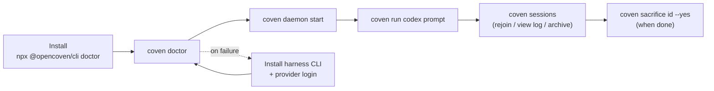

import { DocsDataTable } from '@/components/docs-data-table';

This guide takes a new user from a fresh checkout or npm install to a visible project-scoped agent session.

## What Coven Is

Coven is not a harness. It is the **substrate** that harnesses operate within.

A harness — Codex, Claude Code, or any adapter-registered CLI — brings its own provider credentials, model selection, and tool runtime. Coven provides the shared layer underneath: enforced project boundaries, supervised PTY processes, an append-only session record, and a stable local API. When work passes through Coven, every run gains consistent lifecycle management, replay, and auditability regardless of which harness ran it.

This matters in practice:

- **Provider independence** — switch between Codex and Claude Code without rewiring your workflow; the substrate stays the same.
- **Enforced boundaries** — harnesses can only operate inside the project root you declared; no harness can silently widen scope.
- **Auditable history** — every session is recorded and replayable; completed work survives process restarts.
- **Unified client surface** — any client (CLI, TUI, CastCodes, Cave, OpenClaw, or a script) talks to any harness through one local API.

The short promise:

> One substrate. Any harness. Reproducible, auditable work.

This guide uses the `coven` CLI throughout. If you would rather start in a coding TUI, a desktop app, or a full workspace, see [Choosing your surface](/docs/guide/surfaces) — every surface drives the same daemon, so nothing you learn here is wasted.

## Install Paths

For the full platform matrix, source build path, WSL2 guidance, and unsupported container/Nix status, see [Install Coven](/docs/guide/install).

Use the npm wrapper when you want the fastest public install:

```sh
npx @opencoven/cli doctor
pnpm dlx @opencoven/cli doctor
```

Build from source when you are contributing to Coven:

```sh
git clone https://github.com/OpenCoven/coven.git
cd coven
cargo build --workspace
cargo run -p coven-cli -- doctor
```

## Prerequisites

Coven needs the local prerequisites below.

<DocsDataTable
  caption="Coven prerequisites"
  searchPlaceholder="Filter prerequisites..."
  columns={[
    { key: 'prerequisite', label: 'Prerequisite' },
    { key: 'requiredWhen', label: 'Required when', filter: true },
    { key: 'purpose', label: 'Purpose' },
  ]}
  rows={[
    { prerequisite: 'Rust stable', requiredWhen: 'Building from source', purpose: 'Compiles the Rust CLI and daemon workspace.' },
    { prerequisite: 'Git', requiredWhen: 'All installs', purpose: 'Provides repository context and source checkout support.' },
    { prerequisite: 'Unix-like local runtime', requiredWhen: 'Current daemon path', purpose: 'Supports the local Unix socket and PTY execution path.' },
    { prerequisite: 'Supported harness CLI on `PATH`', requiredWhen: 'Running sessions', purpose: 'Lets Coven launch Codex or Claude Code.' },
  ]}
/>

Supported v0 harnesses are `codex` and `claude`.

Install and authenticate a harness before expecting `coven run` to work:

```sh
npm install -g @openai/codex
codex login

npm install -g @anthropic-ai/claude-code
claude doctor
```

## First Run

From a project directory:

```sh
coven
```

The default command opens the prompt-first TUI.

<DocsDataTable
  caption="First-run TUI controls"
  searchPlaceholder="Filter TUI controls..."
  columns={[
    { key: 'action', label: 'Action' },
    { key: 'input', label: 'Input' },
    { key: 'result', label: 'Result' },
  ]}
  rows={[
    { action: 'Type a task', input: '`fix the failing tests` or `/run codex fix the failing tests`', result: 'Launch or route the requested work.' },
    { action: 'Select a menu item', input: 'Arrow keys or single-key shortcut, then Enter', result: 'Runs the selected TUI action.' },
    { action: 'Open help', input: '`h` or `/help`', result: 'Shows natural-language and slash-command examples.' },
    { action: 'Quit', input: '`Ctrl+C` or `Esc`', result: 'Exits the TUI.' },
  ]}
/>

If you prefer to run the explicit setup checks:

```sh
coven doctor
```

`coven doctor` checks setup readiness before you launch work.

<DocsDataTable
  caption="Doctor checks"
  searchPlaceholder="Filter doctor checks..."
  columns={[
    { key: 'check', label: 'Check' },
    { key: 'group', label: 'Group', filter: true },
    { key: 'output', label: 'Output' },
  ]}
  rows={[
    { check: 'Store readiness', group: 'State', output: 'Confirms local Coven state can be read and written.' },
    { check: 'Project detection', group: 'Project', output: 'Shows whether Coven can identify a usable project root.' },
    { check: 'Built-in harness availability', group: 'Harnesses', output: 'Checks Codex and Claude Code executable availability.' },
    { check: 'Missing setup next steps', group: 'Guidance', output: 'Prints the next install or auth step.' },
  ]}
/>

## Run a Session

Start the daemon, then launch a harness session from a repository or project directory:

```sh
coven daemon start
coven run codex "fix the failing tests"
```

or:

```sh
coven run claude "polish the CLI help text"
```

For a more readable session list, pass a title:

```sh
coven run codex "update the docs" --title "Docs refresh"
```

Use a specific working directory only when it is inside the detected project root:

```sh
coven run codex "inspect this package" --cwd packages/cli
```

Coven rejects outside-root working directories. Clients may validate for nicer UX, but the Rust daemon is the authority.

## Browse Sessions

In an interactive terminal:

```sh
coven sessions
```

This opens the session browser. You can select a session and choose contextual actions.

<DocsDataTable
  caption="Session browser actions"
  searchPlaceholder="Filter session actions..."
  columns={[
    { key: 'action', label: 'Action' },
    { key: 'availableFor', label: 'Available for', filter: true },
    { key: 'effect', label: 'Effect' },
  ]}
  rows={[
    { action: '**Rejoin**', availableFor: 'Live sessions', effect: 'Reattaches to active output and input.' },
    { action: '**View Log**', availableFor: 'Completed sessions', effect: 'Replays completed output.' },
    { action: '**Summon**', availableFor: 'Archived sessions', effect: 'Restores the record to the active list.' },
    { action: '**Archive**', availableFor: 'Completed visible sessions', effect: 'Hides the record while preserving events.' },
    { action: '**Sacrifice**', availableFor: 'Non-running sessions', effect: 'Permanently deletes the session and events.' },
  ]}
/>

For scripts or copy/paste workflows:

```sh
coven sessions --plain
coven sessions --all --plain
coven sessions --json
coven sessions --json --all
```

## Attach, Archive, Summon, and Sacrifice

Lower-level session verbs remain available:

```sh
coven attach <session-id>
coven archive <session-id>
coven summon <session-id>
coven sacrifice <session-id> --yes
```

Archive is reversible. Summon restores an archived session to the active list. Sacrifice is destructive and refuses live sessions.

## Stop the Daemon

```sh
coven daemon stop
```

Use `restart` when the socket or daemon state looks stale:

```sh
coven daemon restart
```

## Diagnostics and Relief

`coven pc` is a macOS-first system diagnostics and relief tool surfaced through the Coven CLI. All read operations are side-effect free.

Inspect:

```sh
coven pc                  # full report: CPU, memory, disk, top processes
coven pc status           # one-line health summary with 🟢/🟡/🔴 indicators
coven pc status --json    # machine-readable health summary
coven pc top --n 10       # top-N processes by CPU usage
coven pc disk             # disk usage breakdown
```

Relief operations mutate system state and require an explicit `--confirm` gate:

```sh
coven pc kill <pid> --confirm     # SIGTERM with PID identity re-check
coven pc cache clear --confirm    # clear ~/Library/Caches + /Library/Caches
```

Safety constraints in v1:

<DocsDataTable
  caption="coven pc safety constraints"
  searchPlaceholder="Filter safety constraints..."
  columns={[
    { key: 'constraint', label: 'Constraint' },
    { key: 'riskArea', label: 'Risk area', filter: true },
    { key: 'behavior', label: 'Behavior' },
  ]}
  rows={[
    { constraint: 'Explicit write gate', riskArea: 'Mutation', behavior: 'All write operations require `--confirm`; there is no bypass path.' },
    { constraint: 'SIGTERM only', riskArea: 'Process control', behavior: 'Termination never escalates to SIGKILL.' },
    { constraint: 'PID identity re-check', riskArea: 'Process control', behavior: 'Process identity is re-checked immediately before SIGTERM to prevent PID reuse.' },
    { constraint: 'Hardcoded cache path list', riskArea: 'Filesystem', behavior: 'Cache clear does not use glob expansion.' },
    { constraint: 'Redacted process arguments', riskArea: 'Privacy', behavior: 'Arguments are redacted by default; pass `--verbose` to inspect them.' },
    { constraint: 'No privileged system control', riskArea: 'System integrity', behavior: 'No `sudo`, no LaunchAgent mutation, no system service control.' },
  ]}
/>

## End-to-end Flow



The "install → doctor → daemon → run → sessions" loop is the entire happy path for a first session. Everything else in this guide is fallback or troubleshooting.

Where to go next:

- [Choosing your surface](/docs/guide/surfaces) — pick between the CLI, Coven Code, Cave, and CastCodes.
- [Concepts](/docs/guide/concepts) — the shared vocabulary for everything above.
- [What is a familiar?](/docs/familiars/what-is-a-familiar) — the persistent layer your sessions feed.
- [The demo loop](/docs/guide/demo-loop) — the five-step end-to-end story in CastCodes.


## Contributor Verification Loop

Before opening a PR:

```sh
cargo fmt --check
cargo clippy --workspace --all-targets -- -D warnings
cargo test --workspace --locked
python scripts/check-secrets.py
```

For daemon/session changes, also run the smoke test:

```sh
cargo test -p coven-cli --test smoke -- --nocapture
```

The smoke test uses a temporary `COVEN_HOME` and a fake harness executable. It does not require private harness credentials.
