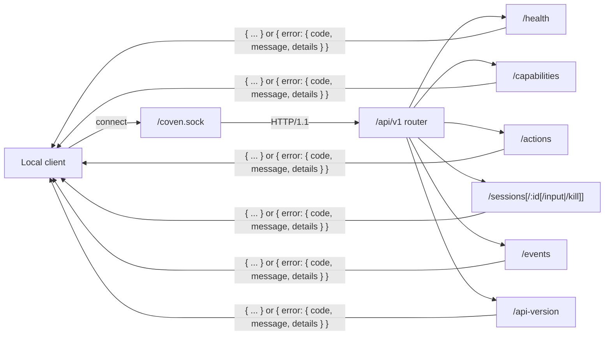
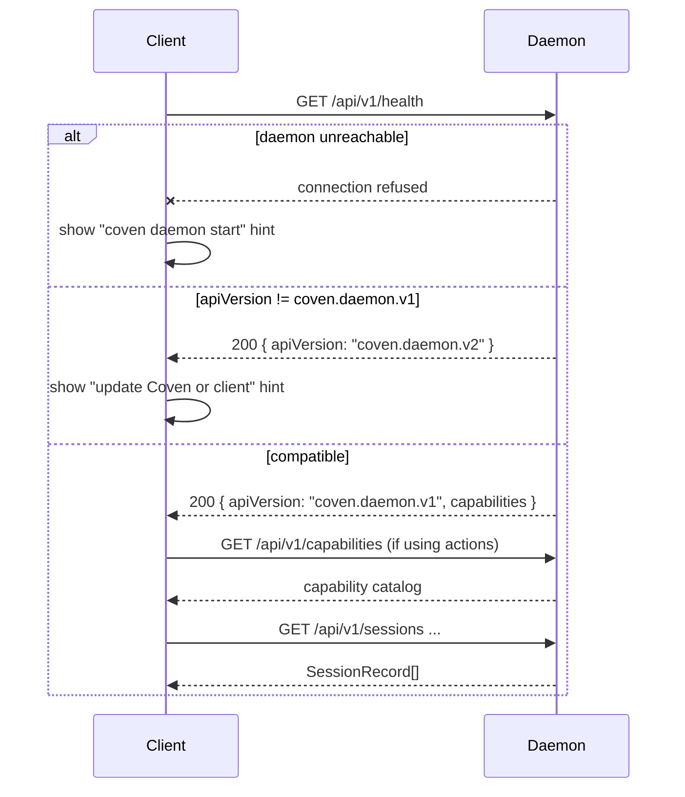
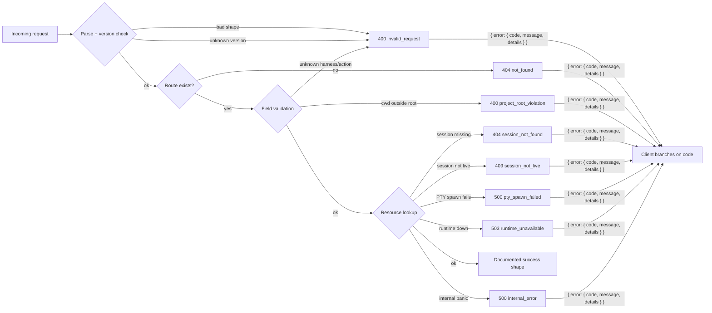
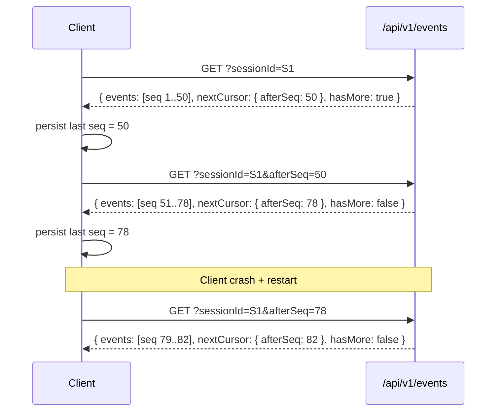
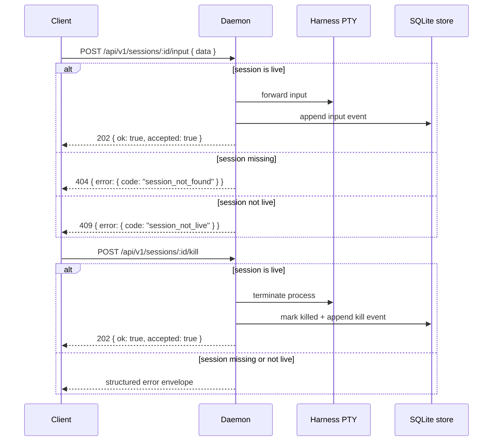
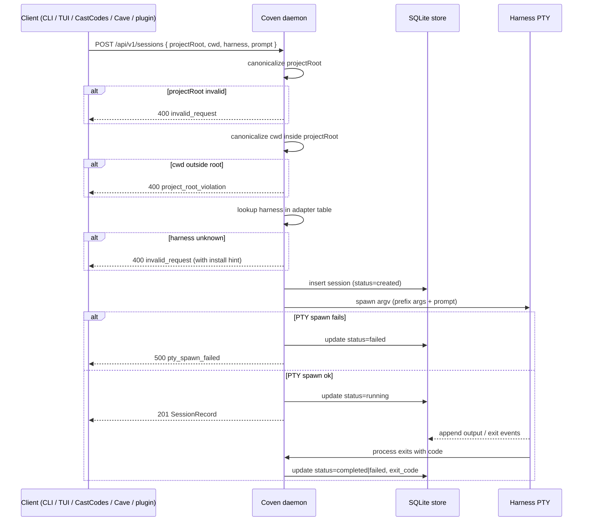
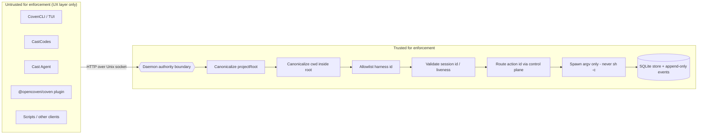

import { DocsDataTable } from '@/components/docs-data-table';

_Last updated: 2026-07-21_

This page collects the API architecture diagrams that live across the Coven source docs and makes them visible from the docs website in one place. Use it as the visual companion to [Coven Local API](/docs/reference/api), [Client Integration](/docs/familiars/clients), [Session Lifecycle](/docs/familiars/sessions), [Authentication and local access](/docs/reference/auth), and [Safety Model](/docs/reference/safety).

<DocsDataTable
  caption="Diagram sources"
  searchPlaceholder="Filter diagram sources..."
  columns={[
    { key: 'diagram', label: 'Diagram' },
    { key: 'source', label: 'Source doc', filter: true },
    { key: 'purpose', label: 'Purpose' },
  ]}
  rows={[
    { diagram: 'API route topology', source: '`docs/API.md`', purpose: 'Shows the local Unix socket, `/api/v1` router, and current endpoint families.' },
    { diagram: 'Compatibility handshake', source: '`docs/CLIENT-INTEGRATION.md`', purpose: 'Shows how clients fail closed before using sessions, events, or actions.' },
    { diagram: 'Structured error envelope', source: '`docs/API-CONTRACT.md`', purpose: 'Shows how parse, routing, validation, lookup, and runtime failures become stable error codes.' },
    { diagram: 'Incremental event reads', source: '`docs/API-CONTRACT.md`', purpose: 'Shows `afterSeq` cursor pagination and crash-safe resume behavior.' },
    { diagram: 'Session launch lifecycle', source: '`docs/SESSION-LIFECYCLE.md`', purpose: 'Shows daemon validation, PTY spawn, event persistence, and terminal status updates.' },
    { diagram: 'Daemon authority boundary', source: '`docs/ARCHITECTURE.md` / `docs/SAFETY-MODEL.md`', purpose: 'Shows why clients are UX layers and the Rust daemon owns enforcement.' },
  ]}
/>

## Route Topology

The public v1 contract is local HTTP served over the user's Unix socket by default (with an optional loopback-guarded TCP listener via `coven daemon serve --tcp`). The route prefix is `/api/v1`; legacy unversioned aliases are early-MVP compatibility only. The diagram shows the stable v1 core; the daemon also serves first-party control-plane routes (familiars, threads, skills, travel, scheduler, hub) mapped in [Coven Local API](/docs/reference/api#control-plane-surface-map).

## Compatibility Handshake

Clients should use `GET /api/v1/health` before assuming response shapes from any other route. `apiVersion: "coven.daemon.v1"` is the contract guard; `covenVersion` is diagnostics metadata.

## Structured Error Envelope

All failures return a structured envelope. Clients should branch on `error.code`, not on message text.

## Incremental Event Reads

Events are append-only and use monotonic `seq` values. Persisting `nextCursor.afterSeq` lets clients resume event reads after a client crash or daemon restart.

## Live Session Control

Live input and kill are accepted only for daemon-verified live sessions. Completed, failed, killed, archived, or orphaned sessions are replay/log surfaces.

## Session Launch Lifecycle

Launches are project-scoped. The daemon canonicalizes the project root and working directory, validates the harness id, inserts the session record, spawns the harness with argv APIs, then persists output and exit events.

## Daemon Authority Boundary

Clients may validate for UX, but daemon validation is the enforcement boundary. Unknown API versions, unsupported harness ids, invalid session ids, unknown action ids, and outside-root working directories fail closed.

