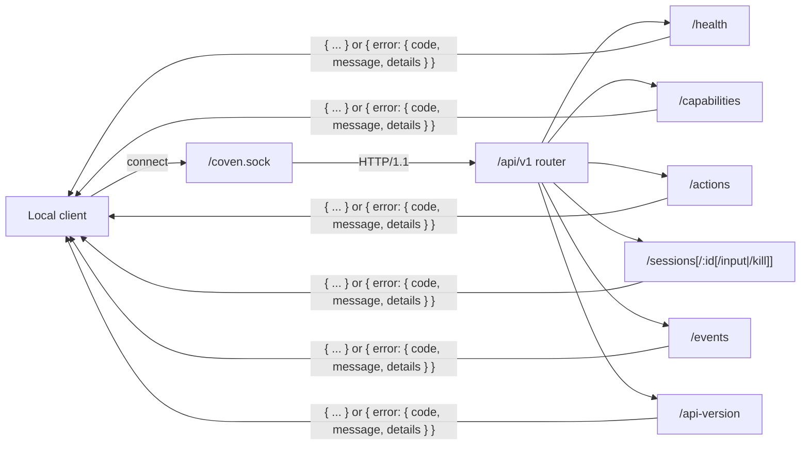

import { Callout } from 'fumadocs-ui/components/callout';
import { DocsDataTable } from '@/components/docs-data-table';

_Last updated: 2026-07-21_

<Callout type="info" title="Looking for an interactive reference?">
  The [API Reference](/docs/openapi) section renders each endpoint as a live page with request/response schemas, code samples in four languages, and Try It panels that bridge to your local daemon. This page remains the narrative reference for concepts, error model, and versioning rules.
</Callout>

Coven exposes an HTTP API over the local Unix socket at `<covenHome>/coven.sock`. The Rust daemon is the authority boundary: clients may validate for UX, but the daemon still validates project roots, cwd, harness ids, session ids, input, and live-session state before acting.

The Unix socket is the default transport. The daemon can also bind a TCP listener via `coven daemon serve --tcp <addr>` (standard loopback address: `127.0.0.1:3000`): the bind address must be loopback, and each request's `Host`/`Origin` headers must be loopback or exactly match a host added with the repeatable `--allow-host <host>` flag (for a trusted reverse proxy such as a Tailscale-served FQDN). The API is unauthenticated on both transports, so any non-loopback reach must be fronted by an authenticated transport.

For a consolidated visual map of route topology, compatibility handshake, error flow, event cursors, live control, launch lifecycle, and authority boundaries, see [API architecture diagrams](/docs/reference/api-architecture).



Every route returns either a documented success shape or the structured error envelope. Unknown routes, unknown action ids, and unknown API versions all fail closed with `invalid_request` or `not_found`.

See [Authentication and local access](/docs/reference/auth) for the current auth posture. In short: the daemon API does not use OAuth, JWTs, bearer tokens, API keys, or cookies today. Access is local Unix-socket based, provider credentials stay with the harness CLIs, and any remote, browser, or TCP exposure needs a separate auth design.

## Versioning

The current public API contract is the named **`coven.daemon.v1`** contract served under the `/api/v1` route prefix.

Versioned clients should use the `/api/v1` prefix:

<DocsDataTable
  caption="coven.daemon.v1 endpoint reference"
  searchPlaceholder="Filter endpoints..."
  columns={[
    { key: 'method', label: 'Method', filter: true },
    { key: 'path', label: 'Path' },
    { key: 'surface', label: 'Surface', filter: true },
    { key: 'purpose', label: 'Purpose' },
  ]}
  rows={[
    { method: 'GET',  path: '`/api/v1/api-version`',              surface: 'Meta',     purpose: 'Read the active API version and supported versions.' },
    { method: 'GET',  path: '`/api/v1/health`',                   surface: 'Meta',     purpose: 'Check daemon health and metadata.' },
    { method: 'GET',  path: '`/api/v1/capabilities`',             surface: 'Meta',     purpose: 'Discover daemon / control-plane capabilities and policy hints.' },
    { method: 'POST', path: '`/api/v1/actions`',                  surface: 'Control',  purpose: 'Route a policy-shaped control-plane action.' },
    { method: 'GET',  path: '`/api/v1/sessions`',                 surface: 'Sessions', purpose: 'List active sessions.' },
    { method: 'POST', path: '`/api/v1/sessions`',                 surface: 'Sessions', purpose: 'Launch a session.' },
    { method: 'POST', path: '`/api/v1/sessions/external`',        surface: 'Sessions', purpose: 'Register a session launched outside the daemon.' },
    { method: 'GET',  path: '`/api/v1/sessions/:id`',             surface: 'Sessions', purpose: 'Fetch one session.' },
    { method: 'GET',  path: '`/api/v1/sessions/:id/log`',         surface: 'Sessions', purpose: 'Read a rendered log-line view of one session.' },
    { method: 'GET',  path: '`/api/v1/sessions/:id/events`',      surface: 'Events',   purpose: 'Read events for one session (path-scoped form of /events).' },
    { method: 'GET',  path: '`/api/v1/sessions/:id/artifacts/:artifactId`', surface: 'Sessions', purpose: 'Fetch a sensitive artifact; requires `raw=1` and opt-in persistence.' },
    { method: 'GET',  path: '`/api/v1/events?sessionId=...`',     surface: 'Events',   purpose: 'Read session events.' },
    { method: 'POST', path: '`/api/v1/sessions/:id/input`',       surface: 'Sessions', purpose: 'Forward input to a live session.' },
    { method: 'POST', path: '`/api/v1/sessions/:id/kill`',        surface: 'Sessions', purpose: 'Kill a live session.' },
    { method: 'POST', path: '`/api/v1/sessions/:id/complete`',    surface: 'Sessions', purpose: 'Mark an externally-registered session completed or failed.' },
  ]}
/>

Unversioned routes currently remain as legacy aliases during the early MVP window, but new clients should not rely on them.

Unknown `/api/<version>/...` prefixes fail closed with an `unsupported API version` JSON response.

## Control-plane Surface Map

The daemon serves a broader control plane beyond the v1 core above. The narrow session/event/action contract is the stable public v1; the control-plane routes below are used by first-party clients (Cave, CastCodes) and may evolve without a version bump. They are listed here so the surface is honest, not to invite third-party coupling.

| Area | Routes |
| --- | --- |
| Cockpit | `GET /overview` · `POST /cast` · `GET /cast-codes` |
| Familiars | `GET /familiars` · `PUT /familiars/:id/icon` · `GET /familiars/:id/ward` · `POST /familiars/:id/edits` |
| Threads | `GET /threads/weaves` · `GET /threads/proposals` · `GET /threads/proposals/:id` · `POST /threads/proposals/:id/approve` · `POST /threads/proposals/:id/reject` |
| Skills | `GET /skills` · `GET /skills/eval-loop/:familiarId` · `POST /skills/eval-loop/:familiarId/run` · `DELETE /skills/eval-loop/:familiarId/run-lock` |
| Coven Calls | `GET /coven-calls` · `GET /coven-calls/:callId` |
| Memory and research | `GET /memory` · `GET /research` |
| Store maintenance | `POST /store/vacuum` |
| Travel | `POST /travel/profiles` · `POST /travel/deltas` · `GET /travel/state` |
| Scheduler | `POST /scheduler/decisions` · `POST /scheduler/redispatch` · `GET /scheduler/decisions/:id` · `GET /scheduler/loops/:id` |
| Hub | `GET /hub/status` · `GET /hub/nodes` · `POST /hub/nodes` · `GET /hub/nodes/:id` · `POST /hub/nodes/:id/health` · `POST /hub/nodes/:id/poll` · `POST /hub/nodes/:id/dispatch` · `GET /hub/dispatches/:jobId` · `GET /hub/jobs` · `POST /hub/jobs` · `GET /hub/jobs/:id` · `POST /hub/jobs/:id/assign` · `POST /hub/jobs/:id/complete` · `GET /hub/routing` |
| Harness capabilities | `GET /capabilities/harnesses` · `GET /capabilities/:harnessId` |

All of these are served under the same `/api/v1` prefix and return the structured error envelope on failure.

## Health Response

`GET /api/v1/health` is the required compatibility handshake. It returns the named contract version, the installed Coven binary version, machine-readable capabilities, and optional daemon metadata:

```json
{
  "ok": true,
  "apiVersion": "coven.daemon.v1",
  "covenVersion": "0.0.0",
  "capabilities": {
    "sessions": true,
    "events": true,
    "travel": true,
    "scheduler": true,
    "hub": true,
    "executorDispatch": true,
    "eventCursor": "sequence",
    "structuredErrors": true
  },
  "daemon": {
    "pid": 12345,
    "startedAt": "2026-05-09T12:00:00Z",
    "socket": "/Users/example/.coven/coven.sock"
  }
}
```

When no daemon metadata is available, `daemon` is `null`. The response may also carry an optional `hub` object (`role`, `hubId`, `nodesTotal`, `nodesAvailable`) summarizing hub control-plane state; it is omitted when the daemon builds the response without store access.

Clients should treat `apiVersion: "coven.daemon.v1"` as the stable contract guard. `covenVersion` identifies the binary build and can be shown in diagnostics, but clients should not branch compatibility on a package version alone.

`GET /api/v1/api-version` is lower-level route metadata. It currently returns the route prefix version, not the named contract:

```json
{
  "apiVersion": "v1",
  "supportedApiVersions": ["v1"]
}
```

Use `/api/v1/health` for normal client handshakes. Use `/api/v1/api-version` only when debugging route-prefix support.

## Control-plane Capabilities

`GET /api/v1/capabilities` is the discovery point for first-party clients. It returns capability ids, adapter ownership, availability, policy hints, and action ids. This keeps clients from hard-coding what the daemon can do.

```json
{
  "capabilities": [
    {
      "id": "coven.control.actions",
      "label": "Coven control-plane action router",
      "adapter": "coven-daemon",
      "status": "available",
      "policy": "allow",
      "actions": ["coven.capabilities.refresh"]
    },
    {
      "id": "desktop.automation",
      "label": "Desktop automation adapters",
      "adapter": "desktop-use",
      "status": "planned",
      "policy": "requiresApproval",
      "actions": []
    }
  ]
}
```

## Control-plane Actions

`POST /api/v1/actions` accepts a structured intent envelope. The daemon routes only known actions; unknown actions fail closed before any adapter can run.

```json
{
  "action": "coven.capabilities.refresh",
  "origin": "coven-client",
  "args": {}
}
```

Immediately completed safe actions return `200` with an event-shaped payload that clients can render optimistically or fold into later event streams:

```json
{
  "ok": true,
  "accepted": true,
  "action": "coven.capabilities.refresh",
  "status": "completed",
  "event": {
    "kind": "capabilities.refreshed",
    "action": "coven.capabilities.refresh",
    "origin": "coven-client",
    "payload": { "capabilities": 3 }
  }
}
```

## Session Records

Session endpoints return the Rust daemon's `SessionRecord` shape with snake_case field names:

```json
{
  "id": "session-1",
  "project_root": "/Users/example/project",
  "harness": "codex",
  "title": "Fix failing tests",
  "status": "running",
  "exit_code": null,
  "archived_at": null,
  "created_at": "2026-05-09T06:43:00Z",
  "updated_at": "2026-05-09T06:43:05Z",
  "conversation_id": null,
  "familiar_id": null,
  "labels": [],
  "visibility": "private",
  "external": false,
  "transcript_path": null
}
```

The trailing fields are additive `v1` metadata: `conversation_id` groups multi-turn chat sessions, `familiar_id` records the familiar identity a session was launched with, `labels` and `visibility` (default `"private"`) support client-side organization, and `external` plus `transcript_path` describe sessions registered from outside the daemon via `POST /api/v1/sessions/external`.

<DocsDataTable
  caption="Session record endpoints"
  searchPlaceholder="Filter session record endpoints..."
  columns={[
    { key: 'method', label: 'Method', filter: true },
    { key: 'path', label: 'Path' },
    { key: 'response', label: 'Response' },
    { key: 'notes', label: 'Notes' },
  ]}
  rows={[
    { method: 'GET', path: '`/api/v1/sessions`', response: '`SessionRecord[]`', notes: 'Lists active, non-archived sessions.' },
    { method: 'POST', path: '`/api/v1/sessions`', response: '`201 SessionRecord`', notes: 'Launches a project-scoped harness session.' },
    { method: 'POST', path: '`/api/v1/sessions/external`', response: '`201 SessionRecord`', notes: 'Registers an externally-launched session (`external: true`). Idempotent: re-registering an existing external id returns `200`; a daemon-owned id returns `409 session_id_conflict`.' },
    { method: 'GET', path: '`/api/v1/sessions/:id`', response: '`SessionRecord`', notes: 'Returns `404 session_not_found` for unknown ids.' },
    { method: 'GET', path: '`/api/v1/sessions/:id/log`', response: '`{ ts, level, message }[]`', notes: 'Rendered log-line view of the session event stream.' },
    { method: 'POST', path: '`/api/v1/sessions/:id/complete`', response: '`SessionRecord`', notes: 'External sessions only: body `{ "exitCode": 0 }`; non-zero marks `failed`, otherwise `completed`. Daemon-managed sessions return `422 not_external_session`.' },
  ]}
/>

`POST /api/v1/sessions` accepts the launch fields the daemon validates before spawning a harness:

```json
{
  "projectRoot": "/Users/example/project",
  "cwd": "/Users/example/project",
  "harness": "codex",
  "prompt": "Fix the failing tests",
  "title": "Fix failing tests"
}
```

`cwd` must resolve inside `projectRoot`. `harness` must be a supported harness id. Provider credentials are not part of this request; Codex, Claude Code, and future harnesses keep their own local auth flows.

## Events

`GET /api/v1/events` returns an event page for one session. `GET /api/v1/sessions/:id/events` is the path-scoped form of the same read: it takes the same cursor parameters (minus `sessionId`) and returns the same response shape.

<DocsDataTable
  caption="Events query parameters"
  searchPlaceholder="Filter event query parameters..."
  columns={[
    { key: 'parameter', label: 'Parameter' },
    { key: 'required', label: 'Required', filter: true },
    { key: 'meaning', label: 'Meaning' },
  ]}
  rows={[
    { parameter: '`sessionId`', required: 'Yes', meaning: 'Session id whose events should be returned.' },
    { parameter: '`afterSeq`', required: 'No', meaning: 'Preferred cursor. Returns events with `seq > afterSeq`.' },
    { parameter: '`afterEventId`', required: 'No', meaning: 'Compatibility cursor resolved to a sequence position.' },
    { parameter: '`limit`', required: 'No', meaning: 'Maximum records to return. The daemon enforces a max of 1000.' },
  ]}
/>

```json
{
  "events": [
    {
      "seq": 42,
      "id": "event-1",
      "session_id": "session-1",
      "kind": "output",
      "payload_json": "{\"data\":\"hello\"}",
      "created_at": "2026-05-09T06:43:10Z"
    }
  ],
  "nextCursor": {
    "afterSeq": 42
  },
  "hasMore": false
}
```

`nextCursor` is `null` when there are no events. Persisting `nextCursor.afterSeq` lets clients resume incremental reads after a daemon restart.

## Live Input

`POST /api/v1/sessions/:id/input` forwards input only to a daemon-verified live session.

Request:

```json
{
  "data": "continue with the next failing test\n"
}
```

Success returns `202`:

```json
{
  "ok": true,
  "accepted": true
}
```

The daemon records accepted input as a session event. Completed, failed, killed, archived, or orphaned sessions are replay/log surfaces, not live input targets.

## Live Kill

`POST /api/v1/sessions/:id/kill` terminates only a daemon-verified live process. The request body is empty.

Success returns `202`:

```json
{
  "ok": true,
  "accepted": true
}
```

After a successful kill, the daemon updates the session status to `killed` and writes a `kill` event. Killing a session is not the same as deleting its history; use archive/summon/sacrifice lifecycle commands for record management.

## Error Envelope

All API failures use this structured envelope. Clients should branch on `error.code`, not message text:

```json
{
  "error": {
    "code": "session_not_found",
    "message": "Session was not found.",
    "details": {
      "sessionId": "session-1"
    }
  }
}
```

<DocsDataTable
  caption="Stable daemon error codes"
  searchPlaceholder="Filter error codes..."
  columns={[
    { key: 'code', label: 'Code' },
    { key: 'status', label: 'HTTP status', filter: true },
    { key: 'meaning', label: 'Meaning' },
    { key: 'typicalCause', label: 'Typical cause' },
    { key: 'fix', label: 'Fix' },
  ]}
  rows={[
    { code: '`not_found`', status: '`404`', meaning: 'Route not found.', typicalCause: 'Typo in the path, or a client calling an endpoint this daemon version does not serve.', fix: 'Check the route against this reference and confirm `apiVersion` via `GET /api/v1/health`.' },
    { code: '`invalid_request`', status: '`400` or `404`', meaning: 'Malformed request, unsupported API version, or unknown control action.', typicalCause: 'Missing required body fields, an unknown harness id, an unversioned path, or an action id the daemon does not recognize.', fix: 'Compare the request body with the endpoint examples; list valid action ids via `GET /api/v1/capabilities`.' },
    { code: '`session_not_found`', status: '`404`', meaning: 'Session id does not exist.', typicalCause: 'Stale id, a sacrificed session, or a client pointed at a different `COVEN_HOME`.', fix: 'List current ids with `coven sessions --all --json` and confirm both processes share one `COVEN_HOME`.' },
    { code: '`session_not_live`', status: '`409`', meaning: 'Session exists but cannot accept input or kill because it is not running in this daemon.', typicalCause: 'The session already completed, failed, was killed, was archived, or was orphaned by a daemon restart.', fix: 'Treat the record as replay-only: attach for logs instead of sending input. See the session lifecycle states.' },
    { code: '`project_root_violation`', status: '`400`', meaning: 'Requested cwd resolves outside the declared project root.', typicalCause: 'A `--cwd` value using `..`, an absolute path outside the root, or a symlink that escapes the boundary.', fix: 'Pass a cwd that canonicalizes inside the project root, such as `--cwd packages/cli`.' },
    { code: '`pty_spawn_failed`', status: '`500`', meaning: 'Harness PTY could not be launched.', typicalCause: 'Harness executable missing from `PATH`, not executable, or the process failed immediately at spawn.', fix: 'Run `coven doctor`, install or authenticate the harness CLI, then retry the launch.' },
    { code: '`runtime_unavailable`', status: '`503`', meaning: 'The session runtime is unavailable.', typicalCause: 'The daemon is running but its session runtime is not ready to accept work.', fix: 'Retry after `coven daemon status`; restart with `coven daemon restart` if the state persists.' },
    { code: '`internal_error`', status: '`500`', meaning: 'Unexpected internal daemon error.', typicalCause: 'A daemon-side bug or an unexpected local failure such as a full disk.', fix: 'Check daemon logs, then `coven daemon restart`. Report reproducible cases with the request shape.' },
  ]}
/>

For a symptom-first walkthrough of the same failures, see [error code lookup](/docs/reference/troubleshooting#error-code-lookup) in Troubleshooting.

Unknown session:

```json
{
  "error": {
    "code": "session_not_found",
    "message": "Session was not found.",
    "details": { "sessionId": "session-1" }
  }
}
```

Non-live input or kill:

```json
{
  "error": {
    "code": "session_not_live",
    "message": "Session is not live.",
    "details": { "sessionId": "session-1" }
  }
}
```

## Compatibility Rules

<DocsDataTable
  caption="API compatibility rules"
  searchPlaceholder="Filter compatibility rules..."
  columns={[
    { key: 'rule', label: 'Rule' },
    { key: 'riskArea', label: 'Risk area', filter: true },
    { key: 'clientOrMaintainerAction', label: 'Client or maintainer action' },
  ]}
  rows={[
    { rule: 'Additive JSON fields are allowed in `v1` responses.', riskArea: 'Forward compatibility', clientOrMaintainerAction: 'Clients should ignore unknown optional fields when safe.' },
    { rule: 'Existing required fields should not be removed or renamed inside `v1`.', riskArea: 'Breaking changes', clientOrMaintainerAction: 'Keep required response shapes stable for versioned clients.' },
    { rule: 'Breaking response-shape or behavior changes require a new API version prefix.', riskArea: 'Versioning', clientOrMaintainerAction: 'Move incompatible behavior behind a new route prefix.' },
    { rule: 'External clients should call `/api/v1/health` before assuming compatibility.', riskArea: 'Handshake', clientOrMaintainerAction: 'Check daemon availability and API version first.' },
    { rule: 'Daemon changes that affect `/api/v1/health`, `/api/v1/sessions`, `/api/v1/events`, input, or kill behavior should update client compatibility tests in the same repo.', riskArea: 'Contract drift', clientOrMaintainerAction: 'Update tests with the API-affecting change.' },
  ]}
/>
