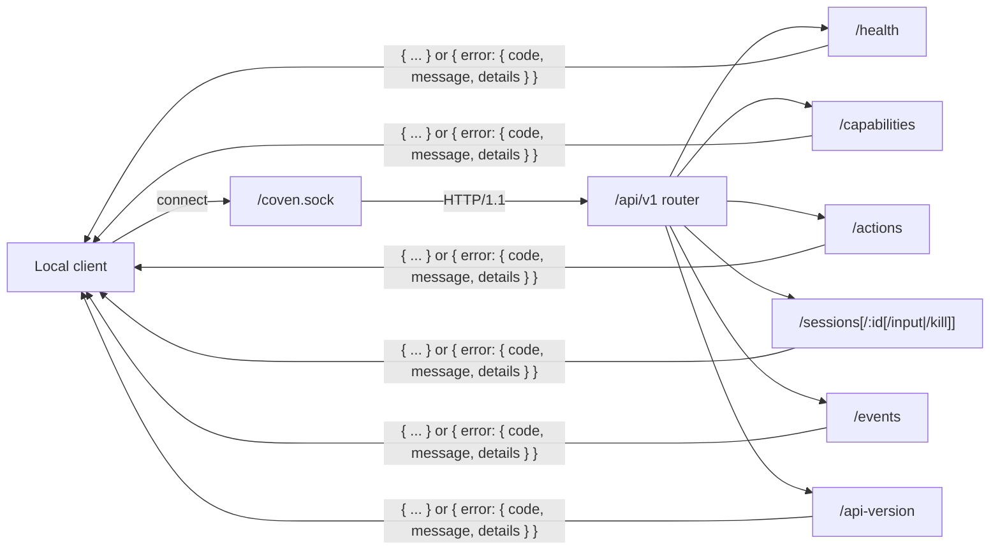

import { DocsDataTable } from '@/components/docs-data-table';

# Coven Local API

_Last updated: 2026-05-09_

Coven exposes a small HTTP API over the local Unix socket at `<covenHome>/coven.sock`. The Rust daemon is the authority boundary: clients may validate for UX, but the daemon still validates project roots, cwd, harness ids, session ids, input, and live-session state before acting.



Every route returns either a documented success shape or the structured error envelope. Unknown routes, unknown action ids, and unknown API versions all fail closed with `invalid_request` or `not_found`.

See [Authentication and local access](/docs/reference/auth) for the current auth posture. In short: the daemon API does not use OAuth, JWTs, bearer tokens, API keys, or cookies today. Access is local Unix-socket based, provider credentials stay with the harness CLIs, and any remote, browser, or TCP exposure needs a separate auth design.

## Versioning

The current public API contract is the named **`coven.daemon.v1`** contract served under the `/api/v1` route prefix.

Versioned clients should use the `/api/v1` prefix:

<DocsDataTable
  caption="coven.daemon.v1 endpoint reference"
  searchPlaceholder="Filter endpoints..."
  columns={[
    { key: 'method', label: 'Method', filter: true },
    { key: 'path', label: 'Path' },
    { key: 'surface', label: 'Surface', filter: true },
    { key: 'purpose', label: 'Purpose' },
  ]}
  rows={[
    { method: 'GET',  path: '`/api/v1/api-version`',              surface: 'Meta',     purpose: 'Read the active API version and supported versions.' },
    { method: 'GET',  path: '`/api/v1/health`',                   surface: 'Meta',     purpose: 'Check daemon health and metadata.' },
    { method: 'GET',  path: '`/api/v1/capabilities`',             surface: 'Meta',     purpose: 'Discover daemon / control-plane capabilities and policy hints.' },
    { method: 'POST', path: '`/api/v1/actions`',                  surface: 'Control',  purpose: 'Route a policy-shaped control-plane action.' },
    { method: 'GET',  path: '`/api/v1/sessions`',                 surface: 'Sessions', purpose: 'List active sessions.' },
    { method: 'POST', path: '`/api/v1/sessions`',                 surface: 'Sessions', purpose: 'Launch a session.' },
    { method: 'GET',  path: '`/api/v1/sessions/:id`',             surface: 'Sessions', purpose: 'Fetch one session.' },
    { method: 'GET',  path: '`/api/v1/events?sessionId=...`',     surface: 'Events',   purpose: 'Read session events.' },
    { method: 'POST', path: '`/api/v1/sessions/:id/input`',       surface: 'Sessions', purpose: 'Forward input to a live session.' },
    { method: 'POST', path: '`/api/v1/sessions/:id/kill`',        surface: 'Sessions', purpose: 'Kill a live session.' },
  ]}
/>

Unversioned routes currently remain as legacy aliases during the early MVP window, but new clients should not rely on them.

Unknown `/api/<version>/...` prefixes fail closed with an `unsupported API version` JSON response.

## Health Response

`GET /api/v1/health` returns the API version alongside daemon status:

```json
{
  "ok": true,
  "apiVersion": "coven.daemon.v1",
  "covenVersion": "0.0.0",
  "capabilities": {
    "sessions": true,
    "events": true,
    "eventCursor": "sequence",
    "structuredErrors": true
  },
  "daemon": {
    "pid": 12345,
    "startedAt": "2026-05-09T12:00:00Z",
    "socket": "/Users/example/.coven/coven.sock"
  }
}
```

When no daemon metadata is available, `daemon` is `null`.

## Control-plane Capabilities

`GET /api/v1/capabilities` is the discovery point for first-party clients. It returns capability ids, adapter ownership, availability, policy hints, and action ids. This keeps clients from hard-coding what the daemon can do.

```json
{
  "capabilities": [
    {
      "id": "coven.control.actions",
      "label": "Coven control-plane action router",
      "adapter": "coven-daemon",
      "status": "available",
      "policy": "allow",
      "actions": ["coven.capabilities.refresh"]
    },
    {
      "id": "desktop.automation",
      "label": "Desktop automation adapters",
      "adapter": "desktop-use",
      "status": "planned",
      "policy": "requiresApproval",
      "actions": []
    }
  ]
}
```

## Control-plane Actions

`POST /api/v1/actions` accepts a structured intent envelope. The daemon routes only known actions; unknown actions fail closed before any adapter can run.

```json
{
  "action": "coven.capabilities.refresh",
  "origin": "coven-client",
  "args": {}
}
```

Immediately completed safe actions return `200` with an event-shaped payload that clients can render optimistically or fold into later event streams:

```json
{
  "ok": true,
  "accepted": true,
  "action": "coven.capabilities.refresh",
  "status": "completed",
  "event": {
    "kind": "capabilities.refreshed",
    "action": "coven.capabilities.refresh",
    "origin": "coven-client",
    "payload": { "capabilities": 3 }
  }
}
```

## Compatibility Rules

<DocsDataTable
  caption="API compatibility rules"
  searchPlaceholder="Filter compatibility rules..."
  columns={[
    { key: 'rule', label: 'Rule' },
    { key: 'riskArea', label: 'Risk area', filter: true },
    { key: 'clientOrMaintainerAction', label: 'Client or maintainer action' },
  ]}
  rows={[
    { rule: 'Additive JSON fields are allowed in `v1` responses.', riskArea: 'Forward compatibility', clientOrMaintainerAction: 'Clients should ignore unknown optional fields when safe.' },
    { rule: 'Existing required fields should not be removed or renamed inside `v1`.', riskArea: 'Breaking changes', clientOrMaintainerAction: 'Keep required response shapes stable for versioned clients.' },
    { rule: 'Breaking response-shape or behavior changes require a new API version prefix.', riskArea: 'Versioning', clientOrMaintainerAction: 'Move incompatible behavior behind a new route prefix.' },
    { rule: 'External clients should call `/api/v1/health` before assuming compatibility.', riskArea: 'Handshake', clientOrMaintainerAction: 'Check daemon availability and API version first.' },
    { rule: 'Daemon changes that affect `/api/v1/health`, `/api/v1/sessions`, `/api/v1/events`, input, or kill behavior should update client compatibility tests in the same repo.', riskArea: 'Contract drift', clientOrMaintainerAction: 'Update tests with the API-affecting change.' },
  ]}
/>
