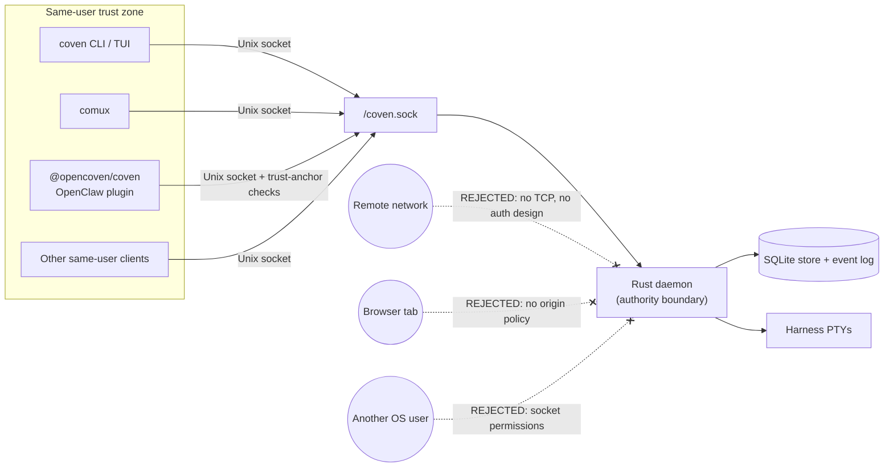

import { DocsDataTable } from '@/components/docs-data-table';

title: "Authentication and local access"
summary: "Coven uses a same-user local Unix socket access model rather than OAuth or API keys. Learn what protects /api/v1 and what remote access requires."
read_when:
  - Checking Coven's daemon auth posture
  - Designing remote access or browser-facing transport
description: "Coven uses a same-user local Unix socket access model rather than OAuth or API keys. Learn what protects /api/v1 and what remote access requires."

# Authentication and Local Access

_Last updated: 2026-05-14_

Coven does not currently have daemon-level user authentication in the OAuth, JWT, bearer-token, API-key, browser-cookie, or hosted-account sense.

The current solution is a **same-user local access model**.

<DocsDataTable
  caption="Same-user local access model"
  searchPlaceholder="Filter local access details..."
  columns={[
    { key: 'property', label: 'Property' },
    { key: 'group', label: 'Group', filter: true },
    { key: 'meaning', label: 'Meaning' },
  ]}
  rows={[
    { property: 'Local Unix socket only', group: 'Transport', meaning: 'The daemon exposes HTTP only over `<covenHome>/coven.sock`.' },
    { property: 'Default socket path', group: 'Transport', meaning: 'The default path is `~/.coven/coven.sock`.' },
    { property: 'Client validation is UX', group: 'Authority', meaning: 'Clients may validate requests for nicer errors, but Rust remains the enforcement boundary.' },
    { property: 'Harness-owned provider credentials', group: 'Credentials', meaning: 'Codex, Claude Code, and other harnesses keep using their normal local auth flow.' },
    { property: 'No credential proxying', group: 'Credentials', meaning: 'Coven should not read, proxy, persist, or mint provider or OpenClaw credentials.' },
  ]}
/>

This is intentionally a local-first MVP posture. It is suitable for same-user local clients such as the Coven CLI/TUI, comux, and the external OpenClaw plugin. It is not a remote API auth scheme.

The boundary is filesystem permissions plus same-user process locality. Anything outside the dashed zone is rejected by design; introducing a remote, browser, or cross-user surface requires a separate auth design (not a tunnel of the existing socket).

## What Protects the API Today

### Unix Socket Locality

The API is not exposed as TCP by default. Clients connect to the local Unix socket owned by the user's Coven state directory.

New clients should treat the socket path as the trust anchor and should connect only to the versioned API under `/api/v1/...`.

### Rust Authority Checks

The daemon must revalidate sensitive request fields before acting, even when a client already validated them.

<DocsDataTable
  caption="Rust authority checks"
  searchPlaceholder="Filter authority checks..."
  columns={[
    { key: 'field', label: 'Field' },
    { key: 'riskArea', label: 'Risk area', filter: true },
    { key: 'failureBehavior', label: 'Failure behavior' },
  ]}
  rows={[
    { field: 'API version', riskArea: 'Compatibility', failureBehavior: 'Fail closed on unknown versions.' },
    { field: 'Project root', riskArea: 'Filesystem policy', failureBehavior: 'Reject invalid or widened roots.' },
    { field: 'Working directory', riskArea: 'Filesystem policy', failureBehavior: 'Reject cwd values outside the project root.' },
    { field: 'Harness id', riskArea: 'Harness policy', failureBehavior: 'Reject unsupported harnesses.' },
    { field: 'Session id', riskArea: 'Session control', failureBehavior: 'Return not found for unknown records.' },
    { field: 'Live-session state', riskArea: 'Session control', failureBehavior: 'Return conflict for non-live input or kill requests.' },
    { field: 'Input requests', riskArea: 'Session control', failureBehavior: 'Forward only to verified live sessions.' },
    { field: 'Kill requests', riskArea: 'Session control', failureBehavior: 'Terminate only verified live processes.' },
    { field: 'Control-plane action ids', riskArea: 'Action routing', failureBehavior: 'Fail closed on unknown action ids.' },
  ]}
/>

Unknown API versions, unknown action ids, unsupported harnesses, invalid session ids, and outside-root working directories must fail closed.

### Harness-owned Provider Auth

Coven launches supported local harness CLIs. It does not implement provider login.

Examples:

<DocsDataTable
  caption="Harness provider authentication owners"
  searchPlaceholder="Filter auth owners..."
  columns={[
    { key: 'harness', label: 'Harness' },
    { key: 'authFlow', label: 'Auth flow' },
    { key: 'owner', label: 'Owner' },
  ]}
  rows={[
    { harness: 'Codex', authFlow: '`codex login` or Codex CLI local setup', owner: 'Codex CLI' },
    { harness: 'Claude Code', authFlow: '`claude doctor` or Claude Code CLI local setup', owner: 'Claude Code CLI' },
  ]}
/>

`coven doctor` may report setup hints for these tools, but Coven does not own their credentials.

### External OpenClaw Plugin Guardrails

OpenClaw integration is externalized through `@opencoven/coven`. OpenClaw core is not a Coven trust root.

The plugin is disabled by default and must be explicitly selected as the ACP backend. It validates the local socket trust anchor before connecting.

<DocsDataTable
  caption="External OpenClaw plugin socket guardrails"
  searchPlaceholder="Filter plugin guardrails..."
  columns={[
    { key: 'guardrail', label: 'Guardrail' },
    { key: 'riskArea', label: 'Risk area', filter: true },
    { key: 'purpose', label: 'Purpose' },
  ]}
  rows={[
    { guardrail: '`covenHome` absolute and non-symlink', riskArea: 'Path trust', purpose: 'Avoid ambiguous or replaceable state roots.' },
    { guardrail: '`socketPath` restricted to `<covenHome>/coven.sock`', riskArea: 'Path trust', purpose: 'Prevent arbitrary socket targets.' },
    { guardrail: 'Socket path is not a symlink', riskArea: 'Replacement race', purpose: 'Avoid following a swapped socket target.' },
    { guardrail: 'Resolved socket is a Unix socket', riskArea: 'Transport', purpose: 'Reject regular files or unexpected filesystem nodes.' },
    { guardrail: 'Socket root, directory, and socket owned by current user', riskArea: 'Ownership', purpose: 'Keep access scoped to the same OS user.' },
    { guardrail: 'Socket root and directory not group/world accessible', riskArea: 'Permissions', purpose: 'Reduce accidental cross-user access.' },
    { guardrail: 'Socket path fingerprinted around connection', riskArea: 'Replacement race', purpose: 'Catch socket replacement between validation and connect.' },
  ]}
/>

These client-side checks improve defense in depth. They do not replace Rust daemon enforcement.

## What This is Not

The current auth solution is intentionally narrow.

<DocsDataTable
  caption="What the current auth model is not"
  searchPlaceholder="Filter excluded auth models..."
  columns={[
    { key: 'excludedModel', label: 'Excluded model' },
    { key: 'category', label: 'Category', filter: true },
    { key: 'implication', label: 'Implication' },
  ]}
  rows={[
    { excludedModel: 'OAuth', category: 'Identity protocol', implication: 'There is no delegated web login boundary.' },
    { excludedModel: 'OpenID Connect', category: 'Identity protocol', implication: 'There is no hosted identity-provider session.' },
    { excludedModel: 'JWT sessions', category: 'Token auth', implication: 'There are no daemon-issued session tokens.' },
    { excludedModel: 'Bearer-token auth', category: 'Token auth', implication: 'There is no reusable API bearer credential.' },
    { excludedModel: 'API-key auth', category: 'Token auth', implication: 'There are no daemon API keys.' },
    { excludedModel: 'Browser cookie auth', category: 'Browser auth', implication: 'The daemon is not browser-origin safe.' },
    { excludedModel: 'RBAC', category: 'Authorization', implication: 'There are no daemon roles or multi-user permissions.' },
    { excludedModel: 'Multi-user authorization', category: 'Authorization', implication: 'Access is same-user local, not team-scoped.' },
    { excludedModel: 'CSRF/origin policy', category: 'Browser auth', implication: 'Do not expose the raw socket through a browser-facing bridge.' },
    { excludedModel: 'Cloud account boundary', category: 'Hosted service', implication: 'Coven v0 is not a hosted account API.' },
    { excludedModel: 'Permission to expose localhost TCP, remote network, or browser access', category: 'Transport', implication: 'Remote access needs a separate auth and pairing design.' },
  ]}
/>

If a future dashboard, mobile app, remote bridge, or browser-exposed service needs to talk to Coven, it needs an explicit additional auth and pairing design. Do not tunnel or proxy the raw daemon socket into a network service and call that authenticated.

## Current Hardening Gap

The TypeScript OpenClaw plugin client already performs strict socket trust-anchor validation.

The Rust daemon currently owns request enforcement and socket API behavior, but Rust-side private `COVEN_HOME` ownership and permission checks before creating, binding, or removing daemon state are still a hardening priority. Until that is implemented, client-side socket validation should be treated as defense in depth for cooperating clients, not as a complete daemon-side auth boundary.

Before broad distribution, Rust should fail closed for the hardening cases below.

<DocsDataTable
  caption="Rust-side hardening gaps"
  searchPlaceholder="Filter hardening gaps..."
  columns={[
    { key: 'condition', label: 'Condition' },
    { key: 'riskArea', label: 'Risk area', filter: true },
    { key: 'expectedBehavior', label: 'Expected behavior' },
  ]}
  rows={[
    { condition: '`COVEN_HOME` is not owned by the current user', riskArea: 'Ownership', expectedBehavior: 'Fail before using the state directory.' },
    { condition: '`COVEN_HOME` is group or world accessible', riskArea: 'Permissions', expectedBehavior: 'Fail before binding or trusting daemon state.' },
    { condition: '`COVEN_HOME` resolves through a symlink', riskArea: 'Path trust', expectedBehavior: 'Reject ambiguous state roots.' },
    { condition: 'Socket path resolves outside `COVEN_HOME`', riskArea: 'Path trust', expectedBehavior: 'Reject widened socket paths.' },
    { condition: 'Existing socket path is a symlink or non-socket file', riskArea: 'Replacement race', expectedBehavior: 'Refuse cleanup or connection assumptions.' },
    { condition: 'Socket creation or cleanup would cross the trusted state directory boundary', riskArea: 'State safety', expectedBehavior: 'Refuse the operation.' },
  ]}
/>

## Requirements for New Clients

New Coven clients must preserve the local authority boundary.

<DocsDataTable
  caption="New client requirements"
  searchPlaceholder="Filter client requirements..."
  columns={[
    { key: 'requirement', label: 'Requirement' },
    { key: 'group', label: 'Group', filter: true },
    { key: 'reason', label: 'Reason' },
  ]}
  rows={[
    { requirement: 'Use `/api/v1/...` routes', group: 'Versioning', reason: 'Keeps clients on the documented compatibility contract.' },
    { requirement: 'Call `GET /api/v1/health` before assuming compatibility', group: 'Handshake', reason: 'Confirms daemon availability and API version first.' },
    { requirement: 'Treat the Rust daemon as the authority boundary', group: 'Policy', reason: 'Client checks are UX, not enforcement.' },
    { requirement: 'Keep provider credentials in the provider or harness auth flow', group: 'Credentials', reason: 'Prevents Coven from becoming a credential proxy.' },
    { requirement: 'Avoid storing repository secrets, environment dumps, private URLs, or token-bearing logs', group: 'Privacy', reason: 'Session artifacts should stay publishable and inspectable where possible.' },
    { requirement: 'Reject configurable socket paths that do not resolve to `<covenHome>/coven.sock`', group: 'Path trust', reason: 'Avoid arbitrary local socket targets.' },
    { requirement: 'Fail closed on unknown harness ids or unsupported API versions', group: 'Compatibility', reason: 'Unknown behavior should not be guessed.' },
    { requirement: 'Avoid network, browser, or remote transport without a separate auth design', group: 'Transport', reason: 'Same-user local access is not remote authentication.' },
  ]}
/>
