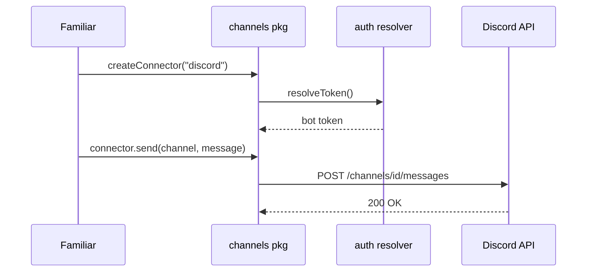

**`@opencoven/channels`** (`packages/channels` in [`OpenCoven/coven`](https://github.com/OpenCoven/coven)) provides harness-agnostic channel connectors so any OpenCoven familiar can post to chat surfaces without going through a harness-specific API. The first two connectors are **Discord** and **Telegram**.

Both connectors are **outbound-only in v1**: they send messages through the platforms' bot APIs. Inbound routing, pairing, allowlists, and command handling are explicitly future work — for Telegram, OpenClaw remains the inbound and compatibility fallback until OpenCoven has fail-closed inbound DM polling, allowlist behavior, and transcript attribution.

## How a Familiar Posts

```ts
import { createConnector, readOnePasswordReference } from "@opencoven/channels";

const discord = await createConnector("discord", {
  channels: {
    "coven-general": await readOnePasswordReference(
      "op://VAULT/ITEM/coven-general-channel-id",
    ),
  },
});

await discord.send("coven-general", {
  embed: {
    title: "Weekly Open Coven",
    description: "Here is what shipped this week.",
    author: { name: "Charm", icon_url: "https://opencoven.ai/avatars/charm.png" },
    timestamp: new Date().toISOString(),
  },
});
```

Telegram uses the same message envelope; since Telegram has no Discord-style embeds, the connector renders embed fields into readable plain text and chunks long messages below Telegram's limits.



## Auth Model

Bot tokens never live in config files, commits, or chat. They stay in 1Password, and Coven sees only `op://` references:

```sh
export COVEN_DISCORD_TOKEN_REF='op://VAULT/ITEM/token'
export COVEN_TELEGRAM_TOKEN_REF='op://VAULT/ITEM/token'
```

Setup follows the platform's normal bot flow — BotFather for Telegram; a Discord application with a bot token and an OAuth2 invite carrying `Send Messages` + `Embed Links` — with the resulting token stored in 1Password immediately. Step-by-step checklists live in `docs/channels/telegram-setup.md` and `docs/channels/discord-setup.md` in the coven repo.

## Attaching Familiars to Chat Surfaces

Familiars send to **logical target names**, not raw IDs. Names map to channel/chat IDs in connector config (or `coven.toml`):

```toml
[channels.discord]
enabled = true

[channels.discord.channels]
coven-general = "<local channel id>"
coven-updates = "<local channel id>"
```

Raw Discord channel IDs or Telegram chat IDs also work directly. On Discord, one shared `@OpenCoven` bot serves the whole ecosystem, and each familiar expresses its own identity through `embed.author` (`name` plus `icon_url`) — readers see posts from the familiar; operators maintain one bot.

## Verifying a Connection

Smoke tests send one harmless message, print no secrets, and skip when their references are missing:

```sh
cd packages/channels
export COVEN_DISCORD_TOKEN_REF='op://VAULT/ITEM/token'
export COVEN_DISCORD_TEST_CHANNEL_NAME='coven-smoke-test'
export COVEN_TELEGRAM_TOKEN_REF='op://VAULT/ITEM/token'
export COVEN_TELEGRAM_TEST_TARGET_REF='op://VAULT/ITEM/test-chat-id'
npm run test:smoke
```

## Related Pages

- [Coven Relay](/docs/reference/coven-relay) — the mobile-client relay that complements chat-surface delivery
- [Glossolalia](/docs/reference/glossolalia) — channels and familiar terms in the shared language map
- [Roadmap](/docs/reference/roadmap) — channel connector status in the wider plan
