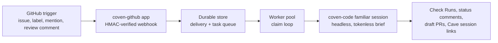

Coven's GitHub integration has moved from research into shipped code. Two public repositories carry it today: **`OpenCoven/coven-github`**, the Coven-native GitHub App adapter, and **`OpenCoven/coven-github-webhook`**, the hosted TypeScript webhook deployment bundle.

> Assign an issue to your familiar. Get a PR back.

## What Ships Today

### coven-github — the GitHub App adapter

`coven-github` routes GitHub issues, labels, mentions, and review comments into a Coven familiar, then publishes progress through Check Runs, issue comments, draft PRs, and CovenCave session links.

The Rust workspace splits into `config`, `github`, `webhook`, `worker`, `gardener`, `store`, and `server` crates. The `coven-github` binary exposes two subcommands:

| Command | Behavior |
|---------|----------|
| `coven-github serve --config config/local.toml` | Validates config (fail-fast on errors), opens the durable store, requeues interrupted work, then starts the webhook server, worker claim loop, and schedulers. |
| `coven-github doctor --config config/local.toml` | Validates a config file and prints actionable next steps; non-zero exit on errors, so it doubles as a CI or container pre-flight check. |

The server exposes these HTTP routes:

| Route | Method | Purpose |
|-------|--------|---------|
| `/healthz` | GET | Health check |
| `/webhook` | POST | GitHub App webhook intake (HMAC signature verified) |
| `/api/github/tasks` | GET | Task queue and history |
| `/api/github/memory` | GET | Memory activity |
| `/api/github/memory/revoke` | POST | Revoke memory entries |
| `/api/github/usage` | GET | Usage reporting |
| `/api/github/audit` | GET | Audit rows |
| `/api/github/routing` | GET | Familiar routing view |

Operational behavior verified in the server crate:

- Deliveries and tasks live in a durable store; `running` rows from a previous process are requeued on boot, or failed once their retry attempts are spent.
- A **Branch Gardener** scheduler enqueues garden tasks per configured installation/repo schedule to prune dead branches and surface PR-less work.
- Optional retention sweeps expire old memory-activity and terminal-task rows on a six-hour ticker; in-flight work is never touched.
- Familiars are configured in the TOML config and routed by bot username or trigger label; runs execute `coven-code --headless` with a tokenless session brief.

### coven-github-webhook — the hosted deployment bundle

`coven-github-webhook` is the TypeScript webhook adapter used for hosted deployments. It is deployment-specific — not the canonical Rust worker — and exists so hosted webhook behavior can be reviewed, reproduced, and changed through PRs instead of server-only edits.

- `src/server.ts` serves `/`, `/healthz`, and `/webhook`; `src/adapter.ts` owns the webhook handler, task router, task runner, PR evidence capture, headless `coven-code` invocation, and comment publisher.
- Secrets and mutable state stay outside git: `GITHUB_APP_ID`, `GITHUB_WEBHOOK_SECRET`, a GitHub App private key path, `COVEN_GITHUB_STATE_DIR`, `COVEN_GITHUB_POLICY_PATH`, and `COVEN_CODE_BIN`.
- `COVEN_REVIEW_FIX_LOOPS` bounds optional review-fix loops between 0 and 5, defaulting to 0 so hosted repair loops are opt-in.
- Signature smoke tests prove unsigned and badly signed requests are rejected while a correctly HMAC-signed `ping` delivery is accepted.

## What Remains Research

The original research brief behind this work is still private. Its abstract remains the honest public boundary:

The brief investigates a Coven-native GitHub App coding agent — a thin GitHub integration handling webhook intake, installation-token authentication, Check Runs, issue and PR lifecycle, and task status, while delegating coding work to an execution backend. It compares incumbent agent products and open-source systems, studies GitHub App mechanics, and recommends a direction centered on OpenCoven's differentiators:

- persistent familiar identity
- bring-your-own-model configuration
- composable skills
- cross-session memory
- multi-familiar routing
- Cave as the owned oversight UI

Product strategy, competitive analysis, and hosted-plan details from the brief are not published here. Public docs describe only shipped behavior (above) and this abstracted direction.

## Related Pages

- [Familiar Contract](/docs/reference/familiar-contract) — the identity spec the GitHub agent's familiars comply with
- [Coven Relay](/docs/reference/coven-relay) — the hosted relay component
- [Roadmap](/docs/reference/roadmap) — where GitHub agent work sits in the wider plan
