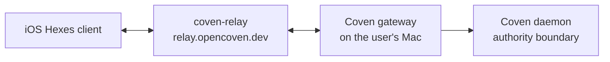

**coven-relay** (`crates/coven-relay` in [`OpenCoven/coven`](https://github.com/OpenCoven/coven)) is a stateless WebSocket relay for **Hexes** — it bridges the Coven gateway running on a user's Mac to iOS Hexes clients that cannot reach a home machine directly.

## What Ships Today

The crate is the Phase 2A scaffold of the Hexes implementation plan: a minimal Axum WebSocket server with a health endpoint.

| Route | Method | Behavior |
|-------|--------|----------|
| `/healthz` | GET | Returns `200 OK` — used by the Fly.io health check. |
| `/ws` | GET (upgrade) | Accepts the WebSocket upgrade; peer routing is stubbed pending Phase 2B. |

The listen address defaults to `0.0.0.0:8080` and is overridable with `LISTEN_ADDR`:

```sh
cargo run -p coven-relay
# or
LISTEN_ADDR=127.0.0.1:9000 cargo run -p coven-relay
curl http://localhost:8080/healthz
```

Later phases are planned in the crate itself, not yet implemented:

- **Phase 2B** — bearer-token auth and peer routing: register peers by role (host/client) and fan out messages between peers sharing the same secret.
- **Phase 2C** — offline buffering and APNs push.
- **Phase 2D** — avatar serving.

## How It Relates to the Daemon and Hub

The relay is intentionally dumb transport. The [Coven daemon](/docs/daemon/lifecycle) stays the local authority boundary for sessions, and the multi-host hub control plane (`coven hub`, `coven scheduler`, `coven travel`) owns routing decisions between machines. The relay only forwards traffic between a Mac-hosted gateway and remote mobile clients — it holds no session state, which is why it can be stateless and scale to zero.



## Deployment

The relay deploys to Fly.io from `crates/coven-relay/deploy/` (a Dockerfile plus `fly.toml`):

| Setting | Value |
|---------|-------|
| App name | `coven-relay` |
| Region | `ord` (Chicago) |
| Hostname | `relay.opencoven.dev` |
| Internal port | `8080`, HTTPS forced |
| Scaling | `auto_stop_machines` / `auto_start_machines`, `min_machines_running = 0` |
| VM | `shared-cpu-1x`, 256 MB |
| Health check | `GET /healthz` every 15s, 2s timeout, 5s grace |

```sh
cd crates/coven-relay/deploy
fly deploy   # requires FLY_API_TOKEN or `fly auth login`
```

## Related Pages

- [Channels](/docs/reference/channels) — chat-surface connectors that complement the mobile relay path
- [Roadmap](/docs/reference/roadmap) — where multi-host and mobile work sits in the plan
