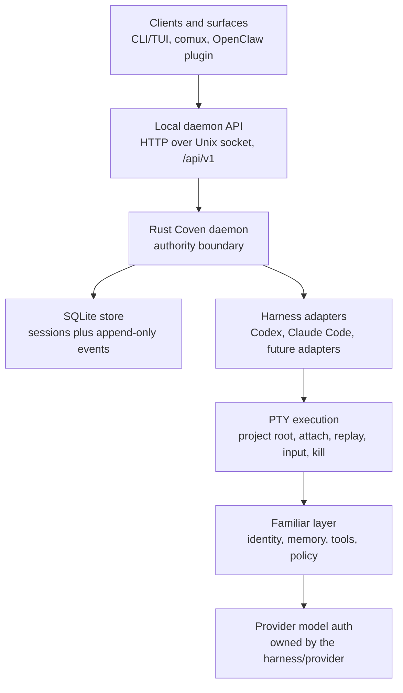
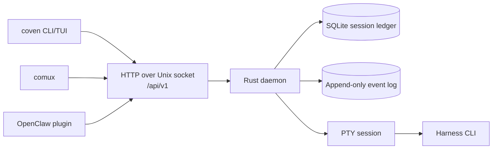
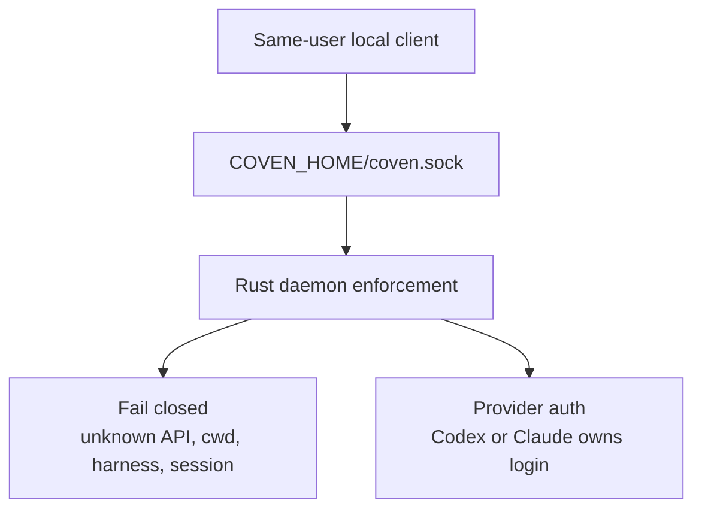
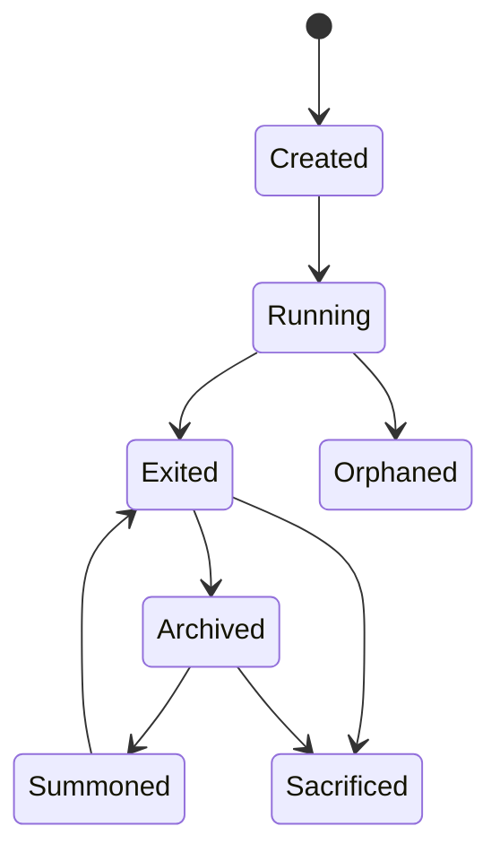
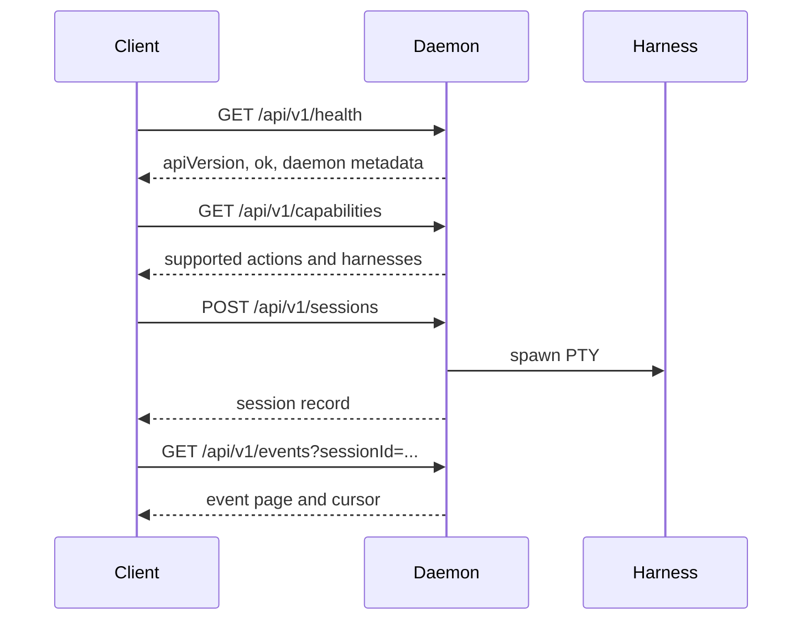
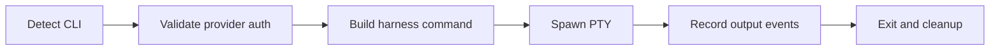
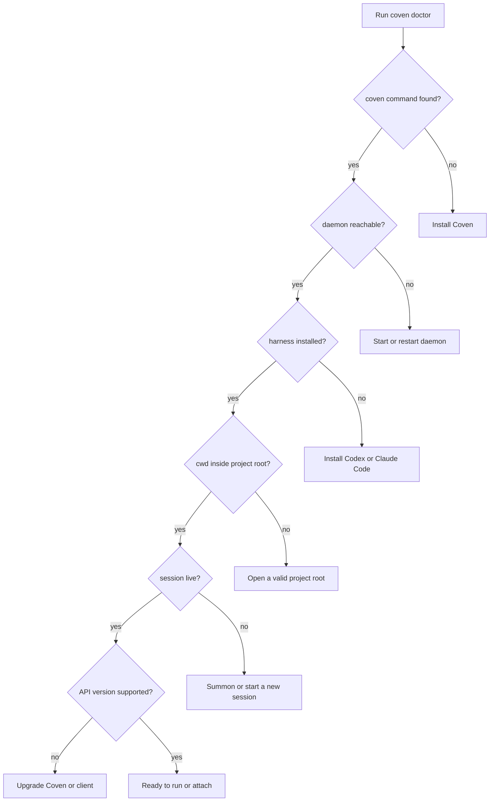

import { DocsDataTable, DocsTabbedTables } from '@/components/docs-data-table';

# Docs Migration Map

This page tracks the gap between the original `OpenCoven/coven/docs` corpus and the public docs site.

The goal is to keep the docs honest: current runtime behavior should be documented as current, while future hosted APIs, distributed orchestration, and harness handoffs should be labeled as roadmap work until shipped.

## Current Stack to Show

The public homepage should expose the actual Coven runtime stack, not only the familiar-facing abstraction.

## Already Migrated

These areas are present in the docs site and should now be polished, not duplicated:

| Source docs | Site location | Status |
| --- | --- | --- |
| `GETTING-STARTED.md` | Guide / Getting Started | Migrated |
| `CONCEPTS.md`, `GLOSSARY.md` | Guide / Concepts, Reference / Glossary | Migrated |
| `ARCHITECTURE.md` | Guide / Architecture | Migrated |
| `SESSION-LIFECYCLE.md` | Familiars / Sessions | Migrated |
| `HARNESS-ADAPTERS.md` | Familiars / Harnesses | Migrated |
| `CLIENT-INTEGRATION.md` | Familiars / Clients | Migrated |
| `API-CONTRACT.md`, `API.md` | Reference / API | Partly migrated |
| `AUTH.md`, `SAFETY-MODEL.md` | Reference / Auth, Reference / Safety | Migrated |
| `ROADMAP.md` | Reference / Roadmap | Migrated |
| `TROUBLESHOOTING.md` | Reference / Troubleshooting | Migrated |

## Add Next

<DocsTabbedTables
  tabs={[
    {
      id: 'install',
      label: 'Install',
      caption: 'Install docs to migrate',
      searchPlaceholder: 'Filter install docs...',
      columns: [
        { key: 'source', label: 'Source doc' },
        { key: 'target', label: 'Target section', filter: true },
        { key: 'status', label: 'Status', filter: true },
      ],
      rows: [
        { source: '`install/index.md`', target: 'Install', status: 'Pending' },
        { source: '`install/macos.md`', target: 'Install', status: 'Pending' },
        { source: '`install/linux.md`', target: 'Install', status: 'Pending' },
        { source: '`install/windows.md`', target: 'Install', status: 'Pending' },
        { source: '`install/wsl2.md`', target: 'Install', status: 'Pending' },
        { source: '`install/docker.md`', target: 'Install', status: 'Pending' },
        { source: '`install/podman.md`', target: 'Install', status: 'Pending' },
        { source: '`install/nix.md`', target: 'Install', status: 'Pending' },
        { source: '`install/from-source.md`', target: 'Install', status: 'Pending' },
        { source: '`install/cargo.md`', target: 'Install', status: 'Pending' },
        { source: '`install/npm.md`', target: 'Install', status: 'Pending' },
        { source: '`install/coven-home.md`', target: 'Install', status: 'Pending' },
        { source: '`install/updating.md`', target: 'Install', status: 'Pending' },
        { source: '`install/uninstall.md`', target: 'Install', status: 'Pending' },
      ],
    },
    {
      id: 'daemon',
      label: 'Daemon',
      caption: 'Daemon docs to migrate',
      searchPlaceholder: 'Filter daemon docs...',
      columns: [
        { key: 'source', label: 'Source doc' },
        { key: 'target', label: 'Target section', filter: true },
        { key: 'status', label: 'Status', filter: true },
      ],
      rows: [
        { source: '`daemon/index.md`', target: 'Daemon', status: 'Pending' },
        { source: '`daemon/lifecycle.md`', target: 'Daemon', status: 'Pending' },
        { source: '`daemon/configuration.md`', target: 'Daemon', status: 'Pending' },
        { source: '`daemon/health.md`', target: 'Daemon', status: 'Pending' },
        { source: '`daemon/logs.md`', target: 'Daemon', status: 'Pending' },
        { source: '`daemon/diagnostics.md`', target: 'Daemon', status: 'Pending' },
        { source: '`daemon/socket-api.md`', target: 'Daemon', status: 'Pending' },
        { source: '`daemon/api-versioning.md`', target: 'Daemon', status: 'Pending' },
        { source: '`daemon/error-envelope.md`', target: 'Daemon', status: 'Pending' },
        { source: '`daemon/capabilities-handshake.md`', target: 'Daemon', status: 'Pending' },
        { source: '`daemon/orphan-recovery.md`', target: 'Daemon', status: 'Pending' },
        { source: '`daemon/trust-boundary.md`', target: 'Daemon', status: 'Pending' },
        { source: '`daemon/auth-posture.md`', target: 'Daemon', status: 'Pending' },
        { source: '`daemon/safety-model.md`', target: 'Daemon', status: 'Pending' },
        { source: '`daemon/remote-access.md`', target: 'Daemon', status: 'Pending' },
        { source: '`daemon/upgrades.md`', target: 'Daemon', status: 'Pending' },
      ],
    },
    {
      id: 'harnesses',
      label: 'Harnesses',
      caption: 'Harness docs to migrate',
      searchPlaceholder: 'Filter harness docs...',
      columns: [
        { key: 'source', label: 'Source doc' },
        { key: 'target', label: 'Target section', filter: true },
        { key: 'status', label: 'Status', filter: true },
      ],
      rows: [
        { source: '`harnesses/what-is-a-harness.md`', target: 'Harnesses overview', status: 'Pending' },
        { source: '`harnesses/installing.md`', target: 'Harnesses', status: 'Pending' },
        { source: '`harnesses/codex.md`', target: 'Harnesses', status: 'Pending' },
        { source: '`harnesses/claude-code.md`', target: 'Harnesses', status: 'Pending' },
        { source: '`harnesses/aider.md`', target: 'Harnesses', status: 'Pending' },
        { source: '`harnesses/cline.md`', target: 'Harnesses', status: 'Pending' },
        { source: '`harnesses/gemini-cli.md`', target: 'Harnesses', status: 'Pending' },
        { source: '`harnesses/hermes.md`', target: 'Harnesses', status: 'Pending' },
        { source: '`harnesses/custom.md`', target: 'Harnesses', status: 'Pending' },
        { source: '`harnesses/provider-auth.md`', target: 'Harnesses', status: 'Pending' },
        { source: '`harnesses/project-root.md`', target: 'Harnesses', status: 'Pending' },
        { source: '`harnesses/working-directory.md`', target: 'Harnesses', status: 'Pending' },
        { source: '`harnesses/title-and-metadata.md`', target: 'Harnesses', status: 'Pending' },
        { source: '`harnesses/troubleshooting.md`', target: 'Harnesses', status: 'Pending' },
      ],
    },
    {
      id: 'familiars',
      label: 'Familiars',
      caption: 'Familiar docs to migrate',
      searchPlaceholder: 'Filter familiar docs...',
      columns: [
        { key: 'source', label: 'Source doc' },
        { key: 'target', label: 'Target section', filter: true },
        { key: 'status', label: 'Status', filter: true },
      ],
      rows: [
        { source: '`familiars/what-is-a-familiar.md`', target: 'Familiars', status: 'Pending' },
        { source: '`familiars/identity.md`', target: 'Familiars', status: 'Pending' },
        { source: '`familiars/roles.md`', target: 'Familiars', status: 'Pending' },
        { source: '`familiars/personas.md`', target: 'Familiars', status: 'Pending' },
        { source: '`familiars/naming-and-voice.md`', target: 'Familiars', status: 'Pending' },
        { source: '`familiars/multi-familiar.md`', target: 'Familiars', status: 'Pending' },
        { source: '`familiars/parallel-lanes.md`', target: 'Familiars', status: 'Pending' },
        { source: '`familiars/orchestration.md`', target: 'Familiars', status: 'Pending' },
        { source: '`familiars/handoff.md`', target: 'Familiars', status: 'Pending' },
      ],
    },
    {
      id: 'memory-models',
      label: 'Memory & Models',
      caption: 'Memory and model docs to migrate',
      searchPlaceholder: 'Filter memory and model docs...',
      columns: [
        { key: 'source', label: 'Source doc' },
        { key: 'target', label: 'Target section', filter: true },
        { key: 'status', label: 'Status', filter: true },
      ],
      rows: [
        { source: '`memory/index.md`', target: 'Memory', status: 'Pending' },
        { source: '`memory/working-memory.md`', target: 'Memory', status: 'Pending' },
        { source: '`memory/episodic.md`', target: 'Memory', status: 'Pending' },
        { source: '`memory/semantic.md`', target: 'Memory', status: 'Pending' },
        { source: '`memory/persistent-memory.md`', target: 'Memory', status: 'Pending' },
        { source: '`memory/search.md`', target: 'Memory', status: 'Pending' },
        { source: '`models/index.md`', target: 'Models', status: 'Pending' },
        { source: '`models/openai.md`', target: 'Models', status: 'Pending' },
        { source: '`models/anthropic.md`', target: 'Models', status: 'Pending' },
        { source: '`models/google.md`', target: 'Models', status: 'Pending' },
        { source: '`models/local-models.md`', target: 'Models', status: 'Pending' },
        { source: '`models/provider-boundary.md`', target: 'Models', status: 'Pending' },
        { source: '`models/why-coven-does-not-own-credentials.md`', target: 'Models', status: 'Pending' },
      ],
    },
    {
      id: 'automation-help',
      label: 'Automation & Help',
      caption: 'Automation, capability, and help docs to migrate',
      searchPlaceholder: 'Filter automation and help docs...',
      columns: [
        { key: 'source', label: 'Source doc' },
        { key: 'target', label: 'Target section', filter: true },
        { key: 'status', label: 'Status', filter: true },
      ],
      rows: [
        { source: '`automation/index.md`', target: 'Automation', status: 'Pending' },
        { source: '`automation/cron.md`', target: 'Automation', status: 'Pending' },
        { source: '`automation/hooks.md`', target: 'Automation', status: 'Pending' },
        { source: '`automation/standing-orders.md`', target: 'Automation', status: 'Pending' },
        { source: '`capabilities/index.md`', target: 'Capabilities', status: 'Pending' },
        { source: '`capabilities/discovery.md`', target: 'Capabilities', status: 'Pending' },
        { source: '`capabilities/action-routing.md`', target: 'Capabilities', status: 'Pending' },
        { source: '`help/index.md`', target: 'Help', status: 'Pending' },
        { source: '`help/daemon-wont-start.md`', target: 'Help', status: 'Pending' },
        { source: '`help/harness-not-found.md`', target: 'Help', status: 'Pending' },
        { source: '`help/session-stuck.md`', target: 'Help', status: 'Pending' },
        { source: '`help/permissions.md`', target: 'Help', status: 'Pending' },
        { source: '`help/paths.md`', target: 'Help', status: 'Pending' },
        { source: '`help/environment.md`', target: 'Help', status: 'Pending' },
        { source: '`help/diagnostics-bundle.md`', target: 'Help', status: 'Pending' },
        { source: '`help/filing-issues.md`', target: 'Help', status: 'Pending' },
        { source: '`help/community.md`', target: 'Help', status: 'Pending' },
      ],
    },
  ]}
/>

## API Naming Note

The current **OpenCoven API** section reads like a future hosted REST API with API keys. That should be handled deliberately.

<DocsDataTable
  caption="API naming decisions"
  searchPlaceholder="Filter API naming decisions..."
  columns={[
    { key: 'decision', label: 'Decision' },
    { key: 'status', label: 'Status', filter: true },
    { key: 'reason', label: 'Reason' },
  ]}
  rows={[
    { decision: 'Keep **Reference / API** as the shipped local daemon API', status: 'Do now', reason: 'The current API is HTTP over Unix socket, `/api/v1`, with no OAuth/JWT/API keys.' },
    { decision: 'Rename hosted-style pages to **Future Hosted API** if they stay', status: 'Conditional', reason: 'Hosted auth and remote access are future-facing, not the shipped daemon contract.' },
    { decision: 'Replace hosted-style pages with daemon endpoint pages when possible', status: 'Preferred', reason: 'Health, capabilities, sessions, events, input, kill, archive, summon, and sacrifice are the useful current reference targets.' },
  ]}
/>

## Diagram Backlog

### Runtime Topology

### Trust Boundary

### Session Lifecycle

### Client Handshake

### Harness Adapter Lifecycle

### Troubleshooting Flow

## Migration Order

<DocsDataTable
  caption="Docs migration order"
  searchPlaceholder="Filter migration steps..."
  columns={[
    { key: 'step', label: 'Step' },
    { key: 'work', label: 'Work' },
    { key: 'dependency', label: 'Dependency', filter: true },
  ]}
  rows={[
    { step: '1', work: 'Expand the homepage stack and link it to real docs.', dependency: 'Foundation' },
    { step: '2', work: 'Add this migration map so future work has a checklist.', dependency: 'Foundation' },
    { step: '3', work: 'Add **Install**.', dependency: 'Foundation' },
    { step: '4', work: 'Add **Daemon**.', dependency: 'Foundation' },
    { step: '5', work: 'Split **Harnesses** into overview plus per-harness pages.', dependency: 'Core runtime' },
    { step: '6', work: 'Expand **Familiars**.', dependency: 'Core runtime' },
    { step: '7', work: 'Add **Memory** and **Models**.', dependency: 'Core runtime stable' },
    { step: '8', work: 'Add **Automation**, **Capabilities**, and **Help**.', dependency: 'Core runtime stable' },
    { step: '9', work: 'Revisit Spanish docs after the English information architecture is stable.', dependency: 'English IA stable' },
  ]}
/>
