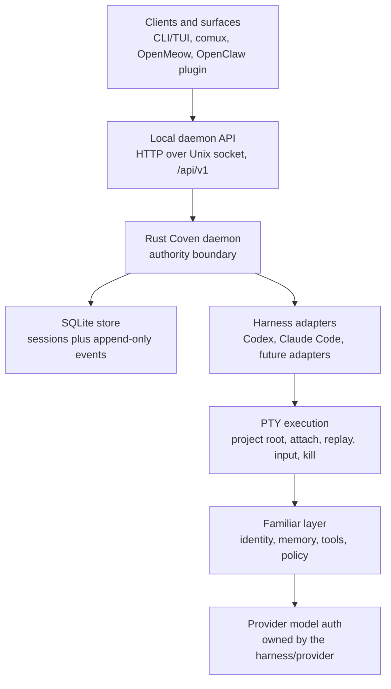
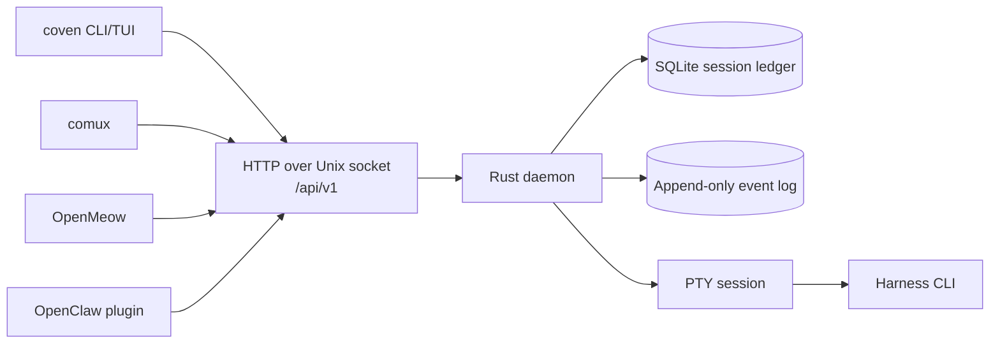
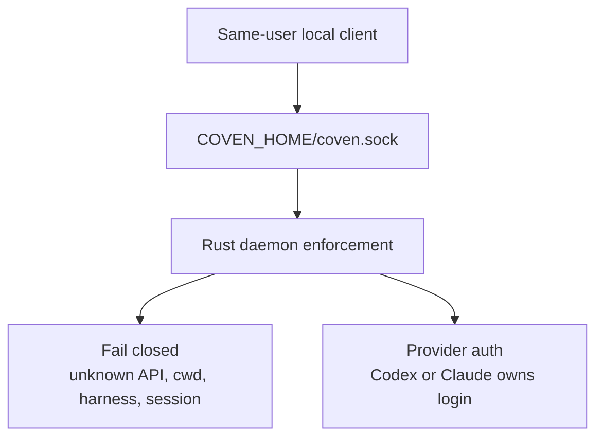
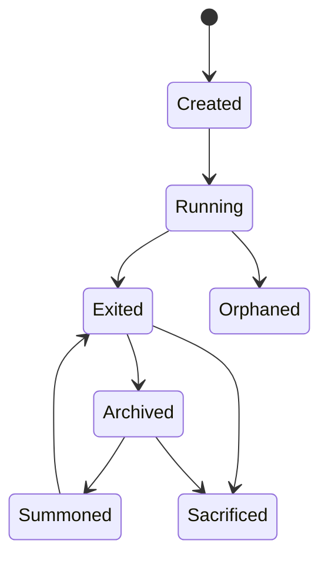
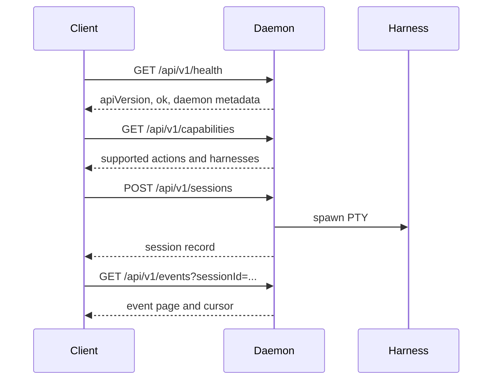
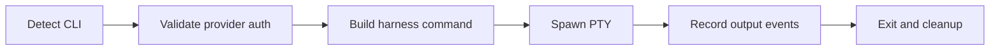
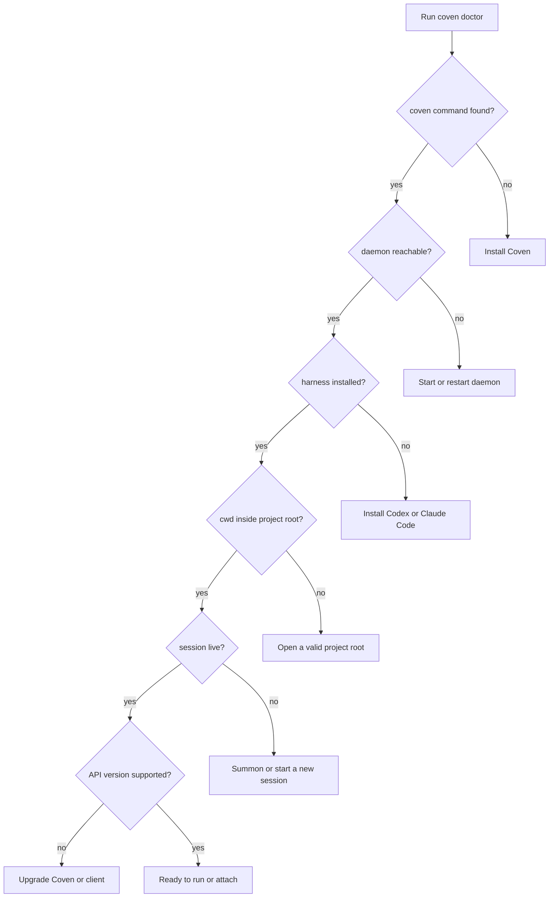

# Docs Migration Map

This page tracks the gap between the original `OpenCoven/coven/docs` corpus and the public docs site.

The goal is to keep the docs honest: current runtime behavior should be documented as current, while future hosted APIs, distributed orchestration, and harness handoffs should be labeled as roadmap work until shipped.

## Current Stack to Show

The public homepage should expose the actual Coven runtime stack, not only the familiar-facing abstraction.

## Already Migrated

These areas are present in the docs site and should now be polished, not duplicated:

| Source docs | Site location | Status |
| --- | --- | --- |
| `GETTING-STARTED.md` | Guide / Getting Started | Migrated |
| `CONCEPTS.md`, `GLOSSARY.md` | Guide / Concepts, Reference / Glossary | Migrated |
| `ARCHITECTURE.md` | Guide / Architecture | Migrated |
| `SESSION-LIFECYCLE.md` | Familiars / Sessions | Migrated |
| `HARNESS-ADAPTERS.md` | Familiars / Harnesses | Migrated |
| `CLIENT-INTEGRATION.md` | Familiars / Clients | Migrated |
| `API-CONTRACT.md`, `API.md` | Reference / API | Partly migrated |
| `AUTH.md`, `SAFETY-MODEL.md` | Reference / Auth, Reference / Safety | Migrated |
| `ROADMAP.md` | Reference / Roadmap | Migrated |
| `TROUBLESHOOTING.md` | Reference / Troubleshooting | Migrated |

## Add Next

### Install

Migrate these into a new **Install** section:

- `install/index.md`
- `install/macos.md`
- `install/linux.md`
- `install/windows.md`
- `install/wsl2.md`
- `install/docker.md`
- `install/podman.md`
- `install/nix.md`
- `install/from-source.md`
- `install/cargo.md`
- `install/npm.md`
- `install/coven-home.md`
- `install/updating.md`
- `install/uninstall.md`

### Daemon

Migrate these into a new **Daemon** section:

- `daemon/index.md`
- `daemon/lifecycle.md`
- `daemon/configuration.md`
- `daemon/health.md`
- `daemon/logs.md`
- `daemon/diagnostics.md`
- `daemon/socket-api.md`
- `daemon/api-versioning.md`
- `daemon/error-envelope.md`
- `daemon/capabilities-handshake.md`
- `daemon/orphan-recovery.md`
- `daemon/trust-boundary.md`
- `daemon/auth-posture.md`
- `daemon/safety-model.md`
- `daemon/remote-access.md`
- `daemon/upgrades.md`

### Harnesses

The current harness page should become an overview, with per-harness pages added:

- `harnesses/what-is-a-harness.md`
- `harnesses/installing.md`
- `harnesses/codex.md`
- `harnesses/claude-code.md`
- `harnesses/aider.md`
- `harnesses/cline.md`
- `harnesses/gemini-cli.md`
- `harnesses/hermes.md`
- `harnesses/custom.md`
- `harnesses/provider-auth.md`
- `harnesses/project-root.md`
- `harnesses/working-directory.md`
- `harnesses/title-and-metadata.md`
- `harnesses/troubleshooting.md`

### Familiars

Expand the Familiars section beyond session management:

- `familiars/what-is-a-familiar.md`
- `familiars/identity.md`
- `familiars/roles.md`
- `familiars/personas.md`
- `familiars/naming-and-voice.md`
- `familiars/multi-familiar.md`
- `familiars/parallel-lanes.md`
- `familiars/orchestration.md`
- `familiars/handoff.md`

### Memory and Models

Add dedicated **Memory** and **Models** sections after the core runtime pages stabilize:

- `memory/index.md`
- `memory/working-memory.md`
- `memory/episodic.md`
- `memory/semantic.md`
- `memory/persistent-memory.md`
- `memory/search.md`
- `models/index.md`
- `models/openai.md`
- `models/anthropic.md`
- `models/google.md`
- `models/local-models.md`
- `models/provider-boundary.md`
- `models/why-coven-does-not-own-credentials.md`

### Automation and Capabilities

Add these once the local daemon/runtime story is fully navigable:

- `automation/index.md`
- `automation/cron.md`
- `automation/hooks.md`
- `automation/standing-orders.md`
- `capabilities/index.md`
- `capabilities/discovery.md`
- `capabilities/action-routing.md`

### Help

Split troubleshooting into targeted help pages:

- `help/index.md`
- `help/daemon-wont-start.md`
- `help/harness-not-found.md`
- `help/session-stuck.md`
- `help/permissions.md`
- `help/paths.md`
- `help/environment.md`
- `help/diagnostics-bundle.md`
- `help/filing-issues.md`
- `help/community.md`

## API Naming Note

The current **OpenCoven API** section reads like a future hosted REST API with API keys. That should be handled deliberately:

- Keep **Reference / API** as the shipped local daemon API: HTTP over Unix socket, `/api/v1`, no OAuth/JWT/API keys.
- Rename the current hosted-style pages to **Future Hosted API** if they stay.
- Otherwise replace them with daemon endpoint pages for health, capabilities, sessions, events, input, kill, archive, summon, and sacrifice.

## Diagram Backlog

### Runtime Topology

### Trust Boundary

### Session Lifecycle

### Client Handshake

### Harness Adapter Lifecycle

### Troubleshooting Flow

## Migration Order

1. Expand the homepage stack and link it to real docs.
2. Add this migration map so future work has a checklist.
3. Add **Install**.
4. Add **Daemon**.
5. Split **Harnesses** into overview plus per-harness pages.
6. Expand **Familiars**.
7. Add **Memory** and **Models**.
8. Add **Automation**, **Capabilities**, and **Help**.
9. Revisit Spanish docs after the English information architecture is stable.
