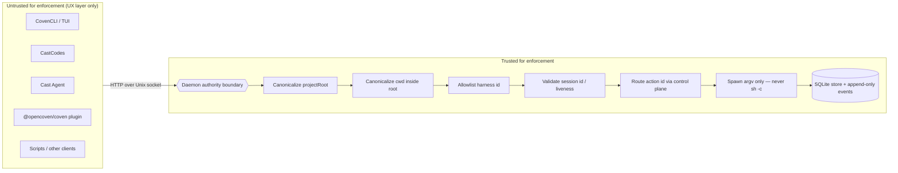

import { DocsDataTable } from '@/components/docs-data-table';

Coven is local-first, but local does not mean harmless. It can launch agent harnesses in real repositories, forward input to live processes, and preserve logs. This document states the safety boundaries that docs, clients, and code should preserve.

## Trust Boundary

The Rust daemon is the authority boundary.

Every client is untrusted for enforcement purposes.

<DocsDataTable
  caption="Untrusted client surfaces"
  searchPlaceholder="Filter client surfaces..."
  columns={[
    { key: 'surface', label: 'Surface' },
    { key: 'status', label: 'Status', filter: true },
    { key: 'trustPosture', label: 'Trust posture' },
  ]}
  rows={[
    { surface: 'CLI/TUI', status: 'Current', trustPosture: 'Presentation layer; daemon still enforces sensitive decisions.' },
    { surface: 'CastCodes', status: 'Current', trustPosture: 'Workspace layer; cannot widen project or session policy.' },
    { surface: 'Cast Agent', status: 'Current backend', trustPosture: 'Substrate and session backend; still submits to daemon enforcement.' },
    { surface: 'External OpenClaw plugin', status: 'External bridge', trustPosture: 'Bridge layer; must use daemon validation.' },
    { surface: 'Scripts', status: 'Current', trustPosture: 'Automation callers; treated like any other untrusted client.' },
    { surface: 'Future desktop clients', status: 'Future', trustPosture: 'Local UI surfaces; policy remains behind Coven.' },
  ]}
/>

Clients may improve UX, but they must not be the only place where a sensitive decision is enforced.



Anything in **UntrustedZone** can lie, drift, or be replaced. Anything in **TrustedZone** is the Rust daemon's job and must fail closed on unknowns. The arrow direction is the only direction a sensitive decision is allowed to flow: from untrusted into the boundary, where it is revalidated.

Cast Codes are part of the untrusted intent surface. They can make routing clear, but they do not authorize launches, live input, kill requests, external actions, or destructive session operations.

## Authentication and Local Access

Coven's current auth solution is a same-user local access model, not a network authentication protocol.

<DocsDataTable
  caption="Authentication and local access posture"
  searchPlaceholder="Filter access posture..."
  columns={[
    { key: 'rule', label: 'Rule' },
    { key: 'group', label: 'Group', filter: true },
    { key: 'implication', label: 'Implication' },
  ]}
  rows={[
    { rule: 'Daemon API runs over `<covenHome>/coven.sock`, not TCP.', group: 'Transport', implication: 'The API is same-user local by default.' },
    { rule: 'No daemon OAuth, JWT, bearer token, API key, browser cookie, RBAC, or hosted account session in v0.', group: 'Auth model', implication: 'Do not treat v0 as a remote service auth scheme.' },
    { rule: 'Provider credentials stay in the harness/provider local auth flow.', group: 'Credentials', implication: 'Codex or Claude Code own provider login.' },
    { rule: 'Clients are untrusted for enforcement.', group: 'Authority', implication: 'The Rust daemon must revalidate every sensitive request.' },
    { rule: 'External OpenClaw plugin performs socket trust-anchor validation.', group: 'Defense in depth', implication: 'Client checks help, but Rust-side private `COVEN_HOME` checks remain a hardening priority.' },
    { rule: 'Do not expose the raw socket API through localhost TCP, browser, remote bridge, or mobile pairing without explicit auth design.', group: 'Transport', implication: 'Remote access needs a separate design.' },
  ]}
/>

The detailed contract lives in [Authentication and local access](/docs/reference/auth).

## Core Rules

<DocsDataTable
  caption="Core safety rules"
  searchPlaceholder="Filter core rules..."
  columns={[
    { key: 'rule', label: 'Rule' },
    { key: 'riskArea', label: 'Risk area', filter: true },
    { key: 'reason', label: 'Reason' },
  ]}
  rows={[
    { rule: 'Launch only with an explicit project root.', riskArea: 'Filesystem policy', reason: 'Every session needs a clear boundary.' },
    { rule: 'Canonicalize `projectRoot` and `cwd` before comparing paths.', riskArea: 'Filesystem policy', reason: 'String paths are not enough for enforcement.' },
    { rule: 'Reject working directories outside the project root.', riskArea: 'Filesystem policy', reason: 'Clients cannot widen the launch boundary.' },
    { rule: 'Keep harness ids allowlisted until a real policy layer exists.', riskArea: 'Harness policy', reason: 'Unknown adapters should not run by default.' },
    { rule: 'Build harness commands with argv APIs.', riskArea: 'Command execution', reason: 'Prompt text should remain data.' },
    { rule: 'Do not execute prompts through `sh -c`.', riskArea: 'Command execution', reason: 'Avoid shell interpolation hazards.' },
    { rule: 'Keep provider credentials in provider or harness authentication flow.', riskArea: 'Credentials', reason: 'Coven should not become a credential holder.' },
    { rule: 'Treat the socket API as a local product contract.', riskArea: 'Compatibility', reason: 'Clients should use documented behavior, not internals.' },
    { rule: 'Fail closed on unknown API versions, unknown action ids, unsupported harnesses, and invalid session ids.', riskArea: 'Unknown behavior', reason: 'Ambiguous requests should not be guessed.' },
  ]}
/>

## Data and Secrets

Coven should not require repository-stored secrets.

Do not commit runtime state:

<DocsDataTable
  caption="Runtime state that must stay out of source control"
  searchPlaceholder="Filter ignored state..."
  columns={[
    { key: 'pattern', label: 'Pattern' },
    { key: 'category', label: 'Category', filter: true },
    { key: 'risk', label: 'Risk' },
  ]}
  rows={[
    { pattern: '`.coven/`', category: 'Coven state', risk: 'Local runtime records and sockets do not belong in repos.' },
    { pattern: '`*.sqlite`', category: 'Database', risk: 'May contain local session history.' },
    { pattern: '`*.sqlite3`', category: 'Database', risk: 'May contain local session history.' },
    { pattern: '`*.db`', category: 'Database', risk: 'May contain local or application state.' },
    { pattern: '`*.sock`', category: 'Socket', risk: 'Socket paths are machine-local runtime artifacts.' },
    { pattern: '`.env*`', category: 'Secrets', risk: 'Environment files often contain credentials.' },
    { pattern: 'Private keys', category: 'Secrets', risk: 'Private key material must never be published.' },
    { pattern: 'Certificates', category: 'Secrets', risk: 'Certificates may expose signing or identity material.' },
    { pattern: 'Token-bearing logs', category: 'Secrets', risk: 'Logs can accidentally contain live credentials.' },
  ]}
/>

Docs and examples must use placeholders such as `/path/to/project`, `/Users/example`, `session-1`, and `intent-1`.

## Event Log Caution

The event log records harness output. A harness may print sensitive data if the user asks it to inspect a sensitive repository or command output includes secrets.

Recommended user guidance:

<DocsDataTable
  caption="Event log safety guidance"
  searchPlaceholder="Filter event log guidance..."
  columns={[
    { key: 'guidance', label: 'Guidance' },
    { key: 'riskArea', label: 'Risk area', filter: true },
    { key: 'reason', label: 'Reason' },
  ]}
  rows={[
    { guidance: 'Do not run untrusted prompts in sensitive repositories.', riskArea: 'Prompt risk', reason: 'Harness output may preserve inspected data.' },
    { guidance: 'Do not ask a harness to dump environment variables.', riskArea: 'Secrets', reason: 'Environment output can include tokens.' },
    { guidance: 'Do not paste secrets into prompts.', riskArea: 'Secrets', reason: 'Prompt text can be echoed or stored.' },
    { guidance: 'Use throwaway projects for demos and smoke tests.', riskArea: 'Demo safety', reason: 'Demo logs should be safe to publish.' },
    { guidance: 'Run `python scripts/check-secrets.py` before publishing docs, fixtures, or release artifacts.', riskArea: 'Publishing', reason: 'Catch accidental secret material before release.' },
  ]}
/>

## Local Socket Posture

The daemon API runs over a local Unix socket. It is intended for same-user local clients.

Hardening priorities:

<DocsDataTable
  caption="Local socket hardening priorities"
  searchPlaceholder="Filter hardening priorities..."
  columns={[
    { key: 'priority', label: 'Priority' },
    { key: 'group', label: 'Group', filter: true },
    { key: 'purpose', label: 'Purpose' },
  ]}
  rows={[
    { priority: 'Private `COVEN_HOME` ownership and permissions', group: 'Filesystem trust', purpose: 'Keep daemon state same-user local.' },
    { priority: 'Safe socket creation and cleanup', group: 'Socket lifecycle', purpose: 'Avoid symlink and replacement hazards.' },
    { priority: 'Request size limits', group: 'API hardening', purpose: 'Constrain malformed or oversized requests.' },
    { priority: 'Read timeouts', group: 'API hardening', purpose: 'Avoid stalled local clients holding resources indefinitely.' },
    { priority: 'Structured error codes', group: 'Compatibility', purpose: 'Let clients handle failures consistently.' },
    { priority: 'Event pagination', group: 'Scalability', purpose: 'Keep large event logs usable.' },
    { priority: 'Compatibility tests for external clients', group: 'Compatibility', purpose: 'Prevent drift between daemon behavior and clients.' },
  ]}
/>

## Live Session Control

Live input and kill requests require a valid live session id.

Expected behavior:

<DocsDataTable
  caption="Live session control behavior"
  searchPlaceholder="Filter live control behavior..."
  columns={[
    { key: 'condition', label: 'Condition' },
    { key: 'response', label: 'Response' },
  ]}
  rows={[
    { condition: 'Unknown session id', response: 'Return not found.' },
    { condition: 'Non-live session input/kill', response: 'Return conflict.' },
    { condition: 'Destructive session deletion of a running session', response: 'Refuse deletion.' },
    { condition: 'Interactive deletion', response: 'Require explicit confirmation.' },
  ]}
/>

## Desktop Automation and Local UI Control

Future desktop automation adapters should be treated as privileged local capabilities.

Required posture:

<DocsDataTable
  caption="Desktop automation adapter posture"
  searchPlaceholder="Filter automation posture..."
  columns={[
    { key: 'requirement', label: 'Requirement' },
    { key: 'group', label: 'Group', filter: true },
    { key: 'reason', label: 'Reason' },
  ]}
  rows={[
    { requirement: 'Discover capabilities before showing actions', group: 'Capability discovery', reason: 'Clients should not invent unavailable controls.' },
    { requirement: 'Label risky actions clearly', group: 'Approval UX', reason: 'Users need to understand sensitive effects.' },
    { requirement: 'Require explicit approval for clicks, typing, deleting, sending, buying, posting, or modifying external state', group: 'Approval UX', reason: 'Visibility is not consent.' },
    { requirement: 'Log action requests and outcomes without recording secrets', group: 'Observability', reason: 'Audits need traces, not credential leakage.' },
    { requirement: 'Keep adapters behind the Coven control plane', group: 'Architecture', reason: 'Clients should not bind directly to brittle OS automation APIs.' },
  ]}
/>

The split should remain:

```text
client intent -> Coven policy/control plane -> adapter -> desktop/app
```

## External Actions

Coven should ask or require host-level policy before actions that leave the machine or affect external services.

<DocsDataTable
  caption="External action approval examples"
  searchPlaceholder="Filter external actions..."
  columns={[
    { key: 'action', label: 'Action' },
    { key: 'category', label: 'Category', filter: true },
    { key: 'approvalReason', label: 'Approval reason' },
  ]}
  rows={[
    { action: 'Sending messages', category: 'Communication', approvalReason: 'Leaves the local machine and speaks to another person.' },
    { action: 'Sending email', category: 'Communication', approvalReason: 'Creates durable external communication.' },
    { action: 'Posting publicly', category: 'Publishing', approvalReason: 'Publishes content under an identity or project.' },
    { action: 'Purchasing', category: 'Commerce', approvalReason: 'Can spend money or create obligations.' },
    { action: 'Deleting remote data', category: 'Remote state', approvalReason: 'Can destroy data outside the local ledger.' },
    { action: 'Pushing to git remotes', category: 'Remote state', approvalReason: 'Changes shared source history or branches.' },
    { action: 'Modifying cloud resources', category: 'Remote infrastructure', approvalReason: 'Can affect live services or billing.' },
  ]}
/>

The local runtime can make these actions visible, but visibility is not consent.
