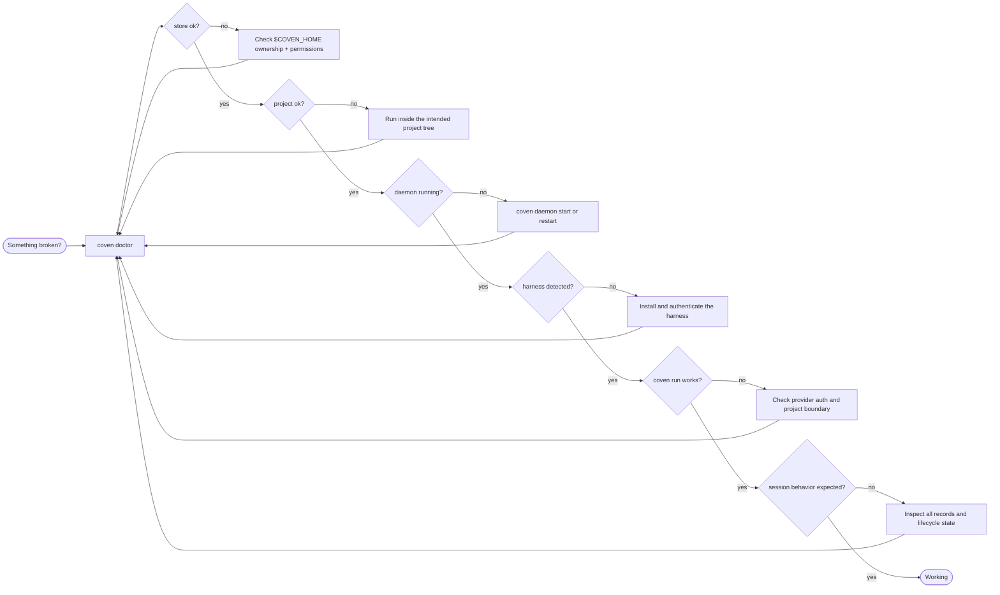

Start with:

```sh
coven doctor
```

`doctor` is the fastest readiness check for the store, current project, daemon,
and installed harnesses. Follow the first failing branch instead of changing
multiple parts of the system at once.

## Recovery rules

Use the same rules at every stage of the first-session journey:

1. Fix the first failing branch `coven doctor` reports, then rerun `doctor`.
2. Inspect before you mutate. Session show, events, logs, and status are
   read-only; sacrifice is permanent.
3. Keep the recovery path aligned with the stage that failed.

| Journey stage | Start here |
| --- | --- |
| Install or `PATH` | [`coven` command not found](#coven-command-not-found) |
| Harness install or login | [Harness missing](#harness-missing) |
| Daemon startup or connection | [Daemon unavailable](#daemon-unavailable) |
| Recorded run or project boundary | [`cwd` rejected](#cwd-rejected) |
| Session inspection or lifecycle | [Stale running sessions](#stale-running-sessions) and [Archive, summon, and sacrifice](#archive-summon-and-sacrifice) |

Return to [Getting started](/docs/guide/getting-started) after the failing stage
passes. Do not change unrelated configuration while the first failure is still
unresolved.



## Error code lookup

Daemon and API failures use a structured error envelope. Branch on
`error.code`, not message wording.

| You see | Start here |
| --- | --- |
| `not_found` | Verify the route and [API version](#api-version-rejected). |
| `invalid_request` | Compare the body with the [local API contract](/docs/reference/api) and check ids and field casing. |
| `session_not_found` | Run `coven sessions --all`; the id may be stale, deleted, or stored under another `COVEN_HOME`. |
| `session_not_live` | See [Session does not accept input](#session-does-not-accept-input). |
| `project_root_violation` | See [`cwd` rejected](#cwd-rejected). |
| `pty_spawn_failed` | See [Harness missing](#harness-missing). |
| `runtime_unavailable` | See [Daemon unavailable](#daemon-unavailable). |
| `internal_error` | Restart the daemon, preserve relevant logs, and report a reproducible case. |

The envelope shape and privacy rules are in
[Error envelope](/docs/reference/api#error-envelope).

## `coven` command not found

Use the dedicated
[install-debugging decision tree](/docs/cli/install-debugging). For a one-off
readiness check before repairing `PATH`:

```sh
npx @opencoven/cli doctor
```

A source checkout can run:

```sh
cargo run -p coven-cli -- doctor
```

## Harness missing

`coven doctor` prints an install hint for every built-in harness. Install and
authenticate the one you selected, then rerun `doctor`.

```sh
npm install -g @openai/codex
codex login
```

```sh
npm install -g @anthropic-ai/claude-code
claude doctor
```

Use [Harness troubleshooting](/docs/harnesses/troubleshooting) for adapter,
binary, and provider-authentication failures.

## Daemon unavailable

```sh
coven daemon start
coven daemon status
coven daemon restart
```

If a client still cannot connect, verify it resolves the same `COVEN_HOME` and
platform IPC endpoint as the CLI. Continue with
[Daemon recovery and upgrades](/docs/daemon/recovery-upgrades) when the socket,
lock, or service manager is stale.

## Stale running sessions

If a daemon stopped while sessions were running, those records may become
`orphaned` on the next start.

```sh
coven sessions --all
```

Inspect the record and log. Archive it when the evidence should remain, or
sacrifice it only when permanent deletion is intended.

## Session does not accept input

Input works only for a live daemon-owned session. Completed, failed, killed,
archived, external, or orphaned sessions remain inspection and replay surfaces;
they do not become live again merely because a client attaches.

Use:

```sh
coven sessions show <session-id>
coven sessions events <session-id> --limit 100
coven sessions log <session-id>
```

## `cwd` rejected

Coven rejects a working directory that canonicalizes outside the project root.

Use a path inside the project:

```sh
coven run codex "inspect package" --cwd packages/cli
```

Do not use parent traversal or a symlink escape. Read
[Project roots](/docs/harnesses/project-roots) for the complete boundary.

## API version rejected

Check the named contract first:

```text
GET /api/v1/health
```

A route-prefix value alone does not prove every capability exists. Update Coven
or the client until their named contracts overlap, then branch on advertised
capabilities.

## `coven sessions` printed a table

The browser opens only in an interactive terminal.

Force browser mode:

```sh
coven sessions --manage
```

Force table mode:

```sh
coven sessions --plain
```

## Archive, summon, and sacrifice

- **Archive** hides a non-running session and keeps its events.
- **Summon** restores an archived record to the active list.
- **Sacrifice** permanently deletes a non-running session and its events.

The [rituals cheat sheet](/docs/cli/sessions#rituals-cheat-sheet) records
allowed states and reversibility.

## Machine pressure

When `doctor` is healthy but local work remains slow, inspect the host without
launching a harness:

```sh
coven pc status
coven pc top --n 10
coven pc disk
```

Mutating relief commands require explicit confirmation. Read the
[`coven pc` reference](/docs/cli/pc) before using them.

## Contributor failures

Repository secret scanning, formatting, generated-output, and test failures are
maintainer workflow rather than end-user runtime recovery. Follow the
[`coven` repository contribution guide](https://github.com/OpenCoven/coven/blob/main/CONTRIBUTING.md)
for runtime work and this repository's
[CONTRIBUTING.md](https://github.com/OpenCoven/coven-docs/blob/main/CONTRIBUTING.md)
for documentation work.
